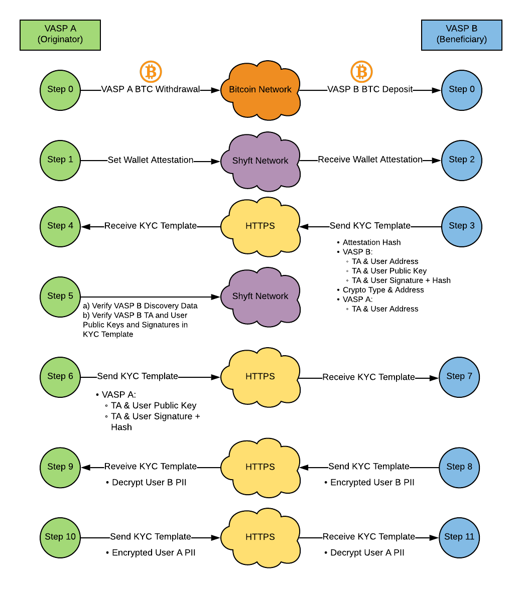
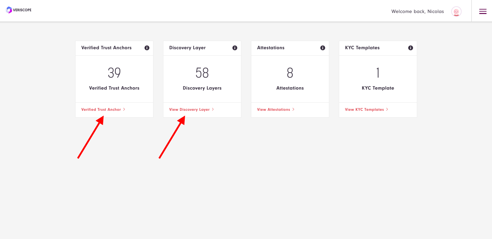
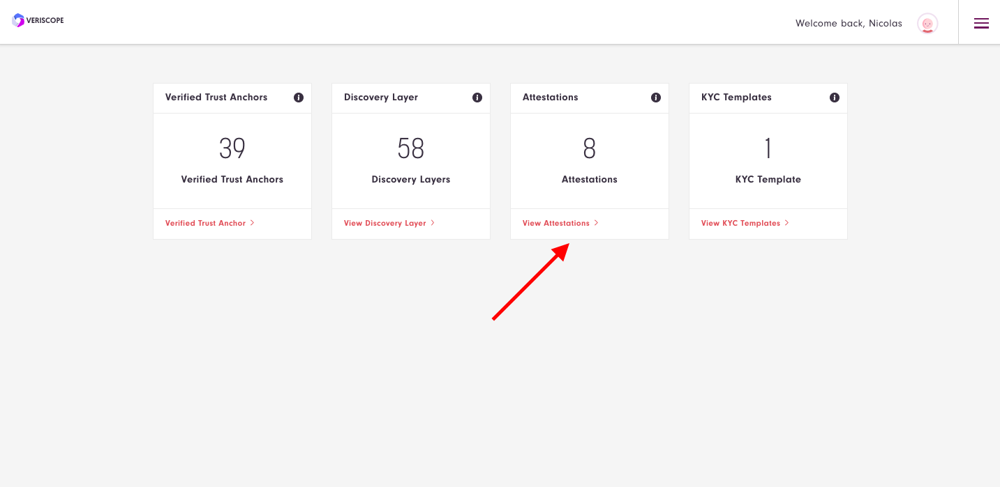

## API Walkthrough Guide

Below are steps to completing a full KYC transfer between Originator and Beneficiary VASPs utilizing API Token Requests.

This guide was produced running two nodes, one as VASP A (Originator) and the other as VASP B (Beneficiary).

Guide references will be made to the following flow diagram.  The end result will be VASP A and VASP B having shared encrypted IVMS PII between them respectively (Step 10 and 11).



Futher information on the KYC Template can be found here: [KYC Template Readme](/KYC-Template-Docs/README.md)

Example API Token requests below can be found in the Postman Collection.

Some API Requests below query your Veriscope application database.  Ensure you have these two cards up to date:

i.e. Verified Trust Anchors and Discovery Layers.



### Before you begin as Originator

1) Originator: **Is Trust Anchor Verified**?

Use TA Account.

eg: {{baseUrl}}/api/v1/server/verify_trust_anchor/0x1bD8d3A9AF399Bfdcd17e45DA27c13C05ef64892

response:

```
{
    "address": "0x1bD8d3A9AF399Bfdcd17e45DA27c13C05ef64892",
    "verified": true
}
```

2) Originator: **Get Trust Anchor API_URL**

Use TA Account.

eg: {{baseUrl}}/api/v1/server/get_trust_anchor_api_url?ta_address=0x1bD8d3A9AF399Bfdcd17e45DA27c13C05ef64892

```
{
    "id": 41,
    "transaction_hash": "0x971226b8d1689f30c300841e63dbe265256421eebae72f8d4c716b8bce7a5632",
    "trust_anchor_address": "0x1bD8d3A9AF399Bfdcd17e45DA27c13C05ef64892",
    "key_value_pair_name": "API_URL",
    "key_value_pair_value": "https://q1.veriscope.network/kyc-template",
    "created_at": "2022-03-07T16:36:37.000000Z",
    "updated_at": "2022-03-07T16:36:37.000000Z",
    "block_number": 652829
}
```

**Note:** key_value_pair_name and key_value_pair_value should be set.

### Preparation before Step 1 - Set Attestation

1) Originator: **Create Shyft User**

Save a copy of this Shyft User.  These properties are used throughout the guide.

eg: {{baseUrl}}/api/v1/server/create_shyft_user

```
{
    "account_address": "0x1c982a37a77b9ae26e077e9ba15b22ec5dd74b19",
    "private_key": "5236fbe797c9b4bf98b1bb893b827186236df6dba203cafabb593e6661b5b52c",
    "public_key": "5f6b31cc3ec4223529cee40422504a5ba74680b9c6faa44ff2cb1520da9bcd35155974578a6e302ea30f0016f84f7829ff0d2ae97aa4f1ff5a76b13970797f53",
    "message": "VERISCOPE_USER",
    "signature_hash": "0x7ec005c40fadb64f4180dcc14d9f5927f649096a08478a4a5a112a3aa77ca549",
    "signature": {
        "r": "0x01c5873f89c2983183b005d2027465a94fc0acc4ec8dc0642f804f4343691f40",
        "s": "0x0334694f75a2ebf9e8d4da046cf5fe5ad782c4898d7c6cd7d8db29de684a3c7b",
        "v": "0x25"
    }
}
```

2) Originator: **Get Trust Anchor Account**

Save a copy of the TA Account.  These properties are used throughout the guide.

eg: {{baseUrl}}/api/v1/server/get_trust_anchor_account

```
{
    "id": 1,
    "ta_prefname": "q1",
    "ta_jurisdiction": 0,
    "user_id": 1,
    "created_at": "2022-03-07T16:20:23.000000Z",
    "updated_at": "2022-03-07T16:20:23.000000Z",
    "account_address": "0x1bD8d3A9AF399Bfdcd17e45DA27c13C05ef64892",
    "public_key": "00553963a21d50d804e5673fcf3993891026ea3866868bacc385fe805794871f9a85f7f0f8d29fb075823de460062ca58b29d7f5eafc196fb1f71c6ab60e4a78",
    "signature_hash": "0x0b709dd4809f36a22fe48250b24a5e41e8aea491bace26627f5c68ea9b4fad3f",
    "signature": "{\"r\":\"0xb7daa8b110e53c70ac261694c45c96d910e482eb9164afc516710be29b2c8067\",\"s\":\"0x292703a76e67a4b20ff67cd0229a66f73cf6e0c8e780979bb5fb7f6313a26d86\",\"v\":\"0x25\"}",
    "legal_person_name": null,
    "legal_person_name_identifier_type": null,
    "address_type": null,
    "street_name": null,
    "building_number": null,
    "building_name": null,
    "postcode": null,
    "town_name": null,
    "country_sub_division": null,
    "country": null
}
```

### Step 1 - Set Attestation

With the above Originator Shyft User and TA Account, you can Set Attestation.

1)  Originator: **Set Attestation**

The three key elements needed in an Attestation are TA Account, Shyft User Account and a Crypto address.
Note that the crypto address would be the withdrawal (or destination address) in Step 0 above.

For testing use a vanity ETH address [https://vanity-eth.tk/](https://vanity-eth.tk/).

eg. ETH Address 0x3f5ce5fbfe3e9af3971dd833d26ba9b5c936f0be

params:
- ta_account:         0x1bD8d3A9AF399Bfdcd17e45DA27c13C05ef64892
- user_account:       0x1c982a37a77b9ae26e077e9ba15b22ec5dd74b19
- jurisdiction:       1
- coin_blockchain:    ETH
- coin_token:         USDT
- coin_address:       0x3f5ce5fbfe3e9af3971dd833d26ba9b5c936f0be
- coin_memo:          tag

Note: 
jurisdiction is ID from Get Jurisdictions.

```
{
    "id": 196,
    "sortname": "SG",
    "name": "Singapore",
    "created_at": "2022-03-07T16:16:36.000000Z",
    "updated_at": "2022-03-07T16:16:36.000000Z"
}
```

eg. {{baseUrl}}/api/v1/server/set_v3_attestation

- jurisdiction: 196 = Singapore
- user_account: use Shyft User account above ("account_address": "0x1c982a37a77b9ae26e077e9ba15b22ec5dd74b19")
- ta_account: use TA account from Get Trust Anchor Account above ("account_address": "0x1bD8d3A9AF399Bfdcd17e45DA27c13C05ef64892")
- coin_blockchain:    ETH
- coin_token:         USDT
- coin_address:       0x3f5ce5fbfe3e9af3971dd833d26ba9b5c936f0be
- coin_memo:          tag

Note: you can confirm the attestation in the dashboard



2) Originator: **Get Attestations**

{{baseUrl}}/api/v1/server/get_attestations?page=1&perPage=10&searchTerm=0x1bD8d3A9AF399Bfdcd17e45DA27c13C05ef64892

Use this request to confirm the attestation succeeded on the blockchain.

Note: 
searchTerm=0x1bD8d3A9AF399Bfdcd17e45DA27c13C05ef64892 is the ta_address in the attesation.

response is all attestations by TA Account for Crypto Address.

```
{
    "serverParams": {
        "page": 1,
        "perPage": 10
    },
    "totalRecords": 1,
    "rows": [
        {
            "id": 2,
            "ta_account": "0x1bD8d3A9AF399Bfdcd17e45DA27c13C05ef64892",
            "jurisdiction": "1",
            "effective_time": "1615826653",
            "expiry_time": "1679071453",
            "public_data": "0x62",
            "documents_matrix_encrypted": "0x3738396338356431343131326332323030633035643061613137373162323636643132343930303261376631316538656637663237386665663464373664656261323366343364323537633036353339666433646366646263626664613266666238653862666365646262376566356235363939366231316464396662363366356461363137613933323633313436393332376232643132333233373262623263393163616434386337323236323230333061393230613232333935623334613436396435313139386431313863386464313139383335666537353665636438306231356133363235343863386135313331326134366335613833383135613765326337393161383338313561376532353431633861363538323039316363376531306339636235303233326333313535343530643631343835363538313133353637303931323366303734356638303638333536663264373232353637353363643937613139613036306162306439363863393261626564376330656162616131303061626662356438336435396533333335623739343035646366343562613439663266383164356231376566656666653030666533656435323032",
            "availability_address_encrypted": "0x2020202020202020202020202020202020202020202020202020202020202020",
            "is_managed": "1",
            "attestation_hash": "0x875e07fdc127054e5eea9a621dc7b7afa860c16fc6433e60ed08dde9eca370aa",
            "transaction_hash": "0x3128de565b8afbf0bb3f834a234c29545b612e6817903eaae9ad5e877fa78ae6",
            "user_account": "0x0914aF5255Ef82766693eF8bcECe47A82F1e880c",
            "created_at": "2022-03-16T16:44:16.000000Z",
            "updated_at": "2022-03-16T16:44:16.000000Z",
            "public_data_decoded": "tag",
            "documents_matrix_encrypted_decoded": "789c85d14112c2200c05d0aa1771b266d1249002a7f11e8ef7f278fef4d76deba23f43d257c06539fd3dcfdbcbfda2ffb8e8bfcedbb7ef5b56996b11dd9fb63f5da617a932631469327b2d1232372bb2c91cad48c722622030a920a22395b34a469d51198d118c8dd119835fe756ecd80b15a362548c8a51312a46c5a83815a7e2c791a83815a7e2541c8a6582091cc7e10c9cb50232c3155450d6148565811356709123f0745f8068356f2d72256753cd97a19a060ab0d968c92abed7c0eabaa100abfb5d83d59e3335b79405dcf45ba49f2f81d5b17efeffe00fe3ed5202",
            "availability_address_encrypted_decoded": null,
            "version_code": "3",
            "coin_blockchain": "ETH",
            "coin_token": "USDT",
            "coin_address": "0x3f5ce5fbfe3e9af3971dd833d26ba9b5c936f0be",
            "coin_memo": "tag"
        }
    ]
}
```

### Step 2 - Get Attestation by Crypto Address as Beneficiary VASP.

Beneficiary: Get Attestation by Crypto Address

Note: 

searchTerm=0x3f5ce5fbfe3e9af3971dd833d26ba9b5c936f0be is the coin_address in the attesation.

{{baseUrl}}/api/v1/server/get_attestations?page=1&perPage=10&searchTerm=0x3f5ce5fbfe3e9af3971dd833d26ba9b5c936f0be

response: 

```
{
    "serverParams": {
        "page": 1,
        "perPage": 10
    },
    "totalRecords": 1,
    "rows": [
        {
            "id": 2,
            "ta_account": "0x1bD8d3A9AF399Bfdcd17e45DA27c13C05ef64892",
            "jurisdiction": "1",
            "effective_time": "1615826653",
            "expiry_time": "1679071453",
            "public_data": "0x62",
            "documents_matrix_encrypted": "0x3738396338356431343131326332323030633035643061613137373162323636643132343930303261376631316538656637663237386665663464373664656261323366343364323537633036353339666433646366646263626664613266666238653862666365646262376566356235363939366231316464396662363366356461363137613933323633313436393332376232643132333233373262623263393163616434386337323236323230333061393230613232333935623334613436396435313139386431313863386464313139383335666537353665636438306231356133363235343863386135313331326134366335613833383135613765326337393161383338313561376532353431633861363538323039316363376531306339636235303233326333313535343530643631343835363538313133353637303931323366303734356638303638333536663264373232353637353363643937613139613036306162306439363863393261626564376330656162616131303061626662356438336435396533333335623739343035646366343562613439663266383164356231376566656666653030666533656435323032",
            "availability_address_encrypted": "0x2020202020202020202020202020202020202020202020202020202020202020",
            "is_managed": "1",
            "attestation_hash": "0x875e07fdc127054e5eea9a621dc7b7afa860c16fc6433e60ed08dde9eca370aa",
            "transaction_hash": "0x3128de565b8afbf0bb3f834a234c29545b612e6817903eaae9ad5e877fa78ae6",
            "user_account": "0x0914aF5255Ef82766693eF8bcECe47A82F1e880c",
            "created_at": "2022-03-16T16:44:16.000000Z",
            "updated_at": "2022-03-16T16:44:16.000000Z",
            "public_data_decoded": "tag",
            "documents_matrix_encrypted_decoded": "789c85d14112c2200c05d0aa1771b266d1249002a7f11e8ef7f278fef4d76deba23f43d257c06539fd3dcfdbcbfda2ffb8e8bfcedbb7ef5b56996b11dd9fb63f5da617a932631469327b2d1232372bb2c91cad48c722622030a920a22395b34a469d51198d118c8dd119835fe756ecd80b15a362548c8a51312a46c5a83815a7e2c791a83815a7e2541c8a6582091cc7e10c9cb50232c3155450d6148565811356709123f0745f8068356f2d72256753cd97a19a060ab0d968c92abed7c0eabaa100abfb5d83d59e3335b79405dcf45ba49f2f81d5b17efeffe00fe3ed5202",
            "availability_address_encrypted_decoded": null,
            "version_code": "3",
            "coin_blockchain": "ETH",
            "coin_token": "USDT",
            "coin_address": "0x3f5ce5fbfe3e9af3971dd833d26ba9b5c936f0be",
            "coin_memo": "tag"
        }
    ]
}
```

Beneficiary: If the crypto address is a deposit address on the Beneficiary VASP, the Beneficiary VASP can do the following:

1) Confirm if the Originator TA account in the attestation is verified; ie 

eg: {{baseUrl}}/api/v1/server/verify_trust_anchor/0x1bD8d3A9AF399Bfdcd17e45DA27c13C05ef64892

response:

```
{
    "address": "0x1bD8d3A9AF399Bfdcd17e45DA27c13C05ef64892",
    "verified": true
}
```

2) Is ta_account API_URL in the Discovery Layer

eg: {{baseUrl}}/api/v1/server/get_trust_anchor_api_url?ta_address=0x1bD8d3A9AF399Bfdcd17e45DA27c13C05ef64892

response:

```
{
    "id": 41,
    "transaction_hash": "0x971226b8d1689f30c300841e63dbe265256421eebae72f8d4c716b8bce7a5632",
    "trust_anchor_address": "0x1bD8d3A9AF399Bfdcd17e45DA27c13C05ef64892",
    "key_value_pair_name": "API_URL",
    "key_value_pair_value": "https://q1.veriscope.network/kyc-template",
    "created_at": "2022-03-07T16:37:30.000000Z",
    "updated_at": "2022-03-07T16:37:30.000000Z",
    "block_number": 652829
}
```
**Note:** key_value_pair_name and key_value_pair_value should be set.

If TA is verified and TA has API_URL set, proceed with Create KYC Template

### Step 3 - Create KYC Template

1) Beneficiary: **Create Shyft User**

Note: this represents the Beneficiary User on the Beneficiary VASP (user with the crypto address as their deposit address)

Save a copy of this Shyft User. These properties are used throughout the guide.

eg: {{baseUrl}}/api/v1/server/create_shyft_user

```
{
    "account_address": "0x1cde6938088edcef189a4599ce1331132fc1903c",
    "private_key": "94b6b800b9b61ae4586ef970272c631594a39fb7fcb5694a9fde23ceee7be360",
    "public_key": "d72c12651ff33196f59f82266158c9c9ccf552461538c47413bc2d9baa2a68c01b0316807189a9c764852ddd3370417a24dec0ab0f774313423ab893243c2f62",
    "message": "VERISCOPE_USER",
    "signature_hash": "0x7ec005c40fadb64f4180dcc14d9f5927f649096a08478a4a5a112a3aa77ca549",
    "signature": {
        "r": "0xe39db18a6a3465286f16fc43c7e9d2f63f659ff1471eb764cdb1a0961a2beeda",
        "s": "0x581dd235c7ff28958dabacd08d91b82b673501f4e453ccb3dd314e45795eab7a",
        "v": "0x25"
    }
}
```

2) Beneficiary: **Get Trust Anchor Account**

Save a copy of the TA Account. These properties are used throughout the guide.

eg: {{baseUrl}}/api/v1/server/get_trust_anchor_account

response:

```
{
    "id": 1,
    "ta_prefname": "q2",
    "ta_jurisdiction": 0,
    "user_id": 1,
    "created_at": "2022-03-07T16:37:02.000000Z",
    "updated_at": "2022-03-07T16:37:02.000000Z",
    "account_address": "0x2312e5209760aF088338CE7765531333F3F0e265",
    "public_key": "0a3a43061bdd42b1adc029e64be48503c0b4ec717d092bf37f83d40ab526cd44c88c33945ae598e2bd234f7d9c8096f4b26d1833d393f95c444531c53a377f6d",
    "signature_hash": "0x0b709dd4809f36a22fe48250b24a5e41e8aea491bace26627f5c68ea9b4fad3f",
    "signature": "{\"r\":\"0xe8f8a258f054de3c0a235eaffec390bd4665dd2d437864a09cdc7af200419166\",\"s\":\"0x3ceaf779d5dd685d477708ac2eb7306fd8b2d7c03a739c9b206d4972ee9564c0\",\"v\":\"0x25\"}",
    "legal_person_name": null,
    "legal_person_name_identifier_type": null,
    "address_type": null,
    "street_name": null,
    "building_number": null,
    "building_name": null,
    "postcode": null,
    "town_name": null,
    "country_sub_division": null,
    "country": null
}
```

3) Beneficiary: **Create KYC Template**

eg: {{baseUrl}}/api/v1/server/create_kyc_template

params:

- attestation_hash: 0x875e07fdc127054e5eea9a621dc7b7afa860c16fc6433e60ed08dde9eca370aa
- user_account: 0x1cde6938088edcef189a4599ce1331132fc1903c
- user_public_key: d72c12651ff33196f59f82266158c9c9ccf552461538c47413bc2d9baa2a68c01b0316807189a9c764852ddd3370417a24dec0ab0f774313423ab893243c2f62
- user_signature: {
        "r": "0xe39db18a6a3465286f16fc43c7e9d2f63f659ff1471eb764cdb1a0961a2beeda",
        "s": "0x581dd235c7ff28958dabacd08d91b82b673501f4e453ccb3dd314e45795eab7a",
        "v": "0x25"
    }
- user_signature_hash: 0x7ec005c40fadb64f4180dcc14d9f5927f649096a08478a4a5a112a3aa77ca549

Note: attestation_hash from Beneficiary: Get Attestation by Crypto Address above.

User params from Beneficiary: **Create Shyft User** above

response:

```
{
    "attestation_hash": "0x875e07fdc127054e5eea9a621dc7b7afa860c16fc6433e60ed08dde9eca370aa",
    "updated_at": "2022-03-16T21:00:13.000000Z",
    "created_at": "2022-03-16T21:00:13.000000Z",
    "id": 4,
    "coin_blockchain": "ETH",
    "coin_token": "USDT",
    "coin_address": "0x3f5ce5fbfe3e9af3971dd833d26ba9b5c936f0be",
    "coin_memo": "tag",
    "coin_transaction_hash": "",
    "coin_transaction_value": "",
    "sender_ta_address": "0x1bD8d3A9AF399Bfdcd17e45DA27c13C05ef64892",
    "sender_user_address": "0x0914aF5255Ef82766693eF8bcECe47A82F1e880c",
    "kyc_template_state_id": 7,
    "beneficiary_ta_address": "0x2312e5209760aF088338CE7765531333F3F0e265",
    "beneficiary_user_address": "0x24070f44a29099bacf21bf4c2132e4a77f0e2dc3",
    "beneficiary_ta_public_key": "0a3a43061bdd42b1adc029e64be48503c0b4ec717d092bf37f83d40ab526cd44c88c33945ae598e2bd234f7d9c8096f4b26d1833d393f95c444531c53a377f6d",
    "beneficiary_user_public_key": "557c3ed7328dad8c85dc8a20a76a6af2fb16534c0df01a44b83582f11a1b051458f5ee234ace86e5830005859ff5599cff44622fb7f33f29047ec5a69a1c824d",
    "beneficiary_ta_signature_hash": "0x0b709dd4809f36a22fe48250b24a5e41e8aea491bace26627f5c68ea9b4fad3f",
    "beneficiary_ta_signature": "{\"r\":\"0xe8f8a258f054de3c0a235eaffec390bd4665dd2d437864a09cdc7af200419166\",\"s\":\"0x3ceaf779d5dd685d477708ac2eb7306fd8b2d7c03a739c9b206d4972ee9564c0\",\"v\":\"0x25\"}",
    "beneficiary_user_signature_hash": "0x7ec005c40fadb64f4180dcc14d9f5927f649096a08478a4a5a112a3aa77ca549",
    "beneficiary_user_signature": "{\"r\":\"0x08db9d0517b080b5cbb5bc36be8f15559380b7299c818f2ab7f2448ad0424722\",\"s\":\"0x08ba368247c6f54262b3eba05a9c5a477638d3f60ddb64b00ec5899c2e5fe9e9\",\"v\":\"0x25\"}",
    "sender_ta_url": "https://q1.veriscope.network/kyc-template",
    "beneficiary_ta_url": "https://q2.veriscope.network/kyc-template"
}
```

4) Beneficiary: **Get KYC Templates** (by atttestation hash)

{{baseUrl}}/api/v1/server/get_kyc_templates?page=1&perPage=10&searchTerm=0x875e07fdc127054e5eea9a621dc7b7afa860c16fc6433e60ed08dde9eca370aa

Note: searchTerm is the attestation_hash above.

response:

```
{
    "serverParams": {
        "page": 1,
        "perPage": 10
    },
    "totalRecords": 1,
    "rows": [
        {
            "id": 4,
            "attestation_hash": "0x875e07fdc127054e5eea9a621dc7b7afa860c16fc6433e60ed08dde9eca370aa",
            "beneficiary_ta_address": "0x2312e5209760aF088338CE7765531333F3F0e265",
            "beneficiary_ta_public_key": "0a3a43061bdd42b1adc029e64be48503c0b4ec717d092bf37f83d40ab526cd44c88c33945ae598e2bd234f7d9c8096f4b26d1833d393f95c444531c53a377f6d",
            "beneficiary_user_address": "0x24070f44a29099bacf21bf4c2132e4a77f0e2dc3",
            "beneficiary_user_public_key": "557c3ed7328dad8c85dc8a20a76a6af2fb16534c0df01a44b83582f11a1b051458f5ee234ace86e5830005859ff5599cff44622fb7f33f29047ec5a69a1c824d",
            "beneficiary_ta_signature_hash": "0x0b709dd4809f36a22fe48250b24a5e41e8aea491bace26627f5c68ea9b4fad3f",
            "beneficiary_ta_signature": "{\"r\":\"0xe8f8a258f054de3c0a235eaffec390bd4665dd2d437864a09cdc7af200419166\",\"s\":\"0x3ceaf779d5dd685d477708ac2eb7306fd8b2d7c03a739c9b206d4972ee9564c0\",\"v\":\"0x25\"}",
            "sender_ta_address": "0x1bD8d3A9AF399Bfdcd17e45DA27c13C05ef64892",
            "sender_ta_public_key": null,
            "sender_user_address": "0x0914aF5255Ef82766693eF8bcECe47A82F1e880c",
            "sender_user_public_key": null,
            "sender_ta_signature_hash": null,
            "sender_ta_signature": null,
            "payload": null,
            "beneficiary_kyc": null,
            "sender_kyc": null,
            "created_at": "2022-03-16T21:00:13.000000Z",
            "updated_at": "2022-03-16T21:00:13.000000Z",
            "kyc_template_state_id": 7,
            "beneficiary_user_signature_hash": "0x7ec005c40fadb64f4180dcc14d9f5927f649096a08478a4a5a112a3aa77ca549",
            "beneficiary_user_signature": "{\"r\":\"0x08db9d0517b080b5cbb5bc36be8f15559380b7299c818f2ab7f2448ad0424722\",\"s\":\"0x08ba368247c6f54262b3eba05a9c5a477638d3f60ddb64b00ec5899c2e5fe9e9\",\"v\":\"0x25\"}",
            "sender_user_signature_hash": null,
            "sender_user_signature": null,
            "beneficiary_ta_url": "https://q2.veriscope.network/kyc-template",
            "sender_ta_url": "https://q1.veriscope.network/kyc-template",
            "beneficiary_kyc_decrypt": null,
            "sender_kyc_decrypt": null,
            "coin_blockchain": "ETH",
            "coin_token": "USDT",
            "coin_address": "0x3f5ce5fbfe3e9af3971dd833d26ba9b5c936f0be",
            "coin_memo": "tag",
            "coin_transaction_hash": "",
            "coin_transaction_value": ""
        }
    ]
}
```

**Confirm the beneficiary fields match the Beneficiary VASP and Shyft User details.**

### Step 4 - Receive KYC Template

1) Originator: **Get KYC Templates** (by atttestation hash)

Note: use the attestation hash from **Set Attestation** above

{{baseUrl}}/api/v1/server/get_kyc_templates?page=1&perPage=10&searchTerm=0xd6f0e5fe6c38ca9575082382f495a2e7ff524e1dac102c02dc1e710ca4b7c0dd

response:

```
{
    "serverParams": {
        "page": 1,
        "perPage": 10
    },
    "totalRecords": 1,
    "rows": [
        {
            "id": 5,
            "attestation_hash": "0xd6f0e5fe6c38ca9575082382f495a2e7ff524e1dac102c02dc1e710ca4b7c0dd",
            "beneficiary_ta_address": "0x2312e5209760aF088338CE7765531333F3F0e265",
            "beneficiary_ta_public_key": "0a3a43061bdd42b1adc029e64be48503c0b4ec717d092bf37f83d40ab526cd44c88c33945ae598e2bd234f7d9c8096f4b26d1833d393f95c444531c53a377f6d",
            "beneficiary_user_address": "0x1cde6938088edcef189a4599ce1331132fc1903c",
            "beneficiary_user_public_key": "d72c12651ff33196f59f82266158c9c9ccf552461538c47413bc2d9baa2a68c01b0316807189a9c764852ddd3370417a24dec0ab0f774313423ab893243c2f62",
            "beneficiary_ta_signature_hash": "0x0b709dd4809f36a22fe48250b24a5e41e8aea491bace26627f5c68ea9b4fad3f",
            "beneficiary_ta_signature": "{\"r\":\"0xe8f8a258f054de3c0a235eaffec390bd4665dd2d437864a09cdc7af200419166\",\"s\":\"0x3ceaf779d5dd685d477708ac2eb7306fd8b2d7c03a739c9b206d4972ee9564c0\",\"v\":\"0x25\"}",
            "sender_ta_address": "0x1bD8d3A9AF399Bfdcd17e45DA27c13C05ef64892",
            "sender_ta_public_key": "00553963a21d50d804e5673fcf3993891026ea3866868bacc385fe805794871f9a85f7f0f8d29fb075823de460062ca58b29d7f5eafc196fb1f71c6ab60e4a78",
            "sender_user_address": "0x1C982A37a77b9ae26E077E9bA15b22EC5dD74B19",
            "sender_user_public_key": null,
            "sender_ta_signature_hash": null,
            "sender_ta_signature": "null",
            "payload": null,
            "beneficiary_kyc": null,
            "sender_kyc": null,
            "created_at": "2022-03-07T23:21:58.000000Z",
            "updated_at": "2022-03-07T23:21:58.000000Z",
            "kyc_template_state_id": 8,
            "beneficiary_user_signature_hash": "0x7ec005c40fadb64f4180dcc14d9f5927f649096a08478a4a5a112a3aa77ca549",
            "beneficiary_user_signature": "{\"r\":\"0xe39db18a6a3465286f16fc43c7e9d2f63f659ff1471eb764cdb1a0961a2beeda\",\"s\":\"0x581dd235c7ff28958dabacd08d91b82b673501f4e453ccb3dd314e45795eab7a\",\"v\":\"0x25\"}",
            "sender_user_signature_hash": null,
            "sender_user_signature": "null",
            "beneficiary_ta_url": "https://q2.veriscope.network/kyc-template",
            "sender_ta_url": "https://q1.veriscope.network/kyc-template",
            "beneficiary_kyc_decrypt": null,
            "sender_kyc_decrypt": null,
            "coin_blockchain": "ETH",
            "coin_token": "USDT",
            "coin_address": "0x3f5ce5fbfe3e9af3971dd833d26ba9b5c936f0be",
            "coin_memo": "tag",
            "coin_transaction_hash": "",
            "coin_transaction_value": ""
        }
    ]
}
```

### Step 5 - Verify Beneficiary VASP and Beneficiary User

1) Originator: **Is Trust Anchor Verified**?

Use Beneficiary TA Account.

eg: {{baseUrl}}/api/v1/server/verify_trust_anchor/0x2312e5209760aF088338CE7765531333F3F0e265

response:

{
    "address": "0x2312e5209760aF088338CE7765531333F3F0e265",
    "verified": true
}

2) Originator: **Get Trust Anchor API_URL**

Use Beneficiary Account.

eg: {{baseUrl}}/api/v1/server/get_trust_anchor_api_url?ta_address=0x2312e5209760aF088338CE7765531333F3F0e265

{
    "id": 40,
    "transaction_hash": "0xb9f57c90eeb42816b76f63a8b80f04f0d32385c935b81661ba3835d97d9e9d05",
    "trust_anchor_address": "0x2312e5209760aF088338CE7765531333F3F0e265",
    "key_value_pair_name": "API_URL",
    "key_value_pair_value": "https://q2.veriscope.network/kyc-template",
    "created_at": "2022-03-07T16:37:30.000000Z",
    "updated_at": "2022-03-07T16:37:30.000000Z",
    "block_number": 652828
}

Note: key_value_pair_name and key_value_pair_value should be set.

3) Originator: **Recover Beneficiary TA Signature**

Note: use Beneficiary TA details in KYC Template above

{{baseUrl}}/api/v1/server/recover_signature

body:

```
{
    "type":"BeneficiaryTA",
    "template": {
        "BeneficiaryTAAddress":"0x2312e5209760aF088338CE7765531333F3F0e265",
        "BeneficiaryTAPublicKey":"0a3a43061bdd42b1adc029e64be48503c0b4ec717d092bf37f83d40ab526cd44c88c33945ae598e2bd234f7d9c8096f4b26d1833d393f95c444531c53a377f6d",
        "BeneficiaryTASignatureHash":"0x0b709dd4809f36a22fe48250b24a5e41e8aea491bace26627f5c68ea9b4fad3f",
        "BeneficiaryTASignature":{"r":"0xe8f8a258f054de3c0a235eaffec390bd4665dd2d437864a09cdc7af200419166","s":"0x3ceaf779d5dd685d477708ac2eb7306fd8b2d7c03a739c9b206d4972ee9564c0","v":"0x25"}
    }
}
```

response:

```
{"beneficiaryTAPublicKey":"found match","beneficiaryTAAddress":"found match"}
```

4) Originator: **Recover Beneficiary User Signature**

{{baseUrl}}/api/v1/server/recover_signature

body:

```
{
    "type":"BeneficiaryUser",
    "template": {
        "BeneficiaryUserAddress":"0x2312e5209760aF088338CE7765531333F3F0e265",
        "BeneficiaryUserPublicKey":"0a3a43061bdd42b1adc029e64be48503c0b4ec717d092bf37f83d40ab526cd44c88c33945ae598e2bd234f7d9c8096f4b26d1833d393f95c444531c53a377f6d",
        "BeneficiaryUserSignatureHash":"0x0b709dd4809f36a22fe48250b24a5e41e8aea491bace26627f5c68ea9b4fad3f",
        "BeneficiaryUserSignature":{"r":"0xe8f8a258f054de3c0a235eaffec390bd4665dd2d437864a09cdc7af200419166","s":"0x3ceaf779d5dd685d477708ac2eb7306fd8b2d7c03a739c9b206d4972ee9564c0","v":"0x25"}
    }
}
```

response:

```
{"beneficiaryUserPublicKey":"found match","beneficiaryUserAddress":"found match"}
```

### Step 6 - Create KYC Template

1) Originator: **Create KYC Template** (Adding Originator Shyft User details)

eg: {{baseUrl}}/api/v1/server/create_kyc_template

params:

- attestation_hash:0xd6f0e5fe6c38ca9575082382f495a2e7ff524e1dac102c02dc1e710ca4b7c0dd
- user_account:0x1c982a37a77b9ae26e077e9ba15b22ec5dd74b19
- user_public_key:5f6b31cc3ec4223529cee40422504a5ba74680b9c6faa44ff2cb1520da9bcd35155974578a6e302ea30f0016f84f7829ff0d2ae97aa4f1ff5a76b13970797f53
- user_signature:{"r": "0x01c5873f89c2983183b005d2027465a94fc0acc4ec8dc0642f804f4343691f40","s": "0x0334694f75a2ebf9e8d4da046cf5fe5ad782c4898d7c6cd7d8db29de684a3c7b","v": "0x25"}
- user_signature_hash:0x7ec005c40fadb64f4180dcc14d9f5927f649096a08478a4a5a112a3aa77ca549

Note: user params from **Create Shyft User** above (Originator)

attestation_hash from Get KYC Template above

response:

```
{
    "id": 5,
    "attestation_hash": "0xd6f0e5fe6c38ca9575082382f495a2e7ff524e1dac102c02dc1e710ca4b7c0dd",
    "beneficiary_ta_address": "0x2312e5209760aF088338CE7765531333F3F0e265",
    "beneficiary_ta_public_key": "0a3a43061bdd42b1adc029e64be48503c0b4ec717d092bf37f83d40ab526cd44c88c33945ae598e2bd234f7d9c8096f4b26d1833d393f95c444531c53a377f6d",
    "beneficiary_user_address": "0x1cde6938088edcef189a4599ce1331132fc1903c",
    "beneficiary_user_public_key": "d72c12651ff33196f59f82266158c9c9ccf552461538c47413bc2d9baa2a68c01b0316807189a9c764852ddd3370417a24dec0ab0f774313423ab893243c2f62",
    "beneficiary_ta_signature_hash": "0x0b709dd4809f36a22fe48250b24a5e41e8aea491bace26627f5c68ea9b4fad3f",
    "beneficiary_ta_signature": "{\"r\":\"0xe8f8a258f054de3c0a235eaffec390bd4665dd2d437864a09cdc7af200419166\",\"s\":\"0x3ceaf779d5dd685d477708ac2eb7306fd8b2d7c03a739c9b206d4972ee9564c0\",\"v\":\"0x25\"}",
    "sender_ta_address": "0x1bD8d3A9AF399Bfdcd17e45DA27c13C05ef64892",
    "sender_ta_public_key": "00553963a21d50d804e5673fcf3993891026ea3866868bacc385fe805794871f9a85f7f0f8d29fb075823de460062ca58b29d7f5eafc196fb1f71c6ab60e4a78",
    "sender_user_address": "0x1c982a37a77b9ae26e077e9ba15b22ec5dd74b19",
    "sender_user_public_key": "5f6b31cc3ec4223529cee40422504a5ba74680b9c6faa44ff2cb1520da9bcd35155974578a6e302ea30f0016f84f7829ff0d2ae97aa4f1ff5a76b13970797f53",
    "sender_ta_signature_hash": "0x0b709dd4809f36a22fe48250b24a5e41e8aea491bace26627f5c68ea9b4fad3f",
    "sender_ta_signature": "{\"r\":\"0xb7daa8b110e53c70ac261694c45c96d910e482eb9164afc516710be29b2c8067\",\"s\":\"0x292703a76e67a4b20ff67cd0229a66f73cf6e0c8e780979bb5fb7f6313a26d86\",\"v\":\"0x25\"}",
    "payload": null,
    "beneficiary_kyc": null,
    "sender_kyc": null,
    "created_at": "2022-03-07T23:21:58.000000Z",
    "updated_at": "2022-03-08T00:00:02.000000Z",
    "kyc_template_state_id": 11,
    "beneficiary_user_signature_hash": "0x7ec005c40fadb64f4180dcc14d9f5927f649096a08478a4a5a112a3aa77ca549",
    "beneficiary_user_signature": "{\"r\":\"0xe39db18a6a3465286f16fc43c7e9d2f63f659ff1471eb764cdb1a0961a2beeda\",\"s\":\"0x581dd235c7ff28958dabacd08d91b82b673501f4e453ccb3dd314e45795eab7a\",\"v\":\"0x25\"}",
    "sender_user_signature_hash": "0x7ec005c40fadb64f4180dcc14d9f5927f649096a08478a4a5a112a3aa77ca549",
    "sender_user_signature": "{\"r\": \"0x01c5873f89c2983183b005d2027465a94fc0acc4ec8dc0642f804f4343691f40\",\"s\": \"0x0334694f75a2ebf9e8d4da046cf5fe5ad782c4898d7c6cd7d8db29de684a3c7b\",\"v\": \"0x25\"}",
    "beneficiary_ta_url": "https://q2.veriscope.network/kyc-template",
    "sender_ta_url": "https://q1.veriscope.network/kyc-template",
    "beneficiary_kyc_decrypt": null,
    "sender_kyc_decrypt": null,
    "coin_blockchain": "ETH",
    "coin_token": "USDT",
    "coin_address": "0x3f5ce5fbfe3e9af3971dd833d26ba9b5c936f0be",
    "coin_memo": "tag",
    "coin_transaction_hash": "",
    "coin_transaction_value": ""
}
```

**Confirm the sender fields match the Originator VASP and Shyft User details above.**

### Step 7 - Get KYC Template

1) Beneficiary: **Get KYC Template** - if the KYC template contains the Originator User public key, encrypt the Beneficiary User PII (ivms) with the Originator User public key.

{{baseUrl}}/api/v1/server/get_kyc_templates?page=1&perPage=10&searchTerm=0xd6f0e5fe6c38ca9575082382f495a2e7ff524e1dac102c02dc1e710ca4b7c0dd

response:

```
{
    "serverParams": {
        "page": 1,
        "perPage": 10
    },
    "totalRecords": 1,
    "rows": [
        {
            "id": 5,
            "attestation_hash": "0xd6f0e5fe6c38ca9575082382f495a2e7ff524e1dac102c02dc1e710ca4b7c0dd",
            "beneficiary_ta_address": "0x2312e5209760aF088338CE7765531333F3F0e265",
            "beneficiary_ta_public_key": "0a3a43061bdd42b1adc029e64be48503c0b4ec717d092bf37f83d40ab526cd44c88c33945ae598e2bd234f7d9c8096f4b26d1833d393f95c444531c53a377f6d",
            "beneficiary_user_address": "0x1cde6938088edcef189a4599ce1331132fc1903c",
            "beneficiary_user_public_key": "d72c12651ff33196f59f82266158c9c9ccf552461538c47413bc2d9baa2a68c01b0316807189a9c764852ddd3370417a24dec0ab0f774313423ab893243c2f62",
            "beneficiary_ta_signature_hash": "0x0b709dd4809f36a22fe48250b24a5e41e8aea491bace26627f5c68ea9b4fad3f",
            "beneficiary_ta_signature": "{\"r\":\"0xe8f8a258f054de3c0a235eaffec390bd4665dd2d437864a09cdc7af200419166\",\"s\":\"0x3ceaf779d5dd685d477708ac2eb7306fd8b2d7c03a739c9b206d4972ee9564c0\",\"v\":\"0x25\"}",
            "sender_ta_address": "0x1bD8d3A9AF399Bfdcd17e45DA27c13C05ef64892",
            "sender_ta_public_key": "00553963a21d50d804e5673fcf3993891026ea3866868bacc385fe805794871f9a85f7f0f8d29fb075823de460062ca58b29d7f5eafc196fb1f71c6ab60e4a78",
            "sender_user_address": "0x1c982a37a77b9ae26e077e9ba15b22ec5dd74b19",
            "sender_user_public_key": "5f6b31cc3ec4223529cee40422504a5ba74680b9c6faa44ff2cb1520da9bcd35155974578a6e302ea30f0016f84f7829ff0d2ae97aa4f1ff5a76b13970797f53",
            "sender_ta_signature_hash": "0x0b709dd4809f36a22fe48250b24a5e41e8aea491bace26627f5c68ea9b4fad3f",
            "sender_ta_signature": "{\"r\":\"0xb7daa8b110e53c70ac261694c45c96d910e482eb9164afc516710be29b2c8067\",\"s\":\"0x292703a76e67a4b20ff67cd0229a66f73cf6e0c8e780979bb5fb7f6313a26d86\",\"v\":\"0x25\"}",
            "payload": null,
            "beneficiary_kyc": null,
            "sender_kyc": null,
            "created_at": "2022-03-07T23:21:58.000000Z",
            "updated_at": "2022-03-08T00:00:03.000000Z",
            "kyc_template_state_id": 2,
            "beneficiary_user_signature_hash": "0x7ec005c40fadb64f4180dcc14d9f5927f649096a08478a4a5a112a3aa77ca549",
            "beneficiary_user_signature": "{\"r\":\"0xe39db18a6a3465286f16fc43c7e9d2f63f659ff1471eb764cdb1a0961a2beeda\",\"s\":\"0x581dd235c7ff28958dabacd08d91b82b673501f4e453ccb3dd314e45795eab7a\",\"v\":\"0x25\"}",
            "sender_user_signature_hash": "0x7ec005c40fadb64f4180dcc14d9f5927f649096a08478a4a5a112a3aa77ca549",
            "sender_user_signature": "{\"r\":\"0x01c5873f89c2983183b005d2027465a94fc0acc4ec8dc0642f804f4343691f40\",\"s\":\"0x0334694f75a2ebf9e8d4da046cf5fe5ad782c4898d7c6cd7d8db29de684a3c7b\",\"v\":\"0x25\"}",
            "beneficiary_ta_url": "https://q2.veriscope.network/kyc-template",
            "sender_ta_url": "https://q1.veriscope.network/kyc-template",
            "beneficiary_kyc_decrypt": null,
            "sender_kyc_decrypt": null,
            "coin_blockchain": "ETH",
            "coin_token": "USDT",
            "coin_address": "0x3f5ce5fbfe3e9af3971dd833d26ba9b5c936f0be",
            "coin_memo": "tag",
            "coin_transaction_hash": "",
            "coin_transaction_value": ""
        }
    ]
}
```

Note: Options for verification on KYC Template Details

- Beneficiary: **Is Trust Anchor Verified**? (Originator TA)
- Beneficiary: **Get Trust Anchor API_URL** (Originator TA)
- Beneficiary: **Recover Originator TA Signature**
- Beneficiary: **Recover Originator User Signature**

### Step 8 - Encrypt IVMS with Originator User Public Key

1) Beneficiary: **Encrypt IVMS**

**NOTE:** this tutorial uses a simplified ivms payload for simplification.

eg: 

```
"{"beneficiary":"kyc"}"
```

{{baseUrl}}/api/v1/server/encrypt_ivms

params:

- public_key:5f6b31cc3ec4223529cee40422504a5ba74680b9c6faa44ff2cb1520da9bcd35155974578a6e302ea30f0016f84f7829ff0d2ae97aa4f1ff5a76b13970797f53
- ivms_json:{"beneficiary":"kyc"}

Note: public_key is sender_user_public_key in the KYC Template above representing the Originator User Public Key.

response:

```
"BN4vXJxHjoy0uG9FF9KbGvIiCB2q19URxT7n4rh6qdjWOqDAq7vQgR7yxllpKqbF1lrYPMQOMmsp4nxLffA8dI+Yed2/JFICiwf05Twa/tcv85YJ82gukhzN0GrvIKwOxS8fkjK4H+d1x82Qe78oT/bp9FusEsxcbuq9u0SORtFGhNiP3VahrxoyXH8="
```

2) Beneficiary: **Create KYC Template** (adding encrypted ivms)

{{baseUrl}}/api/v1/server/create_kyc_template

params:

- attestation_hash:0xd6f0e5fe6c38ca9575082382f495a2e7ff524e1dac102c02dc1e710ca4b7c0dd
- user_account:0x1cde6938088edcef189a4599ce1331132fc1903c
- user_public_key:d72c12651ff33196f59f82266158c9c9ccf552461538c47413bc2d9baa2a68c01b0316807189a9c764852ddd3370417a24dec0ab0f774313423ab893243c2f62
- user_signature:{"r":"0xe39db18a6a3465286f16fc43c7e9d2f63f659ff1471eb764cdb1a0961a2beeda","s":"0x581dd235c7ff28958dabacd08d91b82b673501f4e453ccb3dd314e45795eab7a","v":"0x25"}
- user_signature_hash:0x7ec005c40fadb64f4180dcc14d9f5927f649096a08478a4a5a112a3aa77ca549
- ivms_encrypt:BN4vXJxHjoy0uG9FF9KbGvIiCB2q19URxT7n4rh6qdjWOqDAq7vQgR7yxllpKqbF1lrYPMQOMmsp4nxLffA8dI+Yed2/JFICiwf05Twa/tcv85YJ82gukhzN0GrvIKwOxS8fkjK4H+d1x82Qe78oT/bp9FusEsxcbuq9u0SORtFGhNiP3VahrxoyXH8=

Note: user params from Create Shyft User above (Beneficiary)

attestation_hash from Get KYC Template above

ivms_encrypt from Encrypt IVMS above
- coin_transaction_hash (Optional)
- coin_transaction_value (Optional)

response:

```
{
    "id": 5,
    "attestation_hash": "0xd6f0e5fe6c38ca9575082382f495a2e7ff524e1dac102c02dc1e710ca4b7c0dd",
    "beneficiary_ta_address": "0x2312e5209760aF088338CE7765531333F3F0e265",
    "beneficiary_ta_public_key": "0a3a43061bdd42b1adc029e64be48503c0b4ec717d092bf37f83d40ab526cd44c88c33945ae598e2bd234f7d9c8096f4b26d1833d393f95c444531c53a377f6d",
    "beneficiary_user_address": "0x1cde6938088edcef189a4599ce1331132fc1903c",
    "beneficiary_user_public_key": "d72c12651ff33196f59f82266158c9c9ccf552461538c47413bc2d9baa2a68c01b0316807189a9c764852ddd3370417a24dec0ab0f774313423ab893243c2f62",
    "beneficiary_ta_signature_hash": "0x0b709dd4809f36a22fe48250b24a5e41e8aea491bace26627f5c68ea9b4fad3f",
    "beneficiary_ta_signature": "{\"r\":\"0xe8f8a258f054de3c0a235eaffec390bd4665dd2d437864a09cdc7af200419166\",\"s\":\"0x3ceaf779d5dd685d477708ac2eb7306fd8b2d7c03a739c9b206d4972ee9564c0\",\"v\":\"0x25\"}",
    "sender_ta_public_key": "00553963a21d50d804e5673fcf3993891026ea3866868bacc385fe805794871f9a85f7f0f8d29fb075823de460062ca58b29d7f5eafc196fb1f71c6ab60e4a78",
    "sender_user_address": "0x1C982A37a77b9ae26E077E9bA15b22EC5dD74B19",
    "sender_user_public_key": "5f6b31cc3ec4223529cee40422504a5ba74680b9c6faa44ff2cb1520da9bcd35155974578a6e302ea30f0016f84f7829ff0d2ae97aa4f1ff5a76b13970797f53",
    "sender_ta_signature_hash": "0x0b709dd4809f36a22fe48250b24a5e41e8aea491bace26627f5c68ea9b4fad3f",
    "sender_ta_signature": "{\"r\":\"0xb7daa8b110e53c70ac261694c45c96d910e482eb9164afc516710be29b2c8067\",\"s\":\"0x292703a76e67a4b20ff67cd0229a66f73cf6e0c8e780979bb5fb7f6313a26d86\",\"v\":\"0x25\"}",
    "payload": null,
    "beneficiary_kyc": "BN4vXJxHjoy0uG9FF9KbGvIiCB2q19URxT7n4rh6qdjWOqDAq7vQgR7yxllpKqbF1lrYPMQOMmsp4nxLffA8dI+Yed2/JFICiwf05Twa/tcv85YJ82gukhzN0GrvIKwOxS8fkjK4H+d1x82Qe78oT/bp9FusEsxcbuq9u0SORtFGhNiP3VahrxoyXH8=",
    "sender_kyc": null,
    "created_at": "2022-03-07T23:21:58.000000Z",
    "updated_at": "2022-03-08T00:19:42.000000Z",
    "kyc_template_state_id": 13,
    "beneficiary_user_signature_hash": "0x7ec005c40fadb64f4180dcc14d9f5927f649096a08478a4a5a112a3aa77ca549",
    "beneficiary_user_signature": "{\"r\":\"0xe39db18a6a3465286f16fc43c7e9d2f63f659ff1471eb764cdb1a0961a2beeda\",\"s\":\"0x581dd235c7ff28958dabacd08d91b82b673501f4e453ccb3dd314e45795eab7a\",\"v\":\"0x25\"}",
    "sender_user_signature_hash": "0x7ec005c40fadb64f4180dcc14d9f5927f649096a08478a4a5a112a3aa77ca549",
    "sender_user_signature": "{\"r\":\"0x01c5873f89c2983183b005d2027465a94fc0acc4ec8dc0642f804f4343691f40\",\"s\":\"0x0334694f75a2ebf9e8d4da046cf5fe5ad782c4898d7c6cd7d8db29de684a3c7b\",\"v\":\"0x25\"}",
    "beneficiary_ta_url": "https://q2.veriscope.network/kyc-template",
    "sender_ta_url": "https://q1.veriscope.network/kyc-template",
    "beneficiary_kyc_decrypt": null,
    "sender_kyc_decrypt": null,
    "coin_blockchain": "ETH",
    "coin_token": "USDT",
    "coin_address": "0x3f5ce5fbfe3e9af3971dd833d26ba9b5c936f0be",
    "coin_memo": "tag",
    "coin_transaction_hash": "",
    "coin_transaction_value": ""
}
```

Note: beneficiary_kyc contains the ivms_encrypt.

### Step 9 - Decrypt Beneficiary IVMS

1) Originator: **Get KYC Template** if the KYC Template contains beneficiary_kyc, decrypt with Originator User private key

{{baseUrl}}/api/v1/server/decrypt_ivms

params:

- private_key:0x5236fbe797c9b4bf98b1bb893b827186236df6dba203cafabb593e6661b5b52c
- kyc_data:BN4vXJxHjoy0uG9FF9KbGvIiCB2q19URxT7n4rh6qdjWOqDAq7vQgR7yxllpKqbF1lrYPMQOMmsp4nxLffA8dI+Yed2/JFICiwf05Twa/tcv85YJ82gukhzN0GrvIKwOxS8fkjK4H+d1x82Qe78oT/bp9FusEsxcbuq9u0SORtFGhNiP3VahrxoyXH8=

Note: private_key from Originator Shyft User above

kyc_data from beneficiary_kyc in KYC Template above.

response:

```
"{\"beneficiary\":\"kyc\"}"
```

### Step 10 - Encrypt Originator IVMS

1) Originator, if the KYC template contains the Beneficiary User public key, **Encrypt IVMS** the Originator User PII (ivms) with the Beneficiary User public key.

**NOTE:** this tutorial uses a simplified ivms payload for simplification.

eg: 

```
"{"originator":"kyc"}"
```

{{baseUrl}}/api/v1/server/encrypt_ivms

params:

- public_key:d72c12651ff33196f59f82266158c9c9ccf552461538c47413bc2d9baa2a68c01b0316807189a9c764852ddd3370417a24dec0ab0f774313423ab893243c2f62
- ivms_json:{"originator":"kyc"}

response:

```
"BIapAI3Xr2qd4rkxHPyruUeZ19FvqbEw+xlivIO/nPS7z1JnAsPG23UgGOBWYALf+9Vq3u5NRRSnWcb5o5BhDL0s26SOuGndSU8pmCVo49Dj8alralxw95wS9rqNCWg0tQZHK6pl9v203cwyHfHtKdmPmqLFixWZP1gtj9JcbmpF+tAIGRIMZsVApQ=="
```

2) Originator: Create KYC Template (adding encrypted ivms)

{{baseUrl}}/api/v1/server/create_kyc_template

params:

- attestation_hash:0xd6f0e5fe6c38ca9575082382f495a2e7ff524e1dac102c02dc1e710ca4b7c0dd
- user_account:0x1C982A37a77b9ae26E077E9bA15b22EC5dD74B19
- user_public_key:5f6b31cc3ec4223529cee40422504a5ba74680b9c6faa44ff2cb1520da9bcd35155974578a6e302ea30f0016f84f7829ff0d2ae97aa4f1ff5a76b13970797f53
- user_signature: {"r":"0x01c5873f89c2983183b005d2027465a94fc0acc4ec8dc0642f804f4343691f40","s":"0x0334694f75a2ebf9e8d4da046cf5fe5ad782c4898d7c6cd7d8db29de684a3c7b","v":"0x25"}
- user_signature_hash:0x7ec005c40fadb64f4180dcc14d9f5927f649096a08478a4a5a112a3aa77ca549
- ivms_encrypt:BIapAI3Xr2qd4rkxHPyruUeZ19FvqbEw+xlivIO/nPS7z1JnAsPG23UgGOBWYALf+9Vq3u5NRRSnWcb5o5BhDL0s26SOuGndSU8pmCVo49Dj8alralxw95wS9rqNCWg0tQZHK6pl9v203cwyHfHtKdmPmqLFixWZP1gtj9JcbmpF+tAIGRIMZsVApQ==

Note: user params from Create Shyft User above (Originator)

attestation_hash from Get KYC Template above

ivms_encrypt from Encrypt IVMS above

- coin_transaction_hash (Optional)
- coin_transaction_value (Optional)

response:

```
{
    "id": 5,
    "attestation_hash": "0xd6f0e5fe6c38ca9575082382f495a2e7ff524e1dac102c02dc1e710ca4b7c0dd",
    "beneficiary_ta_address": "0x2312e5209760aF088338CE7765531333F3F0e265",
    "beneficiary_ta_public_key": "0a3a43061bdd42b1adc029e64be48503c0b4ec717d092bf37f83d40ab526cd44c88c33945ae598e2bd234f7d9c8096f4b26d1833d393f95c444531c53a377f6d",
    "beneficiary_user_address": "0x1cde6938088edcef189a4599ce1331132fc1903c",
    "beneficiary_user_public_key": "d72c12651ff33196f59f82266158c9c9ccf552461538c47413bc2d9baa2a68c01b0316807189a9c764852ddd3370417a24dec0ab0f774313423ab893243c2f62",
    "beneficiary_ta_signature_hash": "0x0b709dd4809f36a22fe48250b24a5e41e8aea491bace26627f5c68ea9b4fad3f",
    "beneficiary_ta_signature": "{\"r\":\"0xe8f8a258f054de3c0a235eaffec390bd4665dd2d437864a09cdc7af200419166\",\"s\":\"0x3ceaf779d5dd685d477708ac2eb7306fd8b2d7c03a739c9b206d4972ee9564c0\",\"v\":\"0x25\"}",
    "sender_ta_address": "0x1bD8d3A9AF399Bfdcd17e45DA27c13C05ef64892",
    "sender_ta_public_key": "00553963a21d50d804e5673fcf3993891026ea3866868bacc385fe805794871f9a85f7f0f8d29fb075823de460062ca58b29d7f5eafc196fb1f71c6ab60e4a78",
    "sender_user_address": "0x1C982A37a77b9ae26E077E9bA15b22EC5dD74B19",
    "sender_user_public_key": "5f6b31cc3ec4223529cee40422504a5ba74680b9c6faa44ff2cb1520da9bcd35155974578a6e302ea30f0016f84f7829ff0d2ae97aa4f1ff5a76b13970797f53",
    "sender_ta_signature_hash": "0x0b709dd4809f36a22fe48250b24a5e41e8aea491bace26627f5c68ea9b4fad3f",
    "sender_ta_signature": "{\"r\":\"0xb7daa8b110e53c70ac261694c45c96d910e482eb9164afc516710be29b2c8067\",\"s\":\"0x292703a76e67a4b20ff67cd0229a66f73cf6e0c8e780979bb5fb7f6313a26d86\",\"v\":\"0x25\"}",
    "payload": null,
    "beneficiary_kyc": "BN4vXJxHjoy0uG9FF9KbGvIiCB2q19URxT7n4rh6qdjWOqDAq7vQgR7yxllpKqbF1lrYPMQOMmsp4nxLffA8dI+Yed2/JFICiwf05Twa/tcv85YJ82gukhzN0GrvIKwOxS8fkjK4H+d1x82Qe78oT/bp9FusEsxcbuq9u0SORtFGhNiP3VahrxoyXH8=",
    "sender_kyc": "BIapAI3Xr2qd4rkxHPyruUeZ19FvqbEw+xlivIO/nPS7z1JnAsPG23UgGOBWYALf+9Vq3u5NRRSnWcb5o5BhDL0s26SOuGndSU8pmCVo49Dj8alralxw95wS9rqNCWg0tQZHK6pl9v203cwyHfHtKdmPmqLFixWZP1gtj9JcbmpF+tAIGRIMZsVApQ==",
    "created_at": "2022-03-07T23:21:58.000000Z",
    "updated_at": "2022-03-08T00:33:28.000000Z",
    "kyc_template_state_id": 12,
    "beneficiary_user_signature_hash": "0x7ec005c40fadb64f4180dcc14d9f5927f649096a08478a4a5a112a3aa77ca549",
    "beneficiary_user_signature": "{\"r\":\"0xe39db18a6a3465286f16fc43c7e9d2f63f659ff1471eb764cdb1a0961a2beeda\",\"s\":\"0x581dd235c7ff28958dabacd08d91b82b673501f4e453ccb3dd314e45795eab7a\",\"v\":\"0x25\"}",
    "sender_user_signature_hash": "0x7ec005c40fadb64f4180dcc14d9f5927f649096a08478a4a5a112a3aa77ca549",
    "sender_user_signature": "{\"r\":\"0x01c5873f89c2983183b005d2027465a94fc0acc4ec8dc0642f804f4343691f40\",\"s\":\"0x0334694f75a2ebf9e8d4da046cf5fe5ad782c4898d7c6cd7d8db29de684a3c7b\",\"v\":\"0x25\"}",
    "beneficiary_ta_url": "https://q2.veriscope.network/kyc-template",
    "sender_ta_url": "https://q1.veriscope.network/kyc-template",
    "beneficiary_kyc_decrypt": null,
    "sender_kyc_decrypt": null,
    "coin_blockchain": "ETH",
    "coin_token": "USDT",
    "coin_address": "0x3f5ce5fbfe3e9af3971dd833d26ba9b5c936f0be",
    "coin_memo": "tag",
    "coin_transaction_hash": "",
    "coin_transaction_value": ""
}
```

Note: sender_kyc contains the ivms_encrypt.

### Step 11 - Decrypt Originator IVMS

1) Beneficiary, if KYC Template contains sender_kyc, **Decrypt IVMS** with Beneficiary User private key

{{baseUrl}}/api/v1/server/decrypt_ivms

params:

- private_key:0x94b6b800b9b61ae4586ef970272c631594a39fb7fcb5694a9fde23ceee7be360
- kyc_data:BIapAI3Xr2qd4rkxHPyruUeZ19FvqbEw+xlivIO/nPS7z1JnAsPG23UgGOBWYALf+9Vq3u5NRRSnWcb5o5BhDL0s26SOuGndSU8pmCVo49Dj8alralxw95wS9rqNCWg0tQZHK6pl9v203cwyHfHtKdmPmqLFixWZP1gtj9JcbmpF+tAIGRIMZsVApQ==

response:

```
"{\"originator\":\"kyc\"}"
```

Note: all of these API Requests can be performed using Postman Collection.


