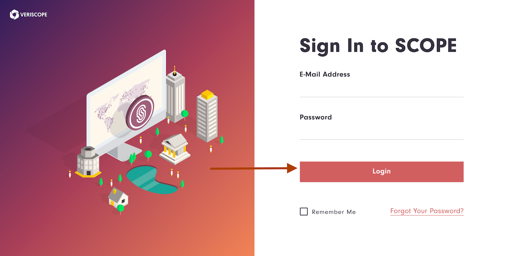
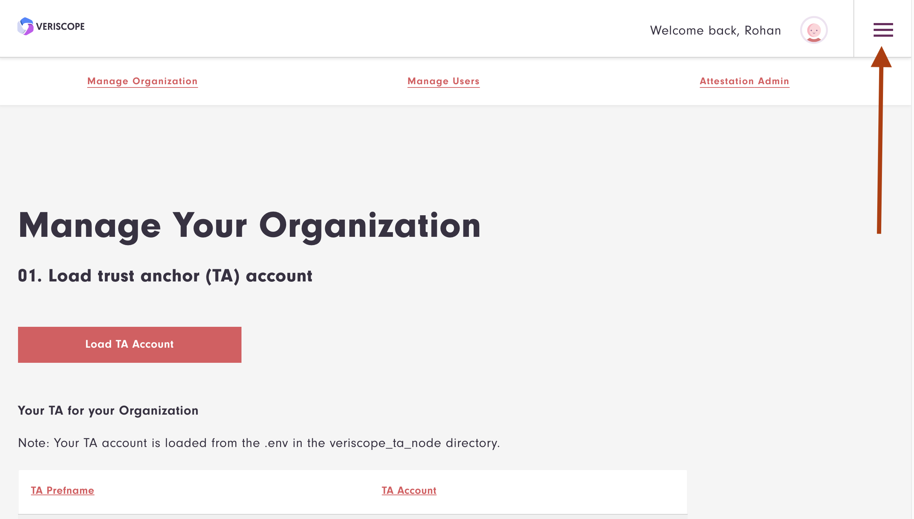
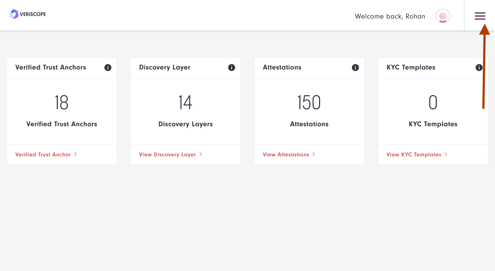
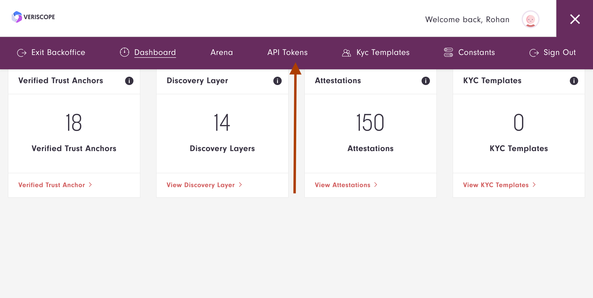
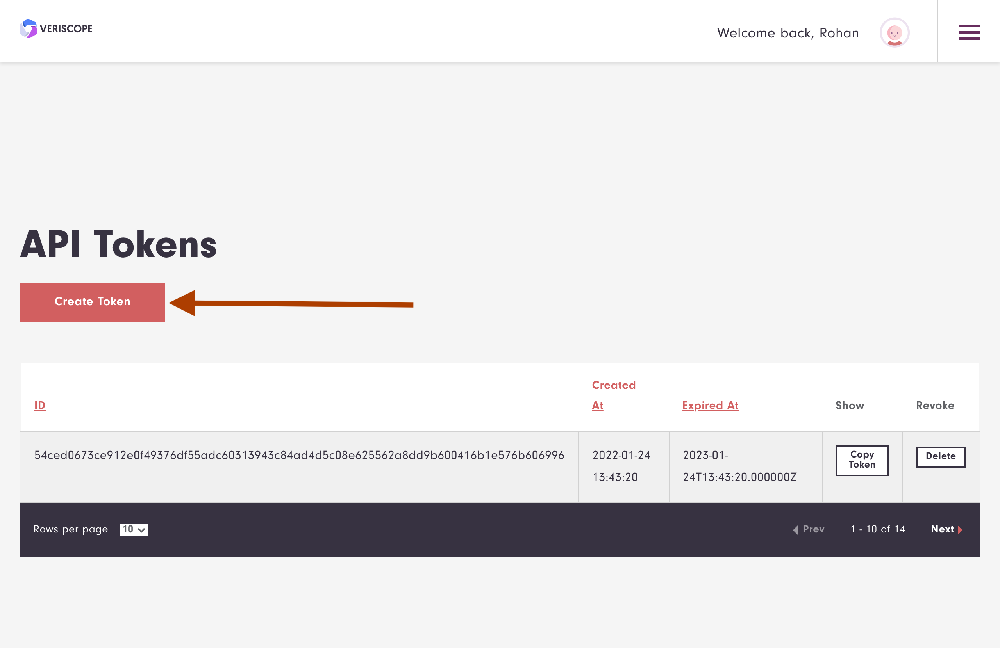
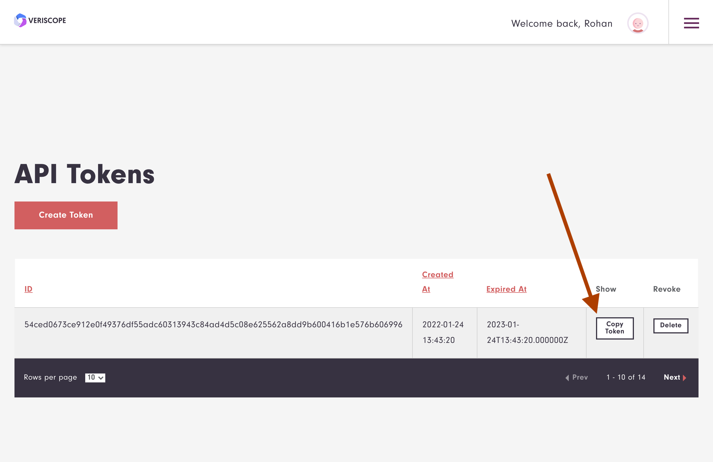
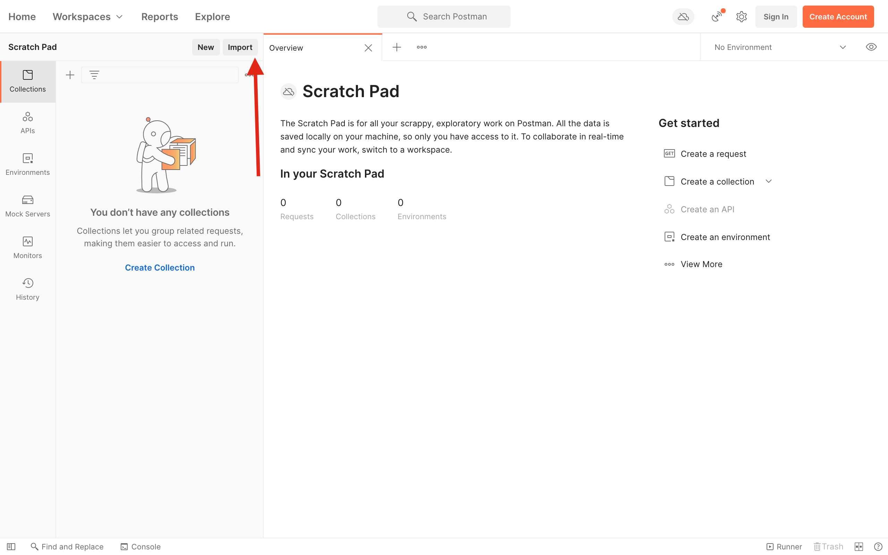
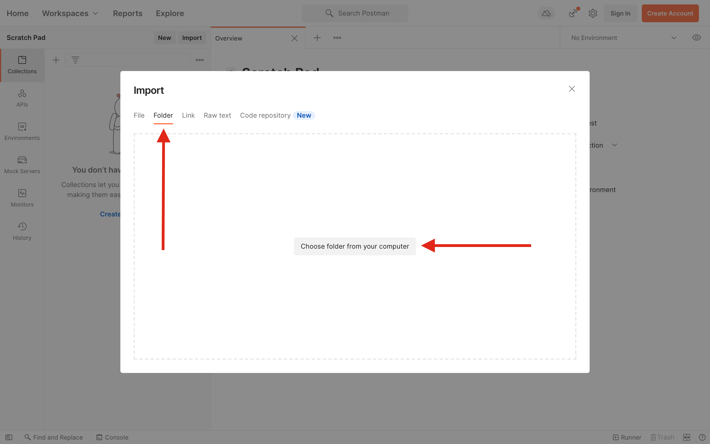
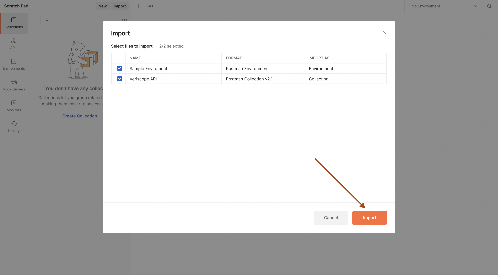
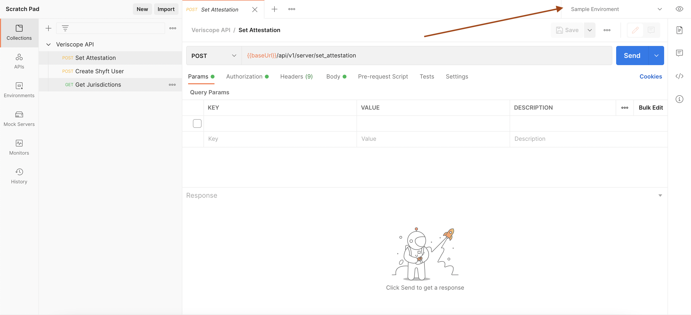

## How To Create an API Access Token

There are a number of API requests available which can be authenticated via an API token.  Follow the guide below to create and manage your API token before integrating any of the available API requests.

#### 1. Sign in

Enter your Email address and Password to login.




#### 2. Backoffice

Choose the Hamburger menu on the right side of the screen and select Backoffice.




#### 3. API tokens

Choose Hamburger menu again and select API Tokens.





#### 4. Create tokens

Choose Create Token button on the left side of the page to create a new token.



#### 5. Copy tokens

Once you have created a token you can choose Copy Token to save the token in your browser clipboard.  You will use the token in the clipboard as the token in the Postman Collection below.



## How to use Veriscope API without postman

Set request headers - 
Authorization: `Bearer ${token}`
${token} - token generated in shyft api settings

## How to use Veriscope Postman API

[Postman](https://getpostman.com/) is an API Collaboration Platform.

Veriscope now offers several Postman Collections and Environments (JSON files) for a quicker and easier usage of our RESTful APIs.
You only need to import and set up with your own API and secret keys to begin.

#### How to import and configure

- Download the `veriscope-api-postman` repository.

- Click the `Import` button. On Postman for Mac, for example, the button is at the top left:

  

- On the `Import` pop-up page, select the `Folder` tab. Click the `Choose folder from your computer` button and choose the API-Docs/veriscope-api-postman folder of the downloaded repository.

  

- Select which collections and environments you would like to import and click the `Import` button.

  

- Select the `Environments` tab on the left, choose an environment, and set your Base  URL and Token by changing the `Current Value` column (see screenshot);

  

- Select your newly-added environment from the environment dropdown menu. On Mac, this is at top right, to the left of the eye icon.

  

## Postman safety practices

The following practices are advised to secure your account's safety:

- Don't use Collections obtained from an unknown source.
- Review the environment JSON file before its usage.
- Don't use any code that you don't understand.
- Make sure that the withdrawal permission **is not enabled** for your API keys.

## FAQ

**Q:** Why I can't get any response?

You haven't imported the environment file or you've imported it but haven't selected it from the dropdown menu

**Q:** How can I debug a request or find the used URL?

- Open the Postman's console to find requests' parameters and URL.


## API Examples

## Create Shyft User
```
POST {{baseUrl}}/api/v1/server/create_shyft_user
```
Response
```
{
    "address": "0x231aaef9a7665622f825bc7f613c861d31f14844",
    "privateKey": "a3d4406fd7846a256f7f57c4aa758f7fa356ca514229810278cabe52747021d1",
    "publicKey": "9134f44795a92e87872d2acc85c14baa624bccac65ef273d30182279025553f4a891613a537e633088f14a9612d10fc4b786bbc71b9f925d97c58d427086ecf5"
}
```
**Note:** use "address": "0x231aaef9a7665622f825bc7f613c861d31f14844" to represent your Shyft User ID (user_address) in Set Attestation example below.

## Get Jurisdictions
```
GET {{baseUrl}}/api/v1/server/get_jurisdictions
```
Response
```
[
    {
        "id": 1,
        "sortname": "AF",
        "name": "Afghanistan",
        "created_at": "2022-01-24T20:39:37.000000Z",
        "updated_at": "2022-01-24T20:39:37.000000Z"
    },
    {
        "id": 2,
        "sortname": "AL",
        "name": "Albania",
        "created_at": "2022-01-24T20:39:37.000000Z",
        "updated_at": "2022-01-24T20:39:37.000000Z"
    },...
    {
        "id": 246,
        "sortname": "ZW",
        "name": "Zimbabwe",
        "created_at": "2022-01-24T20:39:37.000000Z",
        "updated_at": "2022-01-24T20:39:37.000000Z"
    }
]

```
**Note:** "id": 1 as jurisdiction in Set Attestation example below.
## Set Attestation
Params:
ta_address use your TA account in Manage Organization
user_address from example above or by creating a random user in Manage Users
documents_matrix_encrypted is the crypto withdrawal address from your exchange
availability_address_encrypted is the blockchain (eg BTC, ETH)
```
POST {{baseUrl}}/api/v1/server/set_attestation
```
Request Body
```
jurisdiction: "1"
attestation_type: "WALLET"
user_address: "0x1Ba96127AFa2B9FDE25E0Afd92A1EBAe98e3344A"
public_data: "WALLET"
documents_matrix_encrypted: "0x447832bc6303C87A7C7C0E3894a5C6848Aa24877"
availability_address_encrypted: "ETH"
ta_address: "0x3B5D04F55946690873A7E05Cb9E5A6f5363774cB"
```

## Get Verified Trust Anchors
```
GET {{baseUrl}}/api/v1/server/get_verified_trust_anchors
```
Response
```
[
    {
        "id": 38,
        "account_address": "0x10a32419ABcfbaaae91D0e03bc8390c418E65680",
        "created_at": "2022-01-24T21:15:31.000000Z",
        "updated_at": "2022-01-24T21:15:31.000000Z"
    },...
    {
        "id": 50,
        "account_address": "0xee98c82d995E65B96A570fA50213B0Ce558Cf7F9",
        "created_at": "2022-01-24T21:15:31.000000Z",
        "updated_at": "2022-01-24T21:15:31.000000Z"
    }
]
```

## Is Trust Anchor Verified
```
GET {{baseUrl}}/api/v1/server/verify_trust_anchor/0x10a32419ABcfbaaae91D0e03bc8390c418E65680
```
Response
```
{
    "address": "0x10a32419ABcfbaaae91D0e03bc8390c418E65680",
    "verified": true
}
```

## Get Trust Anchors Details
```
GET {{baseUrl}}/api/v1/server/get_trust_anchor_details/0xc2106031Dac53b629976e12aF769F60afcB38793
```
Response
```
[
    {
        "id": 5,
        "transaction_hash": "0x0cffd2f568c2c7fb2b989501c77e070a63f3a7d513829b6ae3dea9a4978ef225",
        "trust_anchor_address": "0xc2106031Dac53b629976e12aF769F60afcB38793",
        "key_value_pair_name": "ENTITY",
        "key_value_pair_value": "Paycase Inc.",
        "created_at": "2022-01-24T20:44:07.000000Z",
        "updated_at": "2022-01-24T20:44:07.000000Z"
    },
    {
        "id": 7,
        "transaction_hash": "0xf2a69553e68453d42398feaad0e5c04756f9d6d722bac1f7fe97cfb108aea969",
        "trust_anchor_address": "0xc2106031Dac53b629976e12aF769F60afcB38793",
        "key_value_pair_name": "API_URL",
        "key_value_pair_value": "https://paycase.veriscope.network/kyc-template",
        "created_at": "2022-01-24T20:44:07.000000Z",
        "updated_at": "2022-01-24T20:46:59.000000Z"
    },
    {
        "id": 47,
        "transaction_hash": "0x35ec28970de7d2d4399b1c2fa3ea4e6336874f8ce5c544858f6a6bca38f15ed1",
        "trust_anchor_address": "0xc2106031Dac53b629976e12aF769F60afcB38793",
        "key_value_pair_name": "API_URL",
        "key_value_pair_value": "https://paycase.veriscope.network/",
        "created_at": "2022-01-24T21:15:46.000000Z",
        "updated_at": "2022-01-24T21:15:46.000000Z"
    }
]
```

## Get Trust Anchor API_URL
```
GET {{baseUrl}}/api/v1/server/get_trust_anchor_api_url?ta_address=0x2312e5209760aF088338CE7765531333F3F0e265
```
Response
```
{
    "id": 40,
    "transaction_hash": "0xb9f57c90eeb42816b76f63a8b80f04f0d32385c935b81661ba3835d97d9e9d05",
    "trust_anchor_address": "0x2312e5209760aF088338CE7765531333F3F0e265",
    "key_value_pair_name": "API_URL",
    "key_value_pair_value": "https://q2.veriscope.network/kyc-template",
    "created_at": "2022-03-07T16:36:37.000000Z",
    "updated_at": "2022-03-07T16:36:37.000000Z"
}
```

## Get Trust Anchor Account
```
GET {{baseUrl}}/api/v1/server/get_trust_anchor_account
```
Response
```
{
    "id": 1,
    "ta_prefname": "q1",
    "ta_jurisdiction": 0,
    "user_id": 1,
    "created_at": "2022-03-07T16:20:23.000000Z",
    "updated_at": "2022-03-07T16:20:23.000000Z",
    "account_address": "0x1bD8d3A9AF399Bfdcd17e45DA27c13C05ef64892",
    "public_key": "00553963a21d50d804e5673fcf3993891026ea3866868bacc385fe805794871f9a85f7f0f8d29fb075823de460062ca58b29d7f5eafc196fb1f71c6ab60e4a78",
    "signature_hash": "0x0b709dd4809f36a22fe48250b24a5e41e8aea491bace26627f5c68ea9b4fad3f",
    "signature": "{\"r\":\"0xb7daa8b110e53c70ac261694c45c96d910e482eb9164afc516710be29b2c8067\",\"s\":\"0x292703a76e67a4b20ff67cd0229a66f73cf6e0c8e780979bb5fb7f6313a26d86\",\"v\":\"0x25\"}",
    "legal_person_name": null,
    "legal_person_name_identifier_type": null,
    "address_type": null,
    "street_name": null,
    "building_number": null,
    "building_name": null,
    "postcode": null,
    "town_name": null,
    "country_sub_division": null,
    "country": null
}
```

## Get Attestations
```
GET {{baseUrl}}/api/v1/server/get_trust_anchor_account
```
params:
- page:1
- perPage:10
- searchTerm:0x48fA45507423246fDE59F5123312beAC05A87F84 (use TA Account, User Account, Attestation Hash or Crypto Address)

Response
```
{
    "serverParams": {
        "page": 1,
        "perPage": 10
    },
    "totalRecords": 1,
    "rows": [
        {
            "id": 2,
            "ta_account": "0x1bD8d3A9AF399Bfdcd17e45DA27c13C05ef64892",
            "jurisdiction": "196",
            "effective_time": "1615070316",
            "expiry_time": "1678315116",
            "public_data": "0x5700000000000000000000000000000000000000000000000000000000000000",
            "documents_matrix_encrypted": "0x3700000000000000000000000000000000000000000000000000000000000000",
            "availability_address_encrypted": "0x2020202020202020202020202020202020202020202020202020202020455448",
            "is_managed": "1",
            "attestation_hash": "0xd6f0e5fe6c38ca9575082382f495a2e7ff524e1dac102c02dc1e710ca4b7c0dd",
            "transaction_hash": "0xe1723f9bb89a76d99da82972c37efd64d257dc6e1d7abe2df9af03f1d7a25049",
            "user_account": "0x1C982A37a77b9ae26E077E9bA15b22EC5dD74B19",
            "created_at": "2022-03-07T22:38:47.000000Z",
            "updated_at": "2022-03-07T22:38:47.000000Z",
            "public_data_decoded": "WALLET",
            "documents_matrix_encrypted_decoded": "0x48fA45507423246fDE59F5123312beAC05A87F84",
            "availability_address_encrypted_decoded": "ETH"
        }
    ]
}
```

## Create KYC Template
```
POST {{baseUrl}}/api/v1/server/create_kyc_template
```
params:

- attestation_hash: 0xd6f0e5fe6c38ca9575082382f495a2e7ff524e1dac102c02dc1e710ca4b7c0dd
- user_account: 0x1cde6938088edcef189a4599ce1331132fc1903c
- user_public_key: d72c12651ff33196f59f82266158c9c9ccf552461538c47413bc2d9baa2a68c01b0316807189a9c764852ddd3370417a24dec0ab0f774313423ab893243c2f62
- user_signature: { "r": "0xe39db18a6a3465286f16fc43c7e9d2f63f659ff1471eb764cdb1a0961a2beeda", "s": "0x581dd235c7ff28958dabacd08d91b82b673501f4e453ccb3dd314e45795eab7a", "v": "0x25" }
- user_signature_hash: 0x7ec005c40fadb64f4180dcc14d9f5927f649096a08478a4a5a112a3aa77ca549

Note: attestation_hash from Beneficiary: Get Attestation by Crypto Address above.
- ivms_encrypt (Optional)

Response
```
{
    "attestation_hash": "0xd6f0e5fe6c38ca9575082382f495a2e7ff524e1dac102c02dc1e710ca4b7c0dd",
    "updated_at": "2022-03-07T23:21:58.000000Z",
    "created_at": "2022-03-07T23:21:58.000000Z",
    "id": 5,
    "crypto_address_type": "ETH",
    "crypto_address": "0x48fA45507423246fDE59F5123312beAC05A87F84",
    "sender_ta_address": "0x1bD8d3A9AF399Bfdcd17e45DA27c13C05ef64892",
    "sender_user_address": "0x1C982A37a77b9ae26E077E9bA15b22EC5dD74B19",
    "kyc_template_state_id": 7,
    "beneficiary_ta_address": "0x2312e5209760aF088338CE7765531333F3F0e265",
    "beneficiary_user_address": "0x1cde6938088edcef189a4599ce1331132fc1903c",
    "beneficiary_ta_public_key": "0a3a43061bdd42b1adc029e64be48503c0b4ec717d092bf37f83d40ab526cd44c88c33945ae598e2bd234f7d9c8096f4b26d1833d393f95c444531c53a377f6d",
    "beneficiary_user_public_key": "d72c12651ff33196f59f82266158c9c9ccf552461538c47413bc2d9baa2a68c01b0316807189a9c764852ddd3370417a24dec0ab0f774313423ab893243c2f62",
    "beneficiary_ta_signature_hash": "0x0b709dd4809f36a22fe48250b24a5e41e8aea491bace26627f5c68ea9b4fad3f",
    "beneficiary_ta_signature": "{\"r\":\"0xe8f8a258f054de3c0a235eaffec390bd4665dd2d437864a09cdc7af200419166\",\"s\":\"0x3ceaf779d5dd685d477708ac2eb7306fd8b2d7c03a739c9b206d4972ee9564c0\",\"v\":\"0x25\"}",
    "beneficiary_user_signature_hash": "0x7ec005c40fadb64f4180dcc14d9f5927f649096a08478a4a5a112a3aa77ca549",
    "beneficiary_user_signature": "{\"r\": \"0xe39db18a6a3465286f16fc43c7e9d2f63f659ff1471eb764cdb1a0961a2beeda\",\"s\": \"0x581dd235c7ff28958dabacd08d91b82b673501f4e453ccb3dd314e45795eab7a\",\"v\": \"0x25\"}",
    "sender_ta_url": "https://q1.veriscope.network/kyc-template",
    "beneficiary_ta_url": "https://q2.veriscope.network/kyc-template"
}
```

## Encrypt IVMS
```
POST {{baseUrl}}/api/v1/server/encrypt_ivms
```
params:

- public_key:5f6b31cc3ec4223529cee40422504a5ba74680b9c6faa44ff2cb1520da9bcd35155974578a6e302ea30f0016f84f7829ff0d2ae97aa4f1ff5a76b13970797f53
- ivms_json:{"beneficiary":"kyc"}

Response
```
"BN4vXJxHjoy0uG9FF9KbGvIiCB2q19URxT7n4rh6qdjWOqDAq7vQgR7yxllpKqbF1lrYPMQOMmsp4nxLffA8dI+Yed2/JFICiwf05Twa/tcv85YJ82gukhzN0GrvIKwOxS8fkjK4H+d1x82Qe78oT/bp9FusEsxcbuq9u0SORtFGhNiP3VahrxoyXH8="
```

## Decrypt IVMS
```
POST {{baseUrl}}/api/v1/server/decrypt_ivms
```
params:

- private_key:0x5236fbe797c9b4bf98b1bb893b827186236df6dba203cafabb593e6661b5b52c
- kyc_data:BN4vXJxHjoy0uG9FF9KbGvIiCB2q19URxT7n4rh6qdjWOqDAq7vQgR7yxllpKqbF1lrYPMQOMmsp4nxLffA8dI+Yed2/JFICiwf05Twa/tcv85YJ82gukhzN0GrvIKwOxS8fkjK4H+d1x82Qe78oT/bp9FusEsxcbuq9u0SORtFGhNiP3VahrxoyXH8=

Response
```
"{\"beneficiary\":\"kyc\"}"
```

## Get KYC Templates
```
GET {{baseUrl}}/api/v1/server/get_kyc_templates?page=1&perPage=10&searchTerm=
```
params:

- page:1
- perPage:10
- searchTerm: (use TA Account, User Account, Attestation Hash)

Response
```
"{\"beneficiary\":\"kyc\"}"
```

## Recover Beneficiary TA Signature
```
GET {{baseUrl}}/api/v1/server/recover_signature
```
params:

```
{
    "type":"BeneficiaryTA",
    "template": {
        "BeneficiaryTAAddress":"0x2312e5209760aF088338CE7765531333F3F0e265",
        "BeneficiaryTAPublicKey":"0a3a43061bdd42b1adc029e64be48503c0b4ec717d092bf37f83d40ab526cd44c88c33945ae598e2bd234f7d9c8096f4b26d1833d393f95c444531c53a377f6d",
        "BeneficiaryTASignatureHash":"0x0b709dd4809f36a22fe48250b24a5e41e8aea491bace26627f5c68ea9b4fad3f",
        "BeneficiaryTASignature":{"r":"0xe8f8a258f054de3c0a235eaffec390bd4665dd2d437864a09cdc7af200419166","s":"0x3ceaf779d5dd685d477708ac2eb7306fd8b2d7c03a739c9b206d4972ee9564c0","v":"0x25"}
    }
}
```

Response
```
{"beneficiaryTAPublicKey":"found match","beneficiaryTAAddress":"found match"}
```

## Recover Originator TA Signature
```
GET {{baseUrl}}/api/v1/server/recover_signature
```
params:

```
{
    "type":"SenderTA",
    "template": {
        "SenderTAAddress":"0x1bD8d3A9AF399Bfdcd17e45DA27c13C05ef64892",
        "SenderTAPublicKey":"00553963a21d50d804e5673fcf3993891026ea3866868bacc385fe805794871f9a85f7f0f8d29fb075823de460062ca58b29d7f5eafc196fb1f71c6ab60e4a78",
        "SenderTASignatureHash":"0x0b709dd4809f36a22fe48250b24a5e41e8aea491bace26627f5c68ea9b4fad3f",
        "SenderTASignature":{"r":"0xb7daa8b110e53c70ac261694c45c96d910e482eb9164afc516710be29b2c8067","s":"0x292703a76e67a4b20ff67cd0229a66f73cf6e0c8e780979bb5fb7f6313a26d86","v":"0x25"}
        }
}
```

Response
```
{"senderTAPublicKey":"found match","senderTAAddress":"found match"}
```

## Recover Beneficiary User Signature
```
GET {{baseUrl}}/api/v1/server/recover_signature
```
params:

```
{
    "type":"BeneficiaryUser",
    "template": {
        "BeneficiaryUserAddress":"0x4051ecc9f76bced2b869057d792450702428311b",
        "BeneficiaryUserPublicKey":"8302e66c2d55e0ecbe232a6e4dc9ca7c481ae15a79e5184a748ed0450ac250937852bb6a0d703d35c18e507fd36f4e93a8875b89ef047ede2209d37b1790bed7",
        "BeneficiaryUserSignatureHash":"0x7ec005c40fadb64f4180dcc14d9f5927f649096a08478a4a5a112a3aa77ca549",
        "BeneficiaryUserSignature":{"r":"0x3cdf51a840d754a0ad561d4927105fcf478d9d686265706e266b692f85646baf","s":"0x6bb3834e1f49efa94800dea40f3f1dd6e4af14150c8681edfb7d45a5d8ac4881","v":"0x25"}
        }
}
```

Response
```
{"beneficiaryUserPublicKey":"found match","beneficiaryUserAddress":"found match"}
```

## Recover Originator User Signature
```
GET {{baseUrl}}/api/v1/server/recover_signature
```
params:

```
{
    "type":"BeneficiaryUser",
    "template": {
        "BeneficiaryUserAddress":"0x4051ecc9f76bced2b869057d792450702428311b",
        "BeneficiaryUserPublicKey":"8302e66c2d55e0ecbe232a6e4dc9ca7c481ae15a79e5184a748ed0450ac250937852bb6a0d703d35c18e507fd36f4e93a8875b89ef047ede2209d37b1790bed7",
        "BeneficiaryUserSignatureHash":"0x7ec005c40fadb64f4180dcc14d9f5927f649096a08478a4a5a112a3aa77ca549",
        "BeneficiaryUserSignature":{"r":"0x3cdf51a840d754a0ad561d4927105fcf478d9d686265706e266b692f85646baf","s":"0x6bb3834e1f49efa94800dea40f3f1dd6e4af14150c8681edfb7d45a5d8ac4881","v":"0x25"}
        }
}
```

Response
```
{"senderUserPublicKey":"found match","senderUserAddress":"found match"}
```

## Get Blockchain Analytics Providers
```
GET {{baseUrl}}/api/v1/server/get-blockchain-analytics-providers
```
Response
```
    {
        "id": 1,
        "name": "Crystal",
        "description": "Crystal powers cryptocurrency transaction analysis and monitoring on the blockchain, bringing best-in-class anti-money laundering compliance and risk management solutions to exchanges, banks, and financial institutions."
    },
    {
        "id": 2,
        "name": "Merkle Science",
        "description": "Merkle Science's Block Monitor is an enterprise-grade, real-time cryptocurrency transaction monitoring and wallet monitoring."
    }
```

## Get Blockchain Analytics Provider Available Networks
Params:
provider_id: blockchain analytics provider id
```
GET {{baseUrl}}/api/v1/server/get-blockchain-analytics-providers-available-networks/{provider_id}
```
Response
```
    {
        "id": 1,
        "blockchain_analytics_provider_id": 1,
        "ticker": "btc",
        "name": "Bitcoin",
        "provider_network_id": null
    },
    ...
```

## Generate Blockchain Analytics Report
```
POST {{baseUrl}}/api/v1/server/generate-blockchain-analytics-report
```
Request Body
```
providerId: "1"
network: "eth"
address: "0x6cC5F688a315f3dC28A7781717a9A798a59fDA7b"
```
Response
```
{
    "blockchain_analytics_provider_id": 2,
    "trust_anchor": "unknown",
    "user_account": "unknown",
    "blockchain": "eth",
    "crypto_address": "0x6cC5F688a315f3dC28A7781717a9A798a59fDA7b",
    "custodian": "OKEx",
    "response": ...,
    "response_status_code": 200,
    "id": 123
}
```
**Note:** Analytics Providers may have different response payloads

