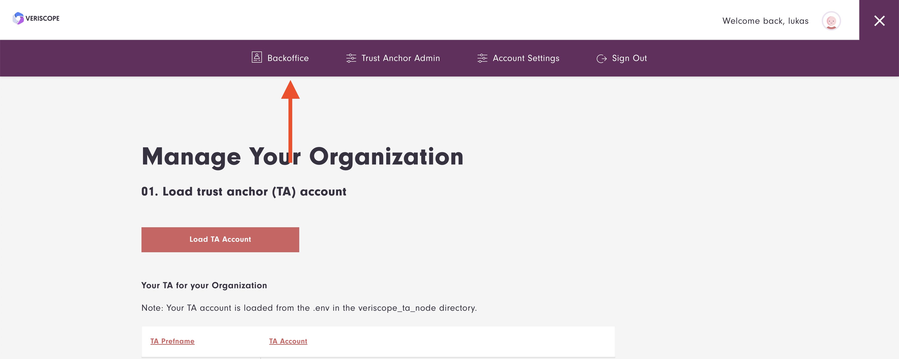
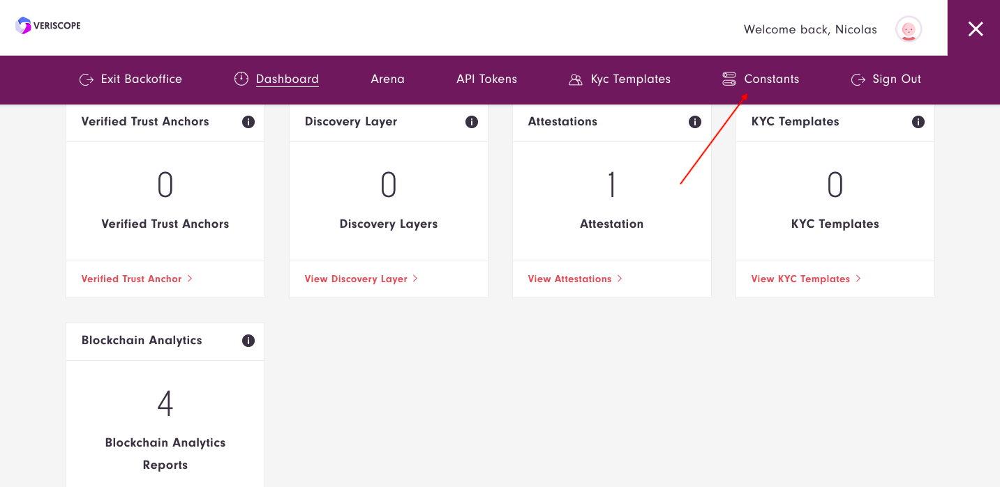
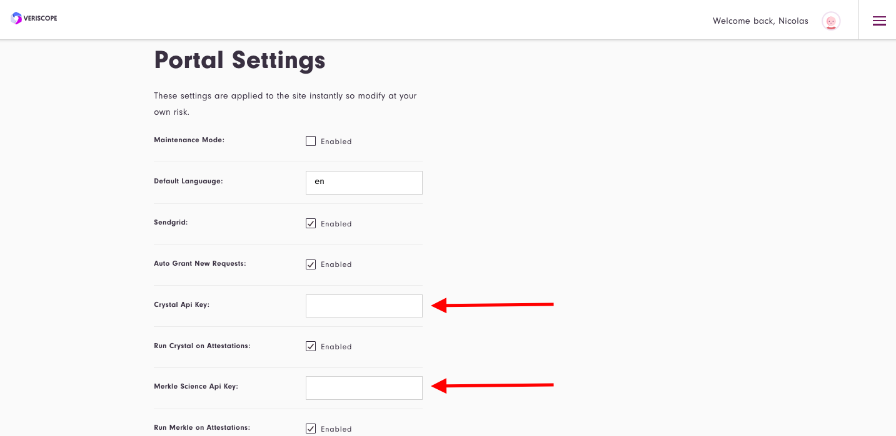
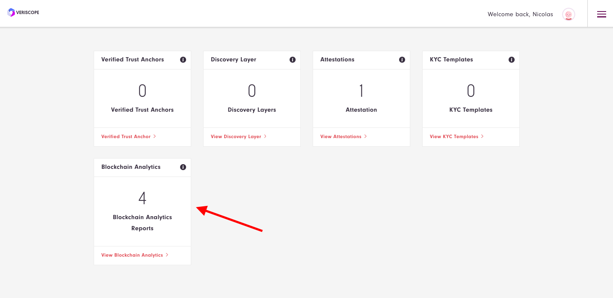
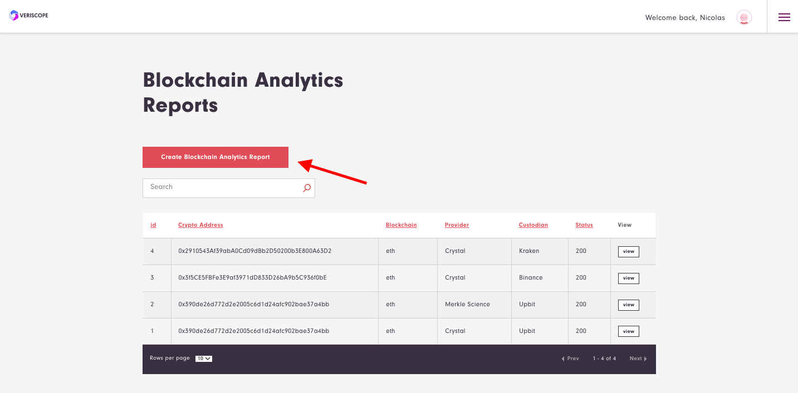
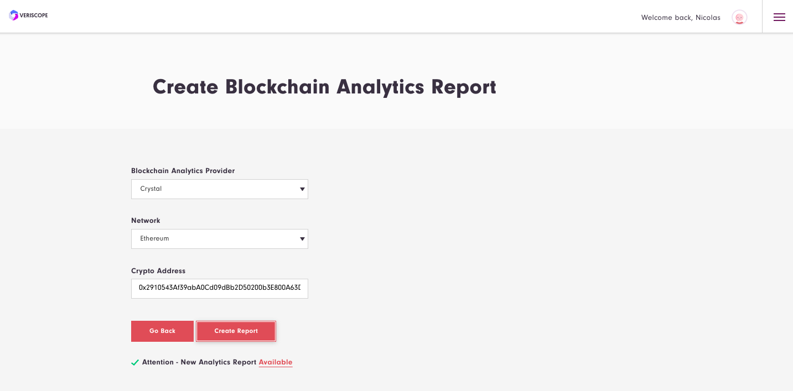
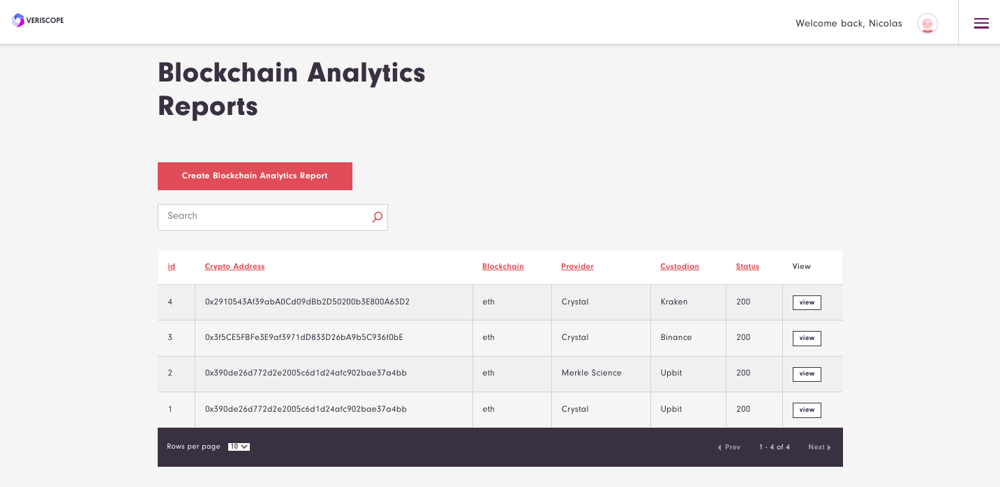
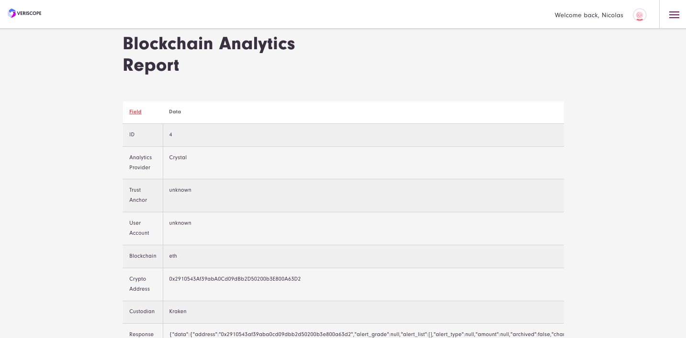

## How To Connect Your Blockchain Analytics Provider

While posting wallet attestions, you have an option to get Blockchain Analytics reports indicating if the crypto wallet is custodial; hosted by another VASP.

Below describes how to include crypto wallet reports by your Blockchain Analytics provider along with your attestations.

#### Currently Available Analytics Providers

| Analytics Provider | Website                        |
|--------------------|--------------------------------|
| Crystal Blockchain | https://crystalblockchain.com/ |
| Merkle Science     | https://www.merklescience.com/ |

**Note:** Before you continue, ensure you have an API key for either provider above.

### Adding your API key to Veriscope

#### 1. Select Backoffice From Menu

#### 2. Select Constants From Menu

Once you are in backoffice select Constants from menu

#### 3. Add API Keys

In Constants page (Portal Settings), you can add your blockchain analytics provider API key. Checkbox "Run (Analytics provider) on Attestations" means whenever you make an attestation all enabled analytics providers will check if that crypto address belongs to a custodian.

#### 3. Create Blockchain Analytics Report

To generate a report, choose Blockchain Analytics Reports card in the dashboard.

Click on "Create Blockchain Analytics Report" button

Select Analytics Provider you want to use, select Network and enter the Crypto Address, click "Create Report" button. After few seconds a notification will pop up with link to the generated report.

#### 4. Analytic Provider Reports

To check analytic provider reports return to backoffice page and click on Blockchain Analytics Reports card.

You will be provided with a table consisting off all reports you have generated. You can sort by table columns and search by Custodian Name and Crypto Address.

Table columns are ID, Crypto Address, Blockchain, Analytics Provider, found Custodian and response status number. Press "View" button to go to more detailed view.

For your convience below are a couple addresses you can query to test your Blockchain Analytics API Key.

| Crypto Address | Network | Custodian |
|--|--|--|
| 0x2910543Af39abA0Cd09dBb2D50200b3E800A63D2 | eth | Kraken |
| 0x3f5CE5FBFe3E9af3971dD833D26bA9b5C936f0bE | eth | Binance |
| 0x390de26d772d2e2005c6d1d24afc902bae37a4bb | eth | Upbit |

#### 5. API Token Access to Blockchain Analytics

Each of the functions described above can be accessed via your API Token.  Please refer to section Get Blockchain Analytics Providers in [API Docs](/API-Docs/README.md#get-blockchain-analytics-providers) for more details