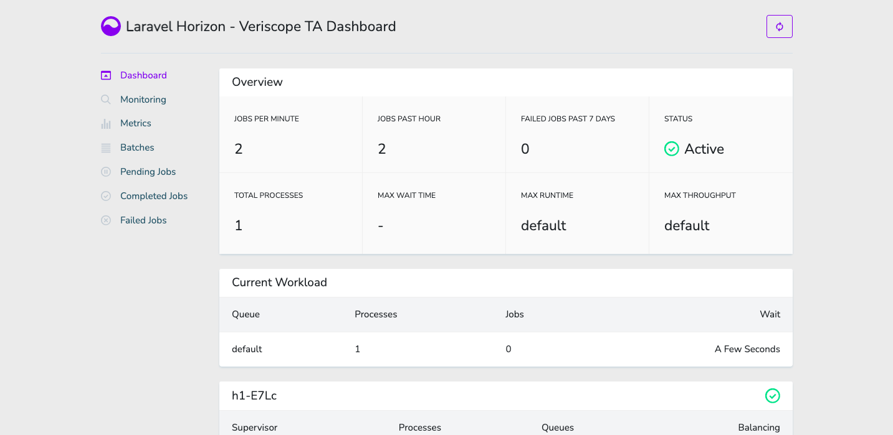
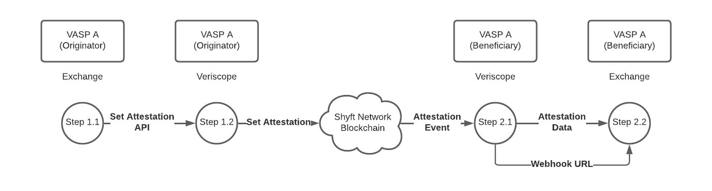
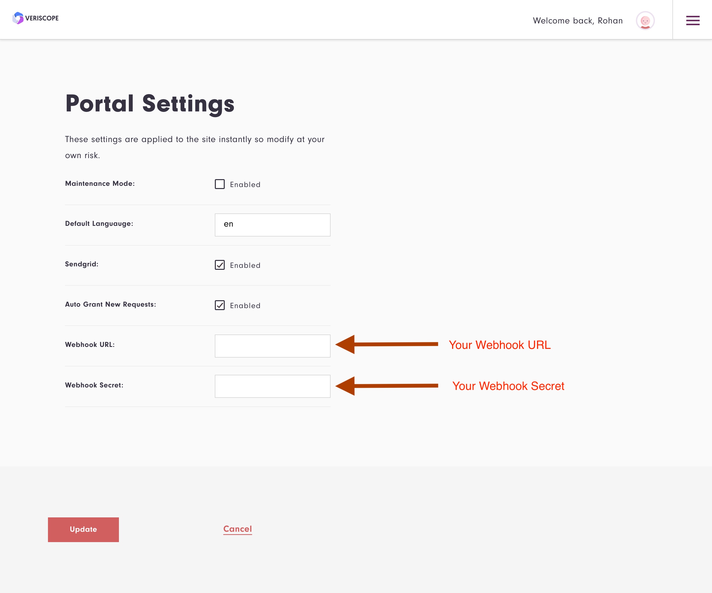
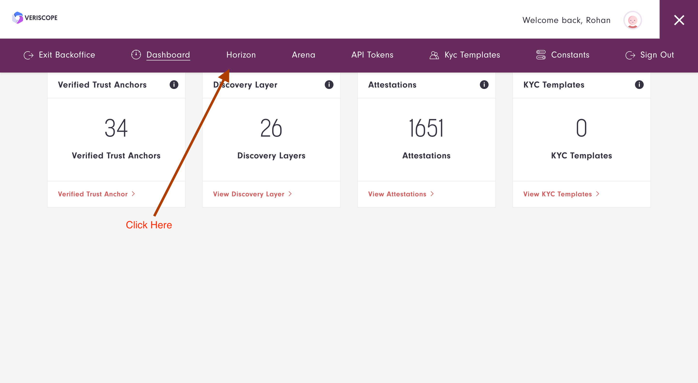
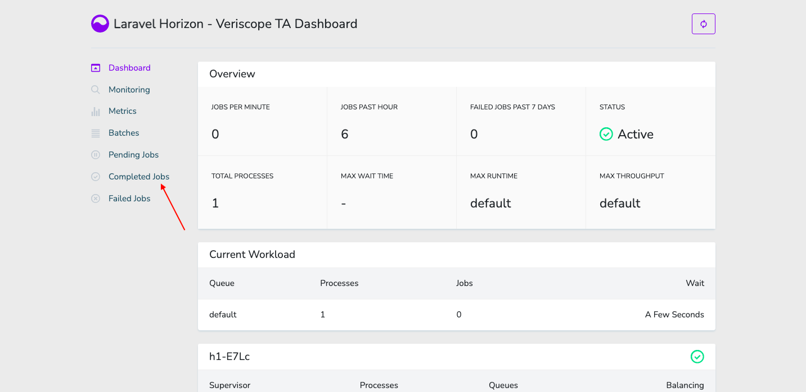
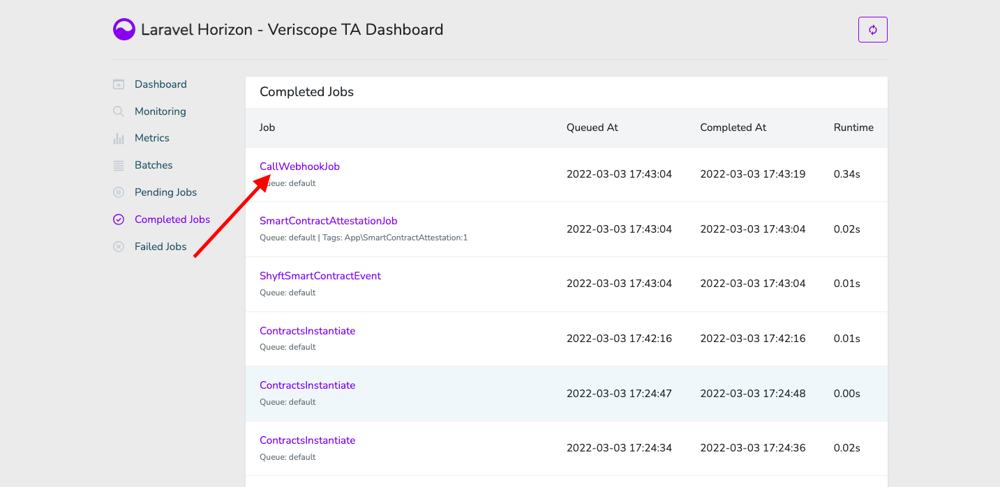
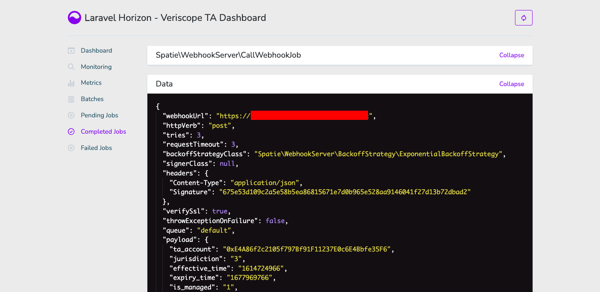

## Description

[Laravel Horizon](https://github.com/laravel/horizon) provides a beautiful dashboard and code-driven configuration for your Laravel powered [Redis queues](https://laravel.com/docs/8.x/queues) and allows you to easily monitor key metrics of your queue system such as job throughput, runtime, and job failures.



### Problem

When VASPs post attestations to the Shyft Blockchain in Step 1 these attestations arrive to all connected VASPs in Step 2 as events.



Attestations in Step 2.1 are sent over to the Exchange via a custom webhook that is configured below.

As you can imagine there will be millions of attestations in the Shyft Blockchain, one for every crypto withdrawal from each Exchange.  Therefore Veriscope uses a Horizon/Redis queuing framework to post these attestations as they arrive directly to the exchange.

When the exchange receives the attestation, it can confirm if the crypto address (in the attestation) is a deposit address on their exchange.  If so, it can proceed by preparing the KYC Template (Step 3).

Below describes the setup and configuration for Horizon.

## Update Instructions

```bash
cd /opt/veriscope
$ sudo scripts/setup-vasp.sh 
+ Located in /opt/veriscope/
+ Service user will be forge


1) Refresh dependencies
2) Install/update nethermind
3) Set up new postgres user
4) Obtain/renew SSL certificate
5) Install/update NGINX
6) Install/update node.js web service
7) Install/update PHP web service
8) Update static node list for nethermind
9) Create admin user
10) Regenerate webhook secret
11) Regenerate oauth secret (passport)
12) Regenerate encrypt secret (EloquentEncryption)
13) Install Redis server
14) Install Passport Client Environment Variables
15) Install Horizon
i) Install Everything
p) show daemon status
w) restart all services
r) reboot
q) quit
Choose what to do: 15

```

Run Step 15 above.

## Webhook config for Horizon

Log into the backoffice and choose Constants.


When in constants (Portal Settings) add your custom Webhook URL and Webhook Secret.

Choose Update to save the Webhook URL and Secret.

**Note:** Webhook URL should be the Exchange host API service to receive attestations (Step 2.1 and Step 2.2 above).



## Webhook Jobs

When Veriscope receives an attestation event (Step 2.1) it will add the payload to Horizon and post it to the Webhook URL.

To view Completed Jobs, navigate to the Horizon Dashboard. 



Choose Completed Jobs.



Successful Webhook jobs are called "CallWebhookJob".  To view the job details choose "CallWebhookJob".



Displayed are the details of the Webhook Post.



Below is an example of the payload sent to the Webhook URL.

```
{
	"webhookUrl": "https://.......",
	"httpVerb": "post",
	"tries": 3,
	"requestTimeout": 3,
	"backoffStrategyClass": "Spatie\WebhookServer\BackoffStrategy\ExponentialBackoffStrategy",
	"signerClass": null,
	"headers": {
	"Content-Type": "application/json",
	"Signature": "675e53d109c2a5e58b5ea86815671e7d0b965e528aa9146041f27d13b72dbad2"
},
"verifySsl": true,
"throwExceptionOnFailure": false,
"queue": "default",
"payload": {
	"ta_account": "0xE4A86f2c2105f797Bf91F11237E0c6E4Bbfe35F6",
	"jurisdiction": "3",
	"effective_time": "1614724966",
	"expiry_time": "1677969766",
	"is_managed": "1",
	"attestation_hash": "0xcbab0f6a75039b34845effdefd3c1ca7d11a25fd3643cfc7ce9a97abe3c10881",
	"transaction_hash": "0xca132d87a85bfad2533133a15ee0a7fac64210f126d3ccdbbdada526257b63fc",
	"user_account": "0x2075CE29Fb03796ab057f02c8241f3Ce969aBA1d",
	"public_data_decoded": "WALLET",
	"documents_matrix_encrypted_decoded": "0x6ec88a2cb932eb46dfda0280c0eadb93b6eca13b",
	"availability_address_encrypted_decoded": "ETH"
},
"meta": [
],
"tags": [
],
"uuid": "e2b0223c-8653-424d-a3bc-722f1692ff21",
"response": null,
"errorType": null,
"errorMessage": null,
"transferStats": null,
"job": null,
"connection": null,
"chainConnection": null,
"chainQueue": null,
"chainCatchCallbacks": null,
"delay": null,
"afterCommit": null,
"middleware": [
],
"chained": [
]
}
```

Note the **Signature** and **payload**.

"documents_matrix_encrypted_decoded": "0x6ec88a2cb932eb46dfda0280c0eadb93b6eca13b" is the crypto address to store and query against deposit addresses in the Exchange.

Signature is the header param you can use to verify the webhook payload originated from Veriscope.

# Signed Signature Verification
We add a header called Signature that will contain a signature the receiving app can use the payload hasn't been tampered with. This is how that signature is calculated:

```php
// payload is the array passed to the `payload` method of the webhook
// secret is the string given to the `signUsingSecret` method on the webhook.
$payloadJson = json_encode($payload);

$signature = hash_hmac('sha256', $payloadJson, $secret);
```


