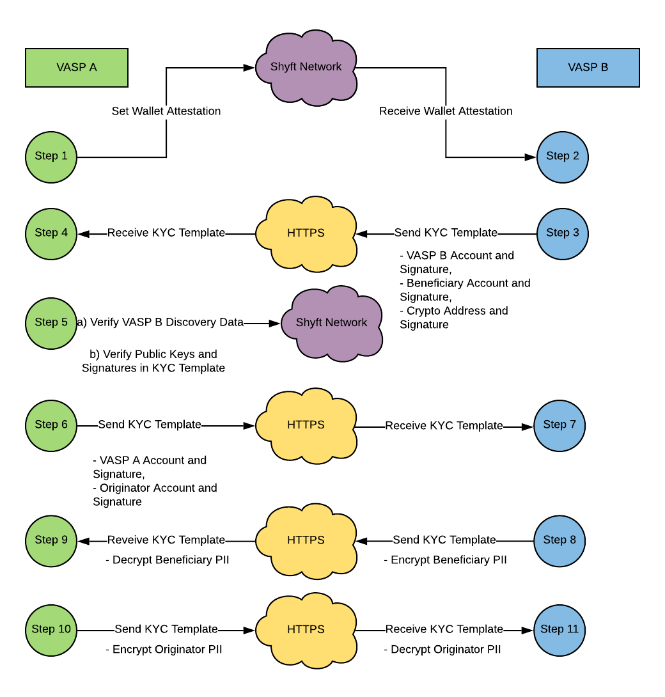

# Veriscope
KYC Template Documentation.

When VASPs are required to share PII as it relates to a crypto transaction, e.g. VASP A to VASP B, a KYC Template is formatted and posted directly to the corresponding VASP, as shown in the following diagram.



When VASP B receives the attestation set by VASP A, they complete the following logic flow while adding data to the KYC Template as shown here:


When VASP A receives the KYC Template via API_URL from VASP B they complete the following logic flow while adding more data to the KYC Template as shown here:


**NOTE:** Recover XX Signature functions are provided by:
```
$ node shyft-template-helper.js 
listening on 8090
```

As illustrated above "KYC Template Diagram", VASP A and B pass the template back and forth until the template is complete, i.e. all fields are verified and included.

Below is an example of a completed KYC Template

# KYC Template

| Key      | Value |
| :--- | :--- |
| Attestation Hash | 0xbd2e8af2b2420320f8d5bc7e0c23ba68191f905e507daca5323738f897b18b95 |
| Beneficiary TA Address | 0xc2106031Dac53b629976e12aF769F60afcB38793 |
| Beneficiary TA Public Key | 6131efac648ffc1980062b428f532e0b5860dd0c559a853c3e43058bba54e79bab5c03487999f75dfdeacbfd8d5564efe87570fae9a5d309012100d60afd7b37 |
| Beneficiary User Address | 0xDF122a5c1d5ddE991E2FDC5a5743B30F2a34EA6e |
| Beneficiary User Public Key | f0c1de568a05a905951dac793b718a34b38269e4df028c995c2e00c1d64179fadebcbcd8fad4471ebb93f684946f8be8cb9b6087439357eb147f2b7da4a33006 |
| Beneficiary TA Signature Hash | 0x121d699204c341a8731803f38a85123d14f1cca922961f8982deacb109d91fa8 |
| Beneficiary TA Signature | {"r":"0xdffc1d2bdd8079d6daeca2938de08a557c9cc8d827f7ea3615c1ec457840d46e","s":"0x51053ef058551cd95062f14cd08a15355feb30e6c369be5feed81aea0083fc8c","v":"0x26"} |
| Crypto Address Type | BTC |
| Crypto Address | 13J8EydyW5Agge9K4UsxMfKE6u7B2gtfgn |
| Originator TA Address | 0xC0cA43B4848823d5417cAAFB9e8E6704b9d5375c |
| Originator TA Public Key | c2d213d585fed2213395e61f99b988f692aec84d38b288d14ffc4a90c879531cd92105bf1336da88ec6bf1f86a74293695cfeaa444dc9fcf2614d201e4a64c02 |
| Originator User Address | 0xb532cCA105f966a76C3826451818b55fB2190933 |
| Originator User Public Key | 030d33064a0312133b5c658d6639776c2583f536d683d337dcbef9a7a92b3e948309ed6d539af0be4789f2cb12a7f307b5f3b2bba5691d38b7f22780c7f9cf06 |
| Originator TA Signature Hash | 0x121d699204c341a8731803f38a85123d14f1cca922961f8982deacb109d91fa8 |
| Originator TA Signature | {"r":"0xa5c3307367600180ebccdada90e9091532f230156a9f42d531817f86925bcf8c","s":"0x166d27232c4bc6b4c4f35c773e77cf4cea6392511fb55a49e1ce5613e986ba17","v":"0x26"} |
| Originator TA Signature | {"r":"0xa5c3307367600180ebccdada90e9091532f230156a9f42d531817f86925bcf8c","s":"0x166d27232c4bc6b4c4f35c773e77cf4cea6392511fb55a49e1ce5613e986ba17","v":"0x26"} |
| Beneficiary KYC | ZNyf/J5XWq39bINw4x2M/gSNW/TArw24zTU+V/8Dh/WrVbkCu40ZgLHNNwkFBzOd/HZGdneo1JskL5YUp2NM9MzYVlMhJJZPJaMrfFWEtewlN4qsYB+wu71XQGkeOKbrGQimAOpvYbvtJ75W2Sg0Ebt98D+00kjgaHTc1gVKsBOtvw3QY8BCnzTNOpUy9nITjeJAIydVTooa7EHPZ4Z+/PORLyAmnJuWq1EKjz7fbW3Mv6skISAWyMZm/Hvyjm5DLgEQmI7G5/ilCC67HeUEbQgfPU33q/MpUjTuKmrfYjeq+NMtKJAc27UBjQ4Ri+/RhRhkhtNuhII1oUHW2aq9snOwpNJ6hsB7qfU3/IJbmrCGGQQsMNV9NJa32baBKulbqQMnDY5HIqHCUBhKvP03qFzWUzWXBQuHm/iTbDGhL4V4apLHVIKLP0l05eIfIlQkO/tC98HKer72naBqm9SpwyQwIIYSGDU8vLm5Ro4H1aWgsJorE+DL22R1KEjAeiRP5yKgFpgbTVW3azKrUGA84IaMlCBA0L+281ZPu3ckzxl8iFpEoZDx2AI3xbG/DuGLraZZMzc9WAoPpk5CoW6C/V2ZKNddAQjmRHIB/0KwKNEWgQ0QhsZCmTsmQog+mZdj0vaybqrM97Cm+hVLj1c9lj1IHJ+Fy2auMV/K/j2lx321v/8g+5eAVWu+ARc5L4yxgIQtPrGUSQp6ClQwF3ymQLzgM8LwfycQFXu2JhQH1s2cVmNXJE37ccpDknRHSXjDlD2TWNgIaH7dGzhSKXLKeZAGu9EI3P3dRG3z2yGnpnEQuP9u4yXS/wYucbcNh5RiR95eyP8U0h6zZKyn75m9lQGsz2H/2UPxfIGf1E/uL8ZooaH2xbsb8CKmi0L1iEpfASdVzmEwmjqnn1on+6QzRj1N5oMBW+LNrn2eiH8DEGm/Ip/WtfM3kD0us3Y/hRmstdoByz7Y3oSIcEtTwxBJdLEPGylDppfMPtS7kZxMcSxq828MGCb4ofHJB9U/Hh+PjhS532kgd8yxNlsk1jyLRAfng1Y51ooQAu8ZbcK1x3zOY0kT35NWt6bsLHawoptM/HaIVtN9zaNlXe9arLLlu6OsqUNyuJ+nEHEy7UqZZaAVufd2vS0tsYR/KOVTSZhFOqfB5jMHE7JQnyVokMBAYEgsK7rEMtdTB/3L1j60ljHqEFFmcAUxRJFEjBx335LiyDvRUmpbeKjs6EqBKLUNpTYeAkGT/OJiVuVzID8gbz1fUA3MBkMaP2zpbFSpg5E2o0W9JcBFx6NeAru7dvbJ9o6wsziUjhkHGA/gPUuJVtNVPNp+iTTmq1eYzqwLmfoaWWCq8fuK3xlHiVdPNeThttHVatWWSQRF5aQaOwCnMWptlw2q0BNJfd8aWGuYVYMr3PJe3ILk4qbtZ4rhkselDH2f83vgfREykK4ZskWiwypYeed449oTjtpLRgfENtoO/tcW+xpzkLgBWDp0LOCVqN+mTbJ5cQoMrpGlc+fTIkCaWotJv4wcLAbULgTE6ES1aomcX/GV9ZlTgTk01ZWKSw1klzo/IPPEc5RxSOIk+/zpaNtz5H7fdc4rbIxdktQi2bO3ZsRBiLRtTTSY/cfvNRo/tzdKnTeXZHKdaoIHb8hLC//ZEte7KIoZyWMkut3pm/RsccjokF78Yw6fgj5LDgePHdfGHK30NOAMMsJOQ6+WVFMd+x0+BZnPy+TD9BLnLAVDNyqaLC9GbHR929ENvw1GcaBUkEyXRTgIyLrG8g7S7TSnbwVPUFrjd0j3xb6d8oQ/wTDhbLeRsSfwxNRNJc6JgZiGmGmXa1joADTQKo0C4JmKtQpBT13w5PdAF3OzduMB5H004O5PjBauqNFYcqI55Zlb49S0dNcn5RfeVnNZ/RT3rfcJCXgTLn7y2p+TzgKy18Hv/AFyTemNgpsjJ8z57BCh4Wj7dS81yaKN0FByLGtbgjUpaIgvHAo9knah1kVTKM1EAq505hgOXu3eF5zgKFhd8zj7FUbeM1hCKIfakAMxGjiUFIoZrxVlsGOIZKT6y7Q09eUftsFV2ZPrkyjICs46IPnEBJiz9OtFrsT7DBV1/d5KteF9OX4f4H+pX9s9uB10GE69LlbAhUttHLXLlS2fIRNsriZ53keSB5Q08qeMGPVgK5yzRYkuggoWbjt8wJ5MS7joRv0Vm8//1aEPJz2daKQPsXMsYlvCdcSzoPsngikXltjFkOcbrFScWJeDr4wht4rLcrkKTjfTjjqC4KD0h/vWQcycVuwx6g+3e3rGC/VfyuKIUwTMD6suvkDeUdCvyxa5U5QAyKkmXR5WRVfl/wGfH8gUQM5gHFmewrGzwKsUEznYXecrVeruGQN0VE39T3lfh/a/a45MPbFmre2vursqXaWeoUmB7BFNqFXfCUknUzX+jmWL3N0e1YgAWddHAMgI93j8CFiqCdYn4ix1xQHQA+CM3JMqiiM8exFV6FuvR9yIKIkju6aOJUZ8Z9S/OHN/js6RAcISpPuAscGMvd3Gfp2y9AAJiT0Q2BpZTVmVUk+4lkbl3w/S9VEu4aBRh415aTSfunTA1W2mYQHF48k1qOj7n+vO2bG7qxctI2PcS1/5pfBHJI7lImjZ+UG3RdS2d/0Bf6ZVALFM4m4zNTvLsLrPtx8xc5XcLdfTbqspTTUqnPbSKWdtatfuIIbdRaRiCqRJd0IlNPK7m6vOKw1tBriuKV5uXxzbzscmxZCHz9bRMMRHkLmFF5lMslSTeibwCDM7kBUXm8JCgCuTjVjUH39I84y3mfNTX/7Z/7czsF5D8NMyzKlOIhh5TDqwpCIRAfkVV4BKX7db5DcJcKwO8pV8XOXrRb1q9TXtIYyLD6NA4D8IZgB4gsvease44h+HNEjtoASiJcH3+iW/zgOr+0N1QcjUrTk3wpxLqFg3COTTQMzzqcY0dTE51ddgCxRpDYPnbR0mBggZdy667Yx+Qyf0srIZzF6Br3Bbx6yqemgtpcMir6MRuDg8FuZybcaZ7geNUjo+As3yUVKZzc971ba/O8/iky2TDlZnjBAe/dpCLiIFasko14ziCY01v+45x1ehu/XBHDDWjXz1Kqdl5xeYIZsKrCQFZ/RjLXRI5Cs78oh6h9b3AhPsvWcRqRvebwrvYILnh2p6VUHnQd920sP+LvhME4WkeO6i7QdpT8VvFSMYjhYtwea30QQSyex04Y35rQD52xR1FqQMeaUkgtbKRMyRcD2ufkxCDKI4Y3MmTnIm9f4foS2BQh3MM4ukn5FFtX0/9P5k/B2NjqB0hE5/B+vdDKD/Xj2OJJRAcDmvzZZV/YNSIAnJsGVSrydIaFvFkk9NBxT79Io7wcBOZhvRLzVtgZos18DPlN87DW3qpM9SQkpjCKmqcMKhTEljk7YHPDgcI6Z2XM5pTGYgr/Kr9hWsmtfObmoIcQj7wACX2jdh4Y3mpykP1DFt+gB1fU3NyExD/8Y= |
| Originator KYC | wHLQw1e1Q5SDdJ95Q2hjQAQbE6De8ATMUWVvNZ+9Jzt2bipr3g4pM8axT98HWIchuVYoQZKpf0bNLniZLSwez2dWVIr7g3Ht03kmBl9k6d3WEs3dpACj8h1VrDabm0poscqELNhhs2XZ35Xzl0f/MIETQe1/qKPgn5EtfyKBH/bZZzhTch9uDdjuxD15xUqnHKyjku1yIDQXHqbG7++OBJkEvtwT4W0ji42vaAczlJaLg1LUUb4ibmHlAgNTRvaSxIVTWbGeljXEBdiaEwtmArKHpeWdJslf80gk6s3pq8Mb5nRyONuN/vA4YG8ve7WiTdRL0XR+HU/NPAPXYYDiQvxhTxyM/3Wjj+0Suff4G6MyBbfs6jCJtqpw73qFnhNONTDBCPdySlqPIUlpkHCON0frciVfm1CccWfoETKWwsQtDTpxd/+KoLLGoB5KcQk8oSzJ6WZShjc/V0wsM6xNqjXXWHqixwNydR2Ib+Btz67UJaLbH/0BU2qsm2i6ZEITY6CQPQ5tRyXm0Vi5RBhCHX7/r6DRq43UEa9e36XtQIX8CViKFUqNeEcVmqU8OUHwUbI7u6tNKv1d5HFt5p9oYaXmGh4/r++S7+BMKJ7NY+8m8k/DiY3sSReyuiSV7uIPl3K0TJRfc5JkOOLaS5s4sS4L3Y7cz3NovBZfT0eBXRcxiS9E3qe3Fypwvc/gZtSDo61i5F32FJU0bqZxHiErzfW1IEaiaX84MBRi4AuH2C0kAwQmOi6isUYnpbvB36EOEqSwmcl/vRKGDmWQZ2I0exKDRQy2p6GMibHa1Ln89T1kFACrMvJ/TEu6Q7l1rXlJR31tzm6dUni2SalB6WkVbhfJ6Y9PIg6DKMi0CDYwIlmSnHGWXvGw8oKMSEQciAls2+wTrWUB3q2+yHv5UDrMLeAZF2DixY7AIKNzFBIJC9YZTndK5NdNflr99WpLnWDbm2MiB98sLkNxgsNYT1Vl0NUPkJsb7O5JrRika1+soqckAGhsidFBJqe1JvAHq1F9T9CrR2rpwPbicV5UWKkru/qc/AIcwRVvEJOrLMO4PEtFe/5Vp7wyINTQ8lvymTacOl/BGphBI1YP5e1SUHFBgLP38gxfa8tLDaaH4Lea+WdJrwSeELMvFVivYp1PNPcUUUZlbwFIEakDlDjG046iMroc4VF3dZN9Y1OnAJy9Br+zOhoaDkJNYXR+6fGMxn75HiCblvPB3452fH9xTQSHBceigGK+l3y2wxE0JDI1HoiMGmFXPCOv9v4RQy73zOzY54hfmKkQOW4ZtQ3h9BQN4pPcOzSm6C/I5TGNcgaNRcKT1KhJO445Bozvl1ke/c4ZIF3qXgRaE/El/ln9+Z231pRJ2V1WiBOxV2z3lEhMY3Xg+J1jnEpP790v4WVEuTveb5yJUavw8tt73MwOCnIbW5hLQmKTMiToPxh3sWSUejSAwJL2cPcpMhXvVcCHQR4Nl6J66og18zpztWa8SasFU+SQwQzrqYRD/IOqIggAQKFvET4uChGZo53EWDOQn3fqY7REI6imcNRcXsqOL0nMXSY86qk3MWlPVD+oN0iqMvTGrAA1E86Yom9RLED2fyb5EqOGFvImBZQIvNJ0N+u0jg4A2tSUQrtDHhIfFhLclXbhz0dC75kt+bsYATrF7ymD4iZoQWamqjS+m4Xfbxm7PZbk/b+aYyzFo0+HV8F7q64ROVgPULAKStgteZbGCUSZc52pZVTwjrWxCShupchslL1wRvlL3Q0x4pqI8JyTdQhxSQBH8zEaTwHujr0HGxz/1S7GGAQP/ls1sOygSyFRN1sXQ0kt6FZC5k4pXRQlhRnFwZ3B+n2ASuJiPv6XeXvAt+vhusKB+ziREjQ2v9ew0+/YMkIZGtmxzGNRbcYxMf0RWcLgir1NZXw2ZGoV7W+15FTT69D5VbZ1bfk8+nA7ZF2z6vQdDfF0lTxjgsd8X1/8jv8XY+2TRCN/xMcnf8+Xo1Z+FtubXMGXUJ7f8KW91O0cOlsn9tmXn/e/98Ip12gx8qGsXIwLOnTFkZ4UyX7AuS2zvvL/Ums6bHQXOwDbUSEHIyx5qTesOP1CHWXMfL6hMn3H4bYFRAn5D+7op0VKTynINe8sObZtp3f1dBctMHz9niyLZx7BJMypYhFJBc/8rHz+h0h0VncbtGWKb2GztCSbBaAFpmrRa132efOyI22wUpQAxJkw4FLWlX3RSA6eRAsD/ozd1X964kvrYQjw1srjisZxg51Fi2HM/mmMYUxxdx/NxVg7K3jXyou5VOdbjPK+jaIHVKH33Sl34OXlOc86HfutN3U/zZB2pKwnSdBSDpbRevnWnMwfXMQzyykRH7WyioY2mth/K4CBEiRZEOFUsPI3iQsJf/1sSNMMwIrF8TZVBfrAbAovzBHDu8SVnGi/0Q7rBKX+Gjn3eZ47fJd0zqs9cM85SR6CnmL1/xlRmuvs94fy9E27mbgaqE7Vfh6xoCvf6uv5NoHhbAmcMasGwpkFIy0H6Zr+iGOjWhIihW4vZLtrTvkT49rYA6NYBzYC0DQs16lBSuiW1KhZObw4eH+03p4JcMHeotpcpURlBgSkVFcswubTsecgzm6US5GzvWrUUqb3f8jlrecxO/ffHbq+D+51ZPNlsu5LB4A7sgX7HqZY3USgm0+fqc5s2XtdeVGinmBDPtk6FsejJu74CXPYE6j9zibhblrmKXodqyEFOwCRzjBdcTHTc0QspkntLMLKjWls6o0Lyp+4UlIoVQ3MsYZJwOXa2NQbdoKaCsP4PVVe0u40e3Jsxs+SS1uQKN7HADqLEvb0ZAN4ejYSWL1ThUsQ1Yx+8fgcSNWEHPkScgkN7DroWtd2zApgQsYsVSR9s//9u1yt4sy6IxOqdHuuXzuLI7VY8UfFfVkFEFJG9QCkU40D//W9bq6W/c94pkBHA5QNV9QWL4kxiV2RK/PFZ10hgMFKc/wGWM9H1EpQ5L+++EgsLafF9bzaW+QuulI+7lGSHGBxZFFjywYx3pxq47jUCJ4F2tZSwMBwiStBLhIzmg6KYMFSciPuv1gw6TOF5vkKMO93t1N3/3Vs48NAGXqOYKT0LUT+zini8BwiTjFuCce5e9qSOyQlryRBD1x9TkpKNYVi6uQyLiCvySTo9+//EaJ/q2RXT+QZjk0fkIkoyD8k32jWDf4VIls/az14N22Q0C3Slif06GbYpAcflUlLYLp2lXUBqyfAa4aipS69UJ4KiYhcF5uvcnB64ZyzLE0pzXJXe73sfE+swmsLZDLwOrgEUfoUd/nlXilyDdzFzeG8xW9j2Fy0j/F6lCdlwC8xzSoIl8QA1L9cF6qcoYYa7GoTIvveGnQeeUKdo0NLk7vcPUfHXtyVoLNoJKd0y3mUh0ZCDipbPb08/wKkr9gM1160HHaJXhmgc1z7S9jAUc5qtBBMGMWyaO3b8Bm31uJlpOU5bdOvOQ== |
| Beneficiary KYC Decrypt | {"originator":{"originatorPersons":[{"naturalPerson":{"name":{"nameIdentifier":[{"primaryIdentifier":"","secondaryIdentifier":"","nameIdentifierType":""}]},"geographicAddress":[{"addressType":"","streetName":"","buildingNumber":"","buildingName":"","postcode":"","townName":"","countrySubDivision":"","country":""}],"nationalIdentification":{"nationalIdentifier":"","nationalIdentifierType":"","countryOfIssue":"","registrationAuthority":""},"customerIdentification":"","dateAndPlaceOfBirth":{"dateOfBirth":"","placeOfBirth":""},"countryOfResidence":""}}],"accountNumber":[""]},"beneficiary":{"beneficiaryPersons":[{"naturalPerson":{"name":{"nameIdentifier":[{"primaryIdentifier":"Ahmed","secondaryIdentifier":"Gibson","nameIdentifierType":"LEGL"}]},"geographicAddress":[{"addressType":"GEOG","streetName":"Heather Sixth","buildingNumber":"143","buildingName":null,"postcode":"40532","townName":"Rosamond","countrySubDivision":"Arkansas","country":"PH"}],"nationalIdentification":{"nationalIdentifier":"1000001113","nationalIdentifierType":"RAID","countryOfIssue":"PH","registrationAuthority":"RA000628"},"customerIdentification":"0xDF122a5c1d5ddE991E2FDC5a5743B30F2a34EA6e","dateAndPlaceOfBirth":{"dateOfBirth":"1972-09-02","placeOfBirth":"Rosamond"},"countryOfResidence":"PH"}}],"accountNumber":[""]},"originatingVASP":{"legalPerson":{"name":{"nameIdentifier":[{"legalPersonName":"","legalPersonNameIdentifierType":""}]},"geographicAddress":[{"addressType":"","streetName":"","buildingNumber":"","buildingName":"","postcode":"","townName":"","countrySubDivision":"","country":""}],"nationalIdentification":{"nationalIdentifier":"","nationalIdentifierType":""},"customerIdentification":""}},"beneficiaryVASP":{"legalPerson":{"name":{"nameIdentifier":[{"legalPersonName":"Paycase","legalPersonNameIdentifierType":"LEGL"}]},"geographicAddress":[{"addressType":"GEOG","streetName":"First St","buildingNumber":"100","buildingName":null,"postcode":"90210","townName":"SF","countrySubDivision":"CA","country":"US"}],"nationalIdentification":{"nationalIdentifier":"","nationalIdentifierType":""},"customerIdentification":"0xc2106031Dac53b629976e12aF769F60afcB38793"}}} |
| Originator KYC Decrypt | {"originator":{"originatorPersons":[{"naturalPerson":{"name":{"nameIdentifier":[{"primaryIdentifier":"Herta","secondaryIdentifier":"Muusse","nameIdentifierType":"LEGL"}]},"geographicAddress":[{"addressType":"GEOG","streetName":"Round Neck","buildingNumber":"319","buildingName":null,"postcode":"57522","townName":"Whitten","countrySubDivision":"Indiana","country":"WS"}],"nationalIdentification":{"nationalIdentifier":"1000001350","nationalIdentifierType":"RAID","countryOfIssue":"WS","registrationAuthority":"RA000628"},"customerIdentification":"0xb532cCA105f966a76C3826451818b55fB2190933","dateAndPlaceOfBirth":{"dateOfBirth":"1992-12-09","placeOfBirth":"Whitten"},"countryOfResidence":"WS"}}],"accountNumber":[""]},"beneficiary":{"beneficiaryPersons":[{"naturalPerson":{"name":{"nameIdentifier":[{"primaryIdentifier":"","secondaryIdentifier":"","nameIdentifierType":""}]},"geographicAddress":[{"addressType":"","streetName":"","buildingNumber":"","buildingName":"","postcode":"","townName":"","countrySubDivision":"","country":""}],"nationalIdentification":{"nationalIdentifier":"","nationalIdentifierType":"","countryOfIssue":"","registrationAuthority":""},"customerIdentification":"","dateAndPlaceOfBirth":{"dateOfBirth":"","placeOfBirth":""},"countryOfResidence":""}}],"accountNumber":[""]},"originatingVASP":{"legalPerson":{"name":{"nameIdentifier":[{"legalPersonName":"PCF","legalPersonNameIdentifierType":"LEGL"}]},"geographicAddress":[{"addressType":"GEOG","streetName":"Third St","buildingNumber":"300","buildingName":null,"postcode":"12345","townName":"New York","countrySubDivision":"NY","country":"US"}],"nationalIdentification":{"nationalIdentifier":"","nationalIdentifierType":""},"customerIdentification":"0xC0cA43B4848823d5417cAAFB9e8E6704b9d5375c"}},"beneficiaryVASP":{"legalPerson":{"name":{"nameIdentifier":[{"legalPersonName":"","legalPersonNameIdentifierType":""}]},"geographicAddress":[{"addressType":"","streetName":"","buildingNumber":"","buildingName":"","postcode":"","townName":"","countrySubDivision":"","country":""}],"nationalIdentification":{"nationalIdentifier":"","nationalIdentifierType":""},"customerIdentification":""}}} |


**NOTE:** Future additions to the KYC Template will include Crypto Network, Crypto TXN Hash, Crypto Value to record actual crypto transactions as they relate to attestations.

