# Veriscope
Welcome to the Veriscope Installation Guide

Veriscope (VS) ships with a number of services (all open sourced) that in tandem enable VASPs to:
- Create Trust Anchor accounts (TAs)
- Create test User accounts (VASP users)
- Register a TA account in the Veriscope Discovery Layer
- Set Wallet Attestations
- Become discovered by other peers on the network
- Share PII between two peers as they are related to an originating crypto transaction from VASP A to VASP B.

In order to accomplish the above, VS utilizes a number of self managed services:
- Shyft Relay Node - a Nethermind POA client that synchronizes with the Shyft Mainnet.  VS communicates with the Relay Node
over an RPC connection (HTTP and Websocket)
- Web Application  - a laravel and vuejs framework for managing TA accounts, sharing KYC data over the peer network
- Node JS application scripts that interface the Web Application with either the Relay Node or various web3 libraries for
cryptography functions.

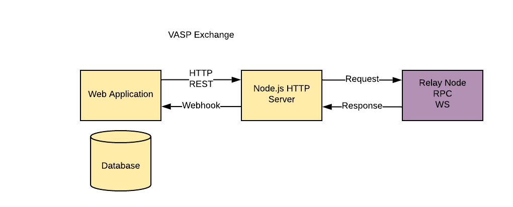

This repository comes with a complete installer that sets up a
running installation, complete with Postgres database, nginx serving
SSL connections with a reverse-proxy to backend services running
Node.js and PHP Artisan.

To use the all-in-one setup script, you first need a machine which
can be reached from the internet on ports 80 and 443, with a DNS
name that points to it.

**Note:** If you intend to synchronize the blockchain with your nethermind node, be mindful on the storage disk size.  e.g. 1 million blocks requires approximately 8GB of storage.

**Do Not Continue with the setup unless you have a domain name that is reachable over ports 80 and 443.  E.g. https://subdomain.domain.com**
## Setup

Please begin the installation by cloning this repository.

```shell
veriscope/
├── API-Docs
├── Blockchain-Analytics-Docs
├── Discovery-Layer-Validator
├── Horizon-Docs
├── IVMS-101
├── KYC-Template-Docs
├── Nethermind-Docs
├── chains
├── docker
├── docs
├── images
├── scripts
├── veriscope_ta_dashboard
├── veriscope_ta_node
├── .env
├── .gitignore
├── Dockerfile
├── README.md
└── docker-compose.yml
```

**scripts/** is the installation setup guide

**chains/** is the Nethermind POA relay node configuration. please review [Chains Readme](/chains/README.md)

**veriscope_ta_dashboard/** is the Web Application (Laravel/VueJS)

**veriscope_ta_node/** is the NodeJS interface between the Web Application and the Relay Node

## Guides

[API Docs](/API-Docs/README.md) - How to setup an API Token.

[API Walk Through Guide](/API-Docs/API-walkthrough-guide.md) - How to use the API for transfer of PII between two peers.

[Blockchain Analytics Docs](/Blockchain-Analytics-Docs/README.md) - How to add your Blockchain Analytics provider API key for wallet screening.

[Horizon Docs](/Horizon-Docs/README.md) - How to set up a webhook to receive notifications from the Shyft Network.

[Arena Queue](/docs/queue.md) - Information on Arena Queue for posting attestations.

[IVMS 101](/IVMS-101/README.md) - How to encode your Entity and User PII into IVMS

[KYC Template Docs](/KYC-Template-Docs/README.md) - How to format your PII and transfer it to a peer.

[Chains](/chains/README.md) - How to connect to the supported blockchains.

[Nethermind Docs](/Nethermind-Docs/README.md) - Links to Nethermind Documentation.

## Setup Script

If necessary, create a new Unix account to act as the service user.

Ensure the service user is in appropriate groups. 

The setup recipe assumes the user who invokes 'sudo' is the service user.

Before continuing ensure you have a sudo user and run the following commands (for example “forge”):

```shell
sudo adduser forge
```

```shell
sudo adduser forge syslog
Adding user `forge' to group `syslog' ...
Adding user forge to group syslog
Done.
```

```shell
sudo adduser forge www-data
```

Next move the repository directory to opt/
```shell
sudo mv veriscope /opt
```
Change the owner of opt/ to forge
```shell
sudo chown -R forge /opt
```
Setup su to your user
```shell
sudo su - forge
```
Then navigate to opt/veriscope/
```shell
cd /opt/veriscope
```

Edit the .env file in the veriscope dir

```
nano .env
```

and add (see example below):
# Your host name (VERISCOPE_SERVICE_HOST),
- Your VASP/Trust Anchor name (VERISCOPE_COMMON_NAME) and
- Chain target (VERISCOPE_TARGET), either `veriscope_testnet`, `fed_testnet` or `fed_mainnet`.

Save and exit with Ctrl+O and Enter, then Ctrl+X.

The VERISCOPE_COMMON_NAME name is only referenced locally.  

Your choice of VERISCOPE_TARGET will install the correct smart contract artifacts hosted in the tartget chain (including correct smart contract addresses), see here [Chains Readme](/chains/README.md) for chain descriptions and configuration.

The Smart Contract ABIs are installed here:

```
/opt/veriscope/veriscope_ta_node/artifacts
```

For example:
```shell
# Provide a DNS name that can be used to reach your node from the Internet. Open ports 80 and 443 to it.
VERISCOPE_SERVICE_HOST=subdomain.domain.com

# Provide a common name for your organization - no Inc or Ltd needed. This is used for user interfaces only.
VERISCOPE_COMMON_NAME=YOUR_VASP_NAME

# Identify a chain to deploy to - choose from the list of directory names in chains/ - veriscope_testnet fed_testnet fed_mainnet
VERISCOPE_TARGET=veriscope_testnet
```

---
**Ensure you use your own domain name that has been configured with DNS (80, 443). DO NOT CONTINUE with the setup unless you have a domain name that is reachable over ports 80 and 443. E.g. https://subdomain.domain.com**

---

Now you can run the setup script where you are presented with a number of options:
```shell
sudo scripts/setup-vasp.sh

+ Located in /opt/veriscope/
+ Service user will be forge

1) Refresh dependencies
2) Install/update nethermind
3) Set up new postgres user
4) Obtain/renew SSL certificate
5) Install/update NGINX
6) Install/update node.js web service
7) Install/update PHP web service
8) Update static node list for nethermind
9) Create admin user
10) Regenerate webhook secret
11) Regenerate oauth secret (passport)
12) Regenerate encrypt secret (EloquentEncryption)
13) Install Redis server
14) Install Passport Client Environment Variables
15) Install Horizon
i) Install Everything
p) show daemon status
w) restart all services
r) reboot
q) quit
Choose what to do:
```

**Note:** for a fresh install complete steps 1-9, 13, 14, 15.

This script deploys an all-in-one installation that is intended to be a template for integration into your own environments' database servers, load balancers, and SSL key management.

### 1. Refresh dependencies

Updates all packages on the operating system, and installs software
dependencies for all subsequent components - examples include
libsnappy for Nethermind, PHP and node.js for web services, and npm
and composer for managing web service dependencies.

This step also installs unconfigured PostgreSQL and Nginx servers
and two cron jobs for housekeeping: automatic clock synchronication
with internet time servers, and purging old logs.

### 2. Install/update nethermind

Nethermind is the Etherum implementation used on Shyft. This is
installed to `/opt/nm/` with its config file in `/opt/nm/config.cfg`,
and the chain state in `/opt/nm/nethermind_db`.

```
├── Data
├── NLog.config
├── Nethermind.Cli
├── Nethermind.Launcher
├── Nethermind.Runner
├── config.cfg
├── git-hash
├── keystore
├── logs
├── nethermind_db
├── plugins
├── shyftchainspec.json
└── static-nodes.json
```
This step will create a random sealer account, and provide its private key and public address. These should be kept someplace safe for permanent systems.

**Note:** if you intend to use an RPC connection instead of synchronizing the blockchain locally, terminate nethermind and change the HTTP and WS params in the .env of veriscope_ta_node/.env to the provided rpc domain. E.g. 
```shell
/opt/veriscope/veriscope_ta_node
cat .env
#RPC Replace HTTP and WS below with the following
#HTTP="https://rpc.shyft.network/"
#WS="wss://rpc.shyft.network/"
```

terminate nethermind and restart the ta-node-1 service like so:

```shell
sudo systemctl stop nethermind
sudo systemctl restart ta-node-1
```

### 3. Set up new postgres user

The Trust Anchor web service relies on PostgreSQL to store attestations.
This will create a new Postgres user, displaying its password and
storing it where the web services can find it. It will also create
a database called `trustanchor`. The database schema will be created
when the PHP webservice is installed.

### 4. Obtain/renew SSL certificate

This obtains a SSL certificate from Let's Encrypt for the domain
name that you configured in `/opt/veriscope/.env`, and deploys it
in a place where Nginx can find it.

### 5. Install/update NGINX

This creates a config file for the web services in
`/etc/nginx/sites-enabled/ta-dashboard.conf`, enables nginx to start
on boot, and starts nginx.

The deployed configuration is set to serve the web services over
port 443, by reverse-proxying connections to backend node.js and
PHP servers.

### 6.  Install/update node.js web service

The node webservice is several components - operating in systemd
units called `ta-node-1` and `ta-node-2`. This step installed
node.js dependencies into `/opt/veriscope/node_modules`, then
installs activates and starts the systemd units.

**Note:** This step copies over the correct ABIs depending on the chain target and places them here:

```shell
/opt/veriscope/veriscope_ta_node/artifacts
```

### 7. Install/update PHP web service

The PHP webservice is several components - operating in systemd
units called `ta-schedule`, `ta-wss` and `ta`. These carry out
respectively, scheduled cron-type jobs, a websocket server, and web
server.  This step installs installs some PHP dependencies via
composer, builds the schema and seed data in the Postgres Database,
then installs, enables and starts those systemd units,

### 8. Update static node list for nethermind

Nethermind relies upon a list of static nodes to find servers to
exchange blockchain information with. The nethermind config sets
this to be in `/opt/nm/static-nodes.json`.  Each machine is identified
by an enode url, formatted like `enode://{key}@{ip_address}:{port}`.
The Nethermind setup step obtains your server's enode, and adds it
to the 'contact' field used in the ethstats service at
https://fedstats.veriscope.network/ . This command replaces your enode
list with one obtained from the ethstats server, then restarts
nethermind to use it.

**Note:** this is optional and only recommended when synchronizing the blockchain with your nethermind relay node.

### 9. Create admin user

The Web Application requires an admin user to manage the Trust Anchor account. Use this option to create an account so you can sign into the application.

### 10. Regenerate webhook secret

The Web Application receives data from the node scripts over a webhook url.  This url is secured using a shared key.  This step creates or refreshes the share key in each .env file.

E.g.:
```shell
/opt/veriscope/veriscope_ta_node/.env

WEBHOOK_CLIENT_SECRET=du7....aec
```

### 11. Regenerate oauth secret (passport)

The Web API is authenticated using Laravel Password (OAuth2).  This step generates or regenerates the oauth public/private keys stored in veriscope_ta_dashboard/storage/.
Further reading can be found here: [laravel.com/docs/8.x/passport/](https://laravel.com/docs/8.x/passport/)

### 12. Regenerate encrypt secret (EloquentEncryption)

The Web Application generates a number of Crypto Wallet Accounts as well as TrustAnchor Users.  Private keys are stored in the DB encrypted.  This step generates or regenerates the encryption keys stored in veriscope_ta_dashboard/storage/app/
Futher reading can be found here: [github.com/RichardStyles/EloquentEncryption](https://github.com/RichardStyles/EloquentEncryption)

### 13. Install Redis server

The NodeJs Application manages posting of Attestations and Pending Transactions via a queuing framework.
Information on the framework can be found here: [The fastest, most reliable, Redis-based queue for Node.](https://www.npmjs.com/package/bull).
Redis is an open source (BSD licensed), in-memory data structure store, used as a database, cache, and message broker. [https://redis.io/](https://redis.io/).
To read more on the motivation for queuing Attestations, please review the queue [/docs/queue.md](docs/queue.md)

### 14. Install Passport Client Environment Variables

Passport OAuth Client variables are required set in the environment file in order to generate API token in the backoffice. Using this command you can set the variables in the environment file automatically.  I.e. "php artisan passportenv:link"
To read more on Passport Client setup and API, please review [API Docs](/API-Docs/README.md)

### 15. Install Horizon

Install Laravel Horizon which provides a beautiful dashboard and code-driven configuration for your Laravel powered Redis queues. Horizon allows you to easily monitor key metrics of your queue system such as job throughput, runtime, and job failures.  Please review the Horizon [/Horizon-Docs/README.md](Horizon-Docs/README.md)

### Ongoing updates

Releases of Veriscope occur frequently.  Before deploying a release ensure you have backed up your TA Private Key (TRUST_ANCHOR_PK) and your TA Account (TRUST_ANCHOR_ACCOUNT). In the event you wish to do a clean deploy, after you complete the installation, replace the newly created TA account with your backup. Then restart ta-node-1 and ta-node-2.
E.g.

```shell
/opt/veriscope/veriscope_ta_node/.env

TRUST_ANCHOR_PK=f37.......5d4
TRUST_ANCHOR_PREFNAME="vasp"
TRUST_ANCHOR_ACCOUNT=0x1bD8.....892
```

## Veriscope Docker Setup
The docker setup requires public hostname must not be a bare IP address.

### Step 1 - Docker

Follow [Install Docker on Ubuntu](https://docs.docker.com/engine/install/ubuntu/)

Verify that Docker Engine is installed correctly by running the hello-world image.

```shell
sudo docker run hello-world
```

This command downloads a test image and runs it in a container. When the container runs, it prints a message and exits.

### Step 2 - Docker Compose

Follow [Install Docker Compose (Linux)](https://docs.docker.com/compose/install/)

Verify that Docker Compose is installed correctly by checking the version.

```shell
docker compose version
```

### Step 3 - Docker Compose UP
```sh
sudo docker compose up -d
```

```sh
sudo docker exec -it veriscope_laravel.test_1 bash
```

Following this, you should be able to access and login to Veriscope at your VERISCOPE_SERVICE_HOST=subdomain.domain.com using the amdin user credentials created in step 9.

Next, please reach-out to your Shyft/Veriscope Account Manager to request your Trust Anchor to be verified. You will be transferred some test SHFT tokens at the same time which will enable you to transact on the Shyft Network.

---
## Installation Confirmation/Troubleshooting

### 1 - Has your TA account been set in the .env (veriscope_ta_node/.env)?

TA Accounts are managed by the http-api.js script and loads it from the .env.  Ensure you have the private key set (TRUST_ANCHOR_PK) and the account (TRUST_ANCHOR_ACCOUNT).  If you plan to manage multiple accounts for testing purposes, you can swap out these accounts in the .env and restart the ta-node-1 service like so:

```
$sudo systemctl restart ta-node-1

```
Below is an example of a completed account setup in the .env:
```
#DO NOT INCLUDE "0x" prefix in TRUST_ANCHOR_PK
TRUST_ANCHOR_PK=ae21....ce00
TRUST_ANCHOR_PREFNAME="vs-....-1"
TRUST_ANCHOR_ACCOUNT=0xB158....b39

WEBHOOK_CLIENT_SECRET=tho....uain
```
**NOTE:** params have been truncated "...."

### 2 - Is TA account loaded in webapp same as in veriscope_ta_node/.env
When running Step 2 of the installation guide above (nethermind), your TA account in the .env will be overwritten.  By refreshing the Load TA Account in the webapp, your TA account in the veriscope_ta_node/.env will be loaded in the webapp.

### 3 - Is Nethermind running? Is your nethermind node in the fedstats? Has it completed the sync?
In order to receive blockchain events or post transactions, your nethermind client must be running.
You can confirm this by
1. viewing https://fedstats.veriscope.network/ to see if your node is up and synchronized.
2. running the following command in the console:
```
	$ sudo systemctl status nethermind
	● nethermind.service - Nethermind Ethereum Daemon
	     Loaded: loaded (/etc/systemd/system/nethermind.service; disabled; vendor p>
	     Active: active (running) since Thu 2021-11-25 21:25:19 UTC; 1 weeks 0 days>
	   Main PID: 1419555 (Nethermind.Runn)
	      Tasks: 72 (limit: 4631)
	     Memory: 1.2G
	     CGroup: /system.slice/nethermind.service
	             └─1419555 /opt/nm/Nethermind.Runner -c /opt/nm/config.cfg

	Dec 03 19:59:50 pcf Nethermind.Runner[1419555]: eth_blockNumber          >
	Dec 03 19:59:50 pcf Nethermind.Runner[1419555]: eth_chainId              >
	Dec 03 19:59:50 pcf Nethermind.Runner[1419555]: eth_getLogs              >
	Dec 03 19:59:50 pcf Nethermind.Runner[1419555]: ------------------------->
	Dec 03 19:59:50 pcf Nethermind.Runner[1419555]: TOTAL                    >
	Dec 03 19:59:50 pcf Nethermind.Runner[1419555]: ------------------------->
	Dec 03 19:59:50 pcf Nethermind.Runner[1419555]:  
	Dec 03 19:59:50 pcf Nethermind.Runner[1419555]: 2021-12-03 19:59:50.0323|>
	Dec 03 19:59:54 pcf Nethermind.Runner[1419555]: 2021-12-03 19:59:54.0361|>
	Dec 03 19:59:54 pcf Nethermind.Runner[1419555]: 2021-12-03 19:59:54.0361|>
	Dec 03 19:59:58 pcf Nethermind.Runner[1419555]: 2021-12-03 19:59:58.0401|>
	Dec 03 19:59:58 pcf Nethermind.Runner[1419555]: 2021-
```

The service should show Active.

To confirm the webapp, http-api and nethermind (fully synched) are all connected, you should be able to fetch account balance in the webapp.

### 4 - Logging
Both the webapp and nodejs logs to files in the following directories:

webapp -> /opt/veriscope/veriscope_ta_dashboard/storage/logs

```
$ pwd
/opt/veriscope/veriscope_ta_dashboard/storage/logs
$ ls
laravel.log
```

nodejs -> /opt/veriscope/veriscope_ta_node/logs

```
$ pwd
/opt/veriscope/veriscope_ta_node/logs
$ ls
blockchain-data.combined.log  http-api.error.log
blockchain-data.error.log     shyft-template-helper.combined.log
http-api.combined.log         shyft-template-helper.error.log
```

### 5 - 503 when loading blockchain data
If loading any of the blockchain data like so (see below section):
```
$ node -e 'require("./blockchain-data").getAllAttestations()'
```
you may notice 503 errors in the logs.
503 is returned when the WEBHOOK_CLIENT_SECRET in both .env files may not be set.
If you need to recreate the secret you can run this step from the guide:
```
10) Regenerate webhook secret
```
This will overwrite WEBHOOK_CLIENT_SECRET in both .env files for veriscope_ta_dashboard and veriscope_ta_node.


## Post-setup steps

### Load Blockchain Data
LOAD ALL ATTESTATIONS, Discovery Layer data
```shell
$ node -e 'require("./blockchain-data").getAllAttestations()'

$ node -e 'require("./blockchain-data").getTrustAnchorKeyValuePairCreated()'

$ node -e 'require("./blockchain-data").getTrustAnchorKeyValuePairUpdated()'

$ node -e 'require("./blockchain-data").getTrustAnchorDataRetrievalParametersCreated()'

$ node -e 'require("./blockchain-data").getVerifiedTrustAnchors()'

```

The above load blockchain data can be achieved in the Dashboard.  See below for more details.


**Check if things work as expected by:**
* Proceeding to [fedstats.veriscope.network/](https://fedstats.veriscope.network/)
and see if your node is in the list and wait for the node to fully synchronize

In your terminal, Use Option p to confirm you have the following services running:

```
p) show daemon status
```
  - nethermind.service - Nethermind Ethereum Daemon
  - ta.service - Trust Anchor Dashboard
  - ta-wss.service - Trust Anchor Dashboard Websockets
  - ta-schedule.service - Trust Anchor Dashboard Schedule
  - ta-queue.service - Trust Anchor Dashboard Queue
  - ta-node-1.service - Trust Anchor Node API
  - ta-node-2.service - Trust Anchor Node Template Helper
  - nginx.service - A high performance web server and a reverse proxy server
  - postgresql.service - PostgreSQL RDBMS
  - redis-server.service - Advanced key-value store
  - horizon.service - Laravel Horizon Queue Manager

# Get comfortable with the Web Application

Login in to the application with the account you created in Option 9 above by navigating to the domain set in your root .env

For example:
```shell
# Provide a DNS name that can be used to reach your node from the Internet. Open ports 80 and 443 to it.
VERISCOPE_SERVICE_HOST=subdomain.domain.com

# Provide a common name for your organization - no Inc or Ltd needed. This is used for user interfaces only.
VERISCOPE_COMMON_NAME=vasp

# Identify a chain to deploy to - choose from the list of directory names in chains/ - veriscope_testnet fed_testnet fed_mainnet
VERISCOPE_TARGET=veriscope_testnet
```

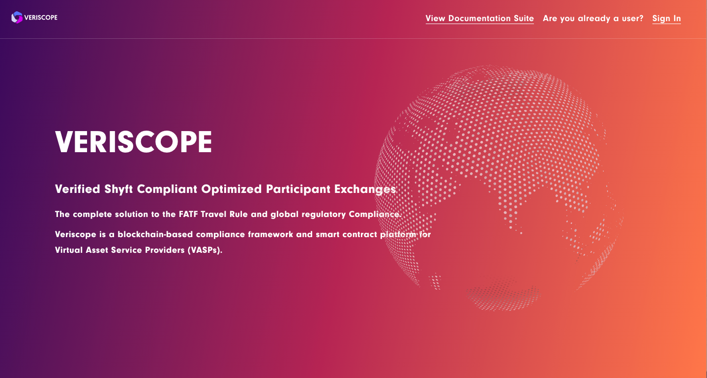


### Manage Your Organization:

Use this page to setup your TA account

Choose “Load TA Account”.

This will load the TA account stored in

```shell
$ cat /opt/veriscope/veriscope_ta_node/.env
#DO NOT INCLUDE "0x" prefix in TRUST_ANCHOR_PK
TRUST_ANCHOR_PK=f3764....5d4
TRUST_ANCHOR_PREFNAME="vasp"
TRUST_ANCHOR_ACCOUNT=0x1bD....892
WEBHOOK_CLIENT_SECRET=du7....aec

HTTP="http://localhost:8545"
WS="ws://localhost:8545"
WEBHOOK="http://localhost:8000/webhook"
HTTP_API_PORT=8080
TEMPLATE_HELPER_PORT=8090

CONTRACTS=/opt/veriscope/veriscope_ta_node/artifacts/

#veriscope testnet
TRUST_ANCHOR_MANAGER_CONTRACT_ADDRESS="0x43E56edA913216666DA92Bc27a874D967F3Cb206"
TRUST_ANCHOR_STORAGE_CONTRACT_ADDRESS="0xe515c95221B8e62c2D5b9548F8a7C5e17307f766"
TRUST_ANCHOR_EXTRA_DATA_GENERIC_CONTRACT_ADDRESS="0x7cC356A02119623A42E26d138fac925b6F5A444c"
TRUST_ANCHOR_EXTRA_DATA_UNIQUE_CONTRACT_ADDRESS="0xC6a080668A62F35687EDBb69B102B3a3766b51a8"

#redis
REDIS_URI=redis://127.0.0.1:6379
LOG_LEVEL=info

SIGN_MESSAGE="VERISCOPE"

```
Note, if you need to create a new TA account, simply replace TRUST_ANCHOR_PK and TRUST_ANCHOR_ACCOUNT with a new Account and Private Key

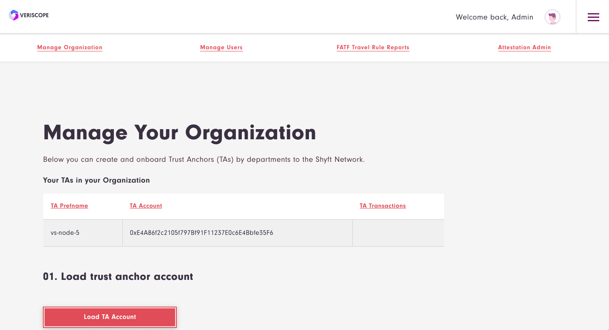


At this stage you can query if your account has been verified and has a balance.


**ACTION: If your account is not verified, please request to have your account on boarded and verified by your Veriscope Account manager and ensure you are granted Shyft Testnet tokens before proceeding further.**

Once your account has been verified, you can confirm as shown here:

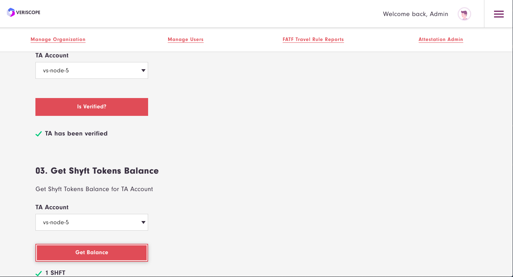

Now you can proceed with completing your account registration.

Add your TA account to the Discovery Layer

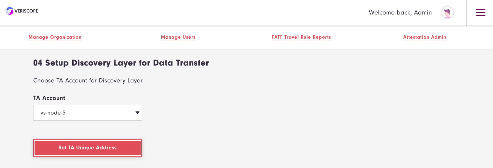

And finally complete the form for each key in the list for “Add Key Value Pair to Discovery Layer”.

Important: For the API_URL key, ensure you enter the domain name associated with this Web Application as configured in step 1 above:
```
VERISCOPE_SERVICE_HOST=”subdomain.domain.com”
```

E.g. [https://subdomain.domain.com/kyc-template](https://subdomain.domain.com/kyc-template)

**Note:** this webapp accepts KYC requests to the route **/kyc-template**.  Ensure you add the route in the API_URL value.

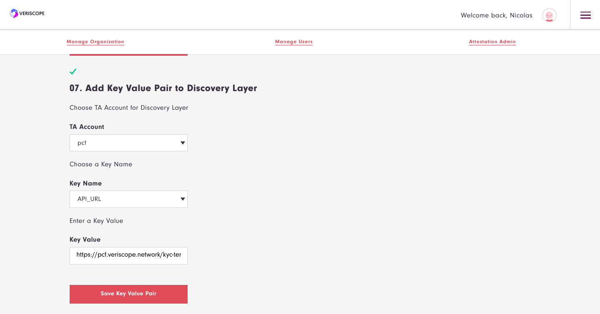

## IVMS for your Organization

In this section of Manage Organization, you are provided a form to complete.  Set or Update Entity Information for IVMS.  This information is not posted to the blockchain or Discovery Layer.  It is used in the KYC Template when posting to another VASP.

See [IVMS 101](/IVMS-101/README.md) for more information.

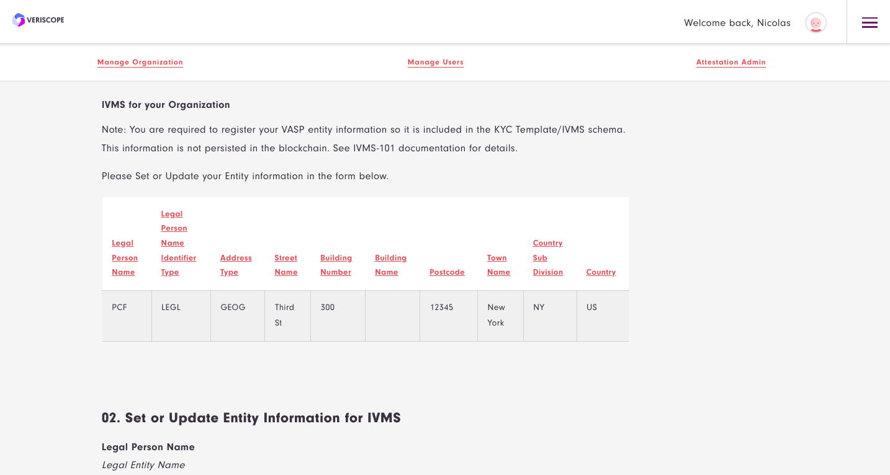

## Manage Users

In this section you can create a number of users to test the transfer of KYC between your VASP and another.

Choose Generate Random User.

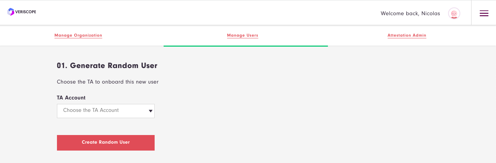

Note: Ensure your TA account is selected in the drop down box first.

When a new user account is created, the system auto generates a unique Shyft User ID and associates it with this user account.
Also unique BTC, ETH, ZEC and XMR addresses are created and assigned to this user.

**Note:** these addresses represent deposit addresses on your exchange platform.

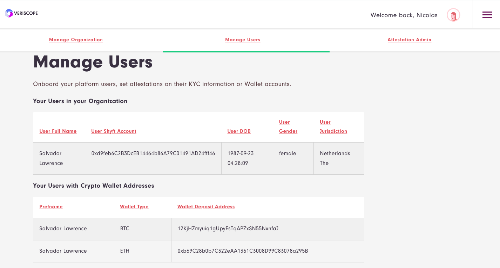

**Note:** Random users include PII that satisfy the IVMS schema.

For this guide we have prepared a second node (paycase) that has a user with Shyft ID, BTC and ETH deposit addresses as shown here:

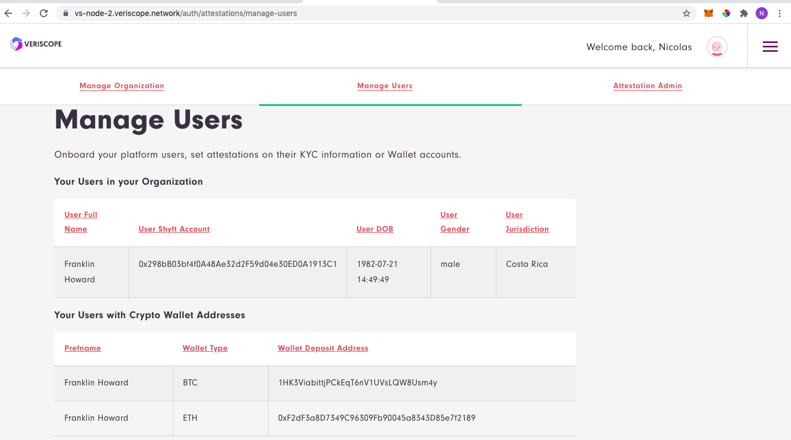

To simulate a crypto withdrawal from your exchange you can set a WALLET Attestation by completing the following fields and entering the crypto destination address.

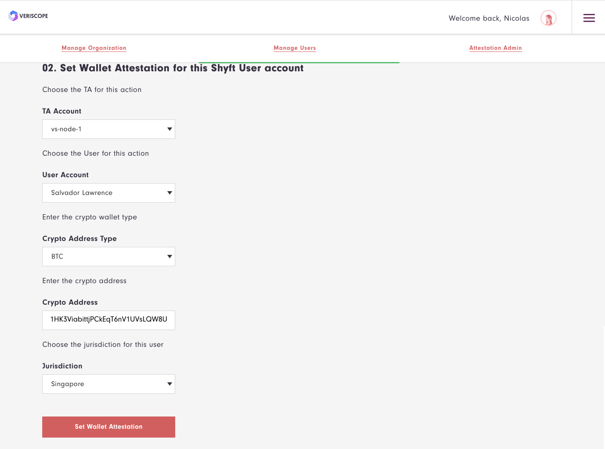

If there is a VASP on the network with this deposit address, they will provide you their Beneficiary PII.  In response your VASP will provide them your Originator PII.

Completed KYC Templates can be found in the backoffice/kyctemplates view.

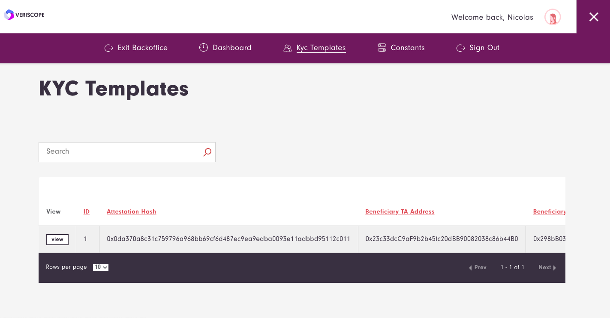

You can view details in the KYC Template by choosing view.

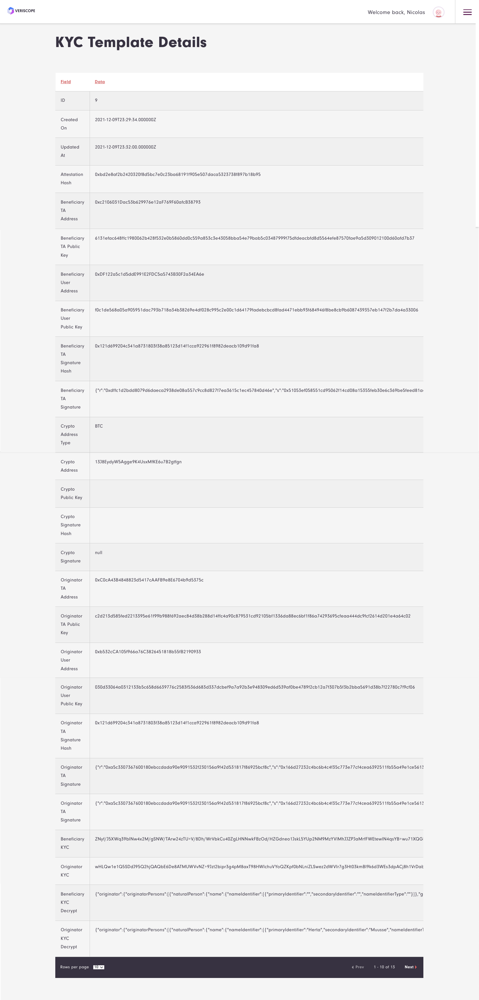

Other views in the backoffice are the number of TAs on the network, Attestations and completed KYC Templates on your platform.

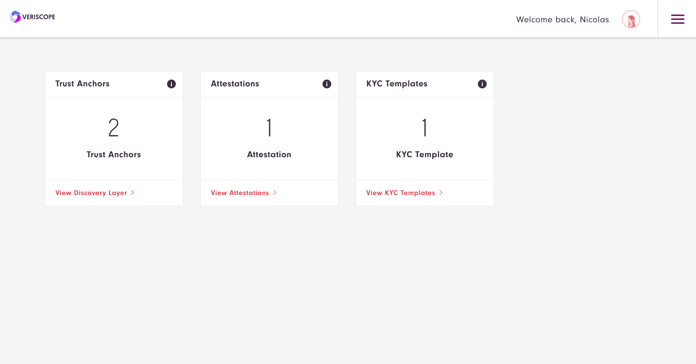

**Note:** Each section (Verified Trust Anchors, Discovery Layers and Attestations) have a Refresh Button to enable you to download all data related.

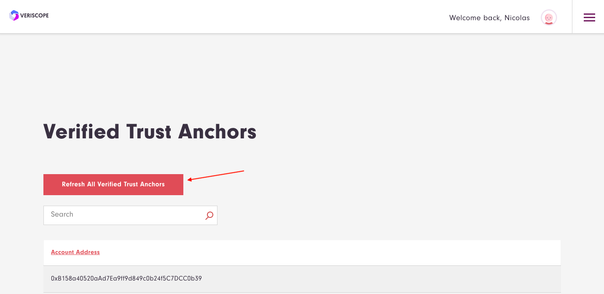

# Conduct a transaction with another VASP

**To do this, please reach out to your Veriscope Account Manager to coordinate a live transaction with another VASP on Veriscope**

# VASP Test Accounts

| Name      | Value |
| :--- | :--- |
| VASP ENTITY | PCF Corp. |
| VASP API_URL | https://pcf.veriscope.network/kyc-template |
| VASP IP | 15.223.33.76 |
| VASP TA Account | 0xC0cA43B4848823d5417cAAFB9e8E6704b9d5375c |
| VASP User     | Felix Bailey |
| BTC Address   | 18crLganfufUzqFB2eH7jt4jPPYze45gZs |
| ETH Address   | 0xA4bdddE6cEA9FB6a57949EBA19E6D213dc569C67 |
| ZEC Address   | t1V6m4PFXCNU3zBDEHfEEwC3ZpxKAZHmiC2 |
| XMR Address   | 45VzrocqjddFmy6vC58XPx5unNdHQozupbuCYPtFCXGreP7mZwCLijrX2pCSeMd1jiTFLohGVwqLyJauAtQ9d8xx3WjGKax |

| Name      | Value |
| :--- | :--- |
| VASP ENTITY | Paycase Inc. |
| VASP API_URL | https://paycase.veriscope.network/kyc-template |
| VASP IP | 3.97.182.35 |
| VASP TA Account | 0xc2106031Dac53b629976e12aF769F60afcB38793 |
| VASP User | Dora Carlson |
| BTC Address | 13J8EydyW5Agge9K4UsxMfKE6u7B2gtfgn |
| ETH Address | 0x08dd8246c4c15F6dA97e5a40ED5a24C405b4FB24
| ZEC Address | t1JLYsteVEu7ER5fzE2veqF8Cx5gV3U2mvX |
| XMR Address | 44Sj2g1s7fsABvPjFFQakKEARu2H2AF1phsTbfiAWrtjDpJe3ncBmT673AhHfMrVr2jfvtWEsX8UJ9G3DWecBqeTPUdSpBi |
