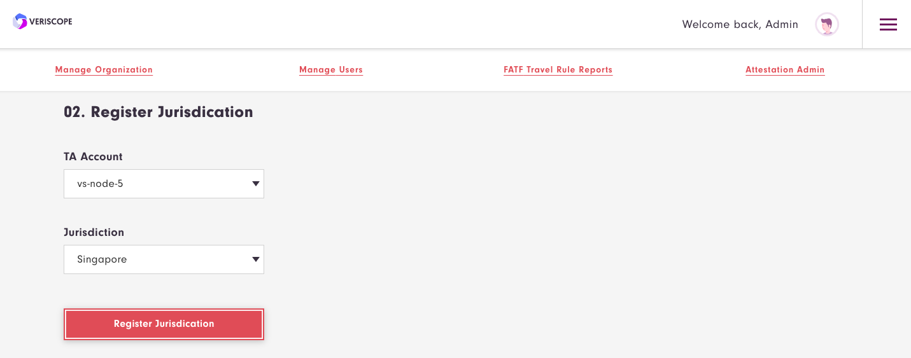
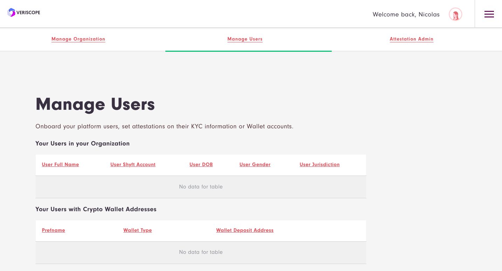

# Veriscope
Welcome to the Veriscope Installation Guide

Veriscope (VS) ships with a number of services (all open sourced) that in tandem enable VASPs to:
Create Trust Anchor accounts (TAs)
Create test User accounts (VASP users)
Register a TA account in the Veriscope Discovery Layer
Set Wallet Attestations
Become discovered by other peers on the network
Share PII between two peers as they are related to an originating crypto transaction from VASP A to VASP B.

By the end of this guide, you should have completed all of the above. 

In order to accomplish the above, VS utilizes a number of self managed services:
Shyft Relay Node - a Nethermind POA client that synchronizes with the Shyft Mainnet.  VS communicates with the Relay Node 
over a local RPC connection (HTTP and Websocket)
Web Application  - a laravel and vuejs framework for managing TA accounts, sharing KYC data over the peer network
Node JS application scripts that interface the Web Application with either the Relay Node or various web3 libraries for 
cryptography functions.

This repository comes with a complete installer that sets up a
running installation, complete with Postgres database, nginx serving
SSL connections with a reverse-proxy to backend services running
Node.js and PHP Artisan.

To use the all-in-one setup script, you **first need a machine which
can be reached from the internet on ports 80 and 443**, with a DNS
name that points to it.  The script is tested on Ubuntu 20.10.
Minimum 2 GB of RAM.

If necessary, create a new Unix account to act as the service user.
Ensure the service user is in appropriate groups. The setup recipe
assumes the user who invokes 'sudo' is the service user.

## Setup
Please begin the installation by cloning this repository.

```shell
veriscope/
├── Dockerfile
├── README.md
├── docker
├── docker-compose.yml
├── images
├── scripts
├── vasp_testnet
├── veriscope_ta_dashboard
└── veriscope_ta_node

```
Note: 
scripts/ is the installation setup guide
vasp_testnet/ is the Nethermind POA relay node configuration
veriscope_ta_dashboard/ is the Web Application (Laravel/VueJS)
veriscipe_ta_node/ is the NodeJS interface between the Web Application and the Relay Node

Before continuing ensure you have a sudo user and run the following commands (for example “forge”):

```shell
$ sudo adduser forge
```

```shell
$ sudo adduser forge syslog
Adding user `forge' to group `syslog' ...
Adding user forge to group syslog
Done.
```

```shell
$ sudo adduser forge www-data
```

Next move the repository directory to opt/
```shell
$ mv veriscope /opt
```
Change the owner of opt/ to forge
```shell
$ sudo chown -R forge /opt
```
Setup su to your user
```shell
$ sudo su - forge
```
Then navigate to opt/veriscope/
```shell
$ ​​cd /opt/veriscope
```

Edit the .env file in the directory and add your host name and TA name.  The TA name is only referenced locally.
Ensure you use your own domain name that has been configured with DNS.
For example:
```shell
VERISCOPE_SERVICE_HOST="vs-node-1.veriscope.network"
VERISCOPE_COMMON_NAME="vs-node-1"
```

Now we can run the setup script where you are presented with a number of options:
```shell
$ sudo scripts/setup-vasp.sh
+ Located in /opt/veriscope/
+ Service user will be forge


1) Refresh dependencies
2) Install/update nethermind
3) Set up new postgres user
4) Obtain/renew SSL certificate
5) Install/update NGINX
6) Install/update node.js web service
7) Install/update PHP web service
8) Update static node list for nethermind
9) Create admin user
10) Regenerate webhook secret
i) install everything
p) show daemon status
w) restart all services
r) reboot
q) quit
Choose what to do: 
```

This script deploys an all-in-one installation that is intended to
be a template for integration into your own environments' database
servers, load balancers, and SSL key management.

### 1. Refresh dependencies

Updates all packages on the operating system, and installs software
dependencies for all subsequent components - examples include
libsnappy for Nethermind, PHP and node.js for web services, and npm
and composer for managing web service dependencies.

This step also installs unconfigured PostgreSQL and Nginx servers
and two cron jobs for housekeeping: automatic clock synchronication
with internet time servers, and purging old logs.

### 2. Install/update nethermind

Nethermind is the Etherum implementation used on Shyft. This is
installed to `/opt/nm/` with its config file in `/opt/nm/config.cfg`,
and the chain state in `/opt/nm/nethermind_db`.

This step will create a random sealer account, and provide its
private key and public address.  These should be kept someplace
safe for permanent systems.

### 3. Set up new postgres user

The Trust Anchor web service relies on PostgreSQL to store attestations.
This will create a new Postgres user, displaying its password and
storing it where the web services can find it. It will also create
a database called `trustanchor`. The database schema will be created
when the PHP webservice is installed.

### 4. Obtain/renew SSL certificate

This obtains a SSL certificate from Let's Encrypt for the domain
name that you configured in `/opt/veriscope/.env`, and deploys it
in a place where Nginx can find it.

### 5. Install/update NGINX

This creates a config file for the web services in
`/etc/nginx/sites-enabled/ta-dashboard.conf`, enables nginx to start
on boot, and starts nginx.

The deployed configuration is set to serve the web services over
port 443, by reverse-proxying connections to backend node.js and
PHP servers.

### 6.  Install/update node.js web service

The node webservice is several components - operating in systemd
units called `ta-node-1` and `ta-node-2`.  This step installed
node.js dependencies into `/opt/veriscope/node_modules`, then
installs activatges and starts the systemd units.

### 7. Install/update PHP web service

The PHP webservice is several components - operating in systemd
units called `ta-schedule`, `ta-wss` and `ta`.    These carry out
respectively, scheduled cron-type jobs, a websocket server, and web
server.  This step installs installs some PHP dependencies via
composer, builds the schema and seed data in the Postgres Database,
then installs, enables and starts those systemd units,

### 8. Update static node list for nethermind

Nethermind relies upon a list of static nodes to find servers to
exchange blockchain information with. The nethermind config sets
this to be in `/opt/nm/static-nodes.json`.  Each machine is identified
by an enode url, formatted like `enode://{key}@{ip_address}:{port}`.
The Nethermind setup step obtains your server's enode, and adds it
to the 'contact' field used in the ethstats service at
https://stats.shyft.network/ .  This command replaces your enode
list with one obtained from the ethstats server, then restarts
nethermind to use it.

### 9. Create admin user

The Web Application requires an admin user to manage the Trust Anchor account.  Use this option to create an account so you can sign into the application.

### 10. Regenerate webhook secret

The Web Application receives data from the node scripts over a webhook url.  This url is secured using a shared key.  This step creates or refreshes the share key in each .env file.


### Ongoing updates

Fetching the veriscope repository and re-running the installation
steps will not damage any part of your installation. If you have
customized your installation, here are the manual steps:

```shell
# log in as service user
$ cd /opt/veriscope
$ git pull
$ cd veriscope_ta_dashboard
$ composer install
$ npm install
$ npm run production
$ php artisan migrate


$ cd ../veriscope_ta_node
$ npm install
$ sudo systemctl restart ta ta-wss ta-schedule ta-node-1 ta-node-2
```


## Veriscope Docker Setup
The docker setup requires public hostname must not be a bare IP address.

### Step 1 - Docker install

[Ubuntu](https://docs.docker.com/engine/install/ubuntu/)


### Step 2 - Docker Compose

https://docs.docker.com/compose/install/


### Step 3 - Docker Compose UP
```sh
sudo docker-compose up -d
```

```sh
sudo docker exec -it veriscope_laravel.test_1 bash
```

```sh
/opt/veriscope/docker/setup.sh
```

```
1) Refresh dependencies
2) Install/update nethermind
3) Set up new postgres user
4) Obtain/renew SSL certificate
5) Install/update NGINX
6) Install/update node.js web service
7) Install/update PHP web service
8) Update static node list for nethermind
9) Create admin user
10) Regenerate webhook secret
i) install everything
p) show daemon status
w) restart all services
r) reboot
q) quit
```

```
Choose what to do: [Press i to install]
```

```
Choose what to do: [Press 9 to create admin user and enter the required information]
```

## Installation Confirmation/Troubleshooting

### 1 - Has your TA account been set in the .env (veriscope_ta_node/.env)?

TA Accounts are managed by the http-api.js script and loads it from the .env.  Ensure you have the private key set (TRUST_ANCHOR_PK) and the account (TRUST_ANCHOR_ACCOUNT).  If you plan to manage multiple accounts for testing purposes, you can swap out these accounts in the .env and restart the ta-node-1 service like so:

```
$sudo systemctl restart ta-node-1

```
Below is an example of a completed account setup in the .env:
```
#DO NOT INCLUDE "0x" prefix in TRUST_ANCHOR_PK
TRUST_ANCHOR_PK=ae21....ce00
TRUST_ANCHOR_PREFNAME="vs-....-1"
TRUST_ANCHOR_ACCOUNT=0xB158....b39 
WEBHOOK_CLIENT_SECRET=tho....uain
```
**NOTE:** params have been truncated "...."

### 2 - Is TA account loaded in webapp same as in veriscope_ta_node/.env
When running Step 2 of the installation guide above (nethermind), your TA account in the .env will be overwritten.  By refreshing the Load TA Account in the webapp, your TA account in the veriscope_ta_node/.env will be loaded in the webapp.

### 3 - Is Nethermind running? Is your nethermind node in the fedstats? Has it completed the sync?
In order to receive blockchain events or post transactions, your nethermind client must be running.
You can confirm this by 
1. viewing https://fedstats.veriscope.network/ to see if your node is up and synchronized.
2. running the following command in the console:
```
$ sudo systemctl status nethermind
● nethermind.service - Nethermind Ethereum Daemon
     Loaded: loaded (/etc/systemd/system/nethermind.service; disabled; vendor p>
     Active: active (running) since Thu 2021-11-25 21:25:19 UTC; 1 weeks 0 days>
   Main PID: 1419555 (Nethermind.Runn)
      Tasks: 72 (limit: 4631)
     Memory: 1.2G
     CGroup: /system.slice/nethermind.service
             └─1419555 /opt/nm/Nethermind.Runner -c /opt/nm/config.cfg

Dec 03 19:59:50 vs-node-1 Nethermind.Runner[1419555]: eth_blockNumber          >
Dec 03 19:59:50 vs-node-1 Nethermind.Runner[1419555]: eth_chainId              >
Dec 03 19:59:50 vs-node-1 Nethermind.Runner[1419555]: eth_getLogs              >
Dec 03 19:59:50 vs-node-1 Nethermind.Runner[1419555]: ------------------------->
Dec 03 19:59:50 vs-node-1 Nethermind.Runner[1419555]: TOTAL                    >
Dec 03 19:59:50 vs-node-1 Nethermind.Runner[1419555]: ------------------------->
Dec 03 19:59:50 vs-node-1 Nethermind.Runner[1419555]:  
Dec 03 19:59:50 vs-node-1 Nethermind.Runner[1419555]: 2021-12-03 19:59:50.0323|>
Dec 03 19:59:54 vs-node-1 Nethermind.Runner[1419555]: 2021-12-03 19:59:54.0361|>
Dec 03 19:59:54 vs-node-1 Nethermind.Runner[1419555]: 2021-12-03 19:59:54.0361|>
Dec 03 19:59:58 vs-node-1 Nethermind.Runner[1419555]: 2021-12-03 19:59:58.0401|>
Dec 03 19:59:58 vs-node-1 Nethermind.Runner[1419555]: 2021-
```
The service should show Active.

To confirm the webapp, http-api and nethermind (fully synched) are all connected, you should be able to fetch account balance in the webapp.

### 4 - Logging
Both the webapp and nodejs logs to files in the following directories:

webapp -> /opt/veriscope/veriscope_ta_dashboard/storage/logs

nodejs -> /opt/veriscope/veriscope_ta_node/logs

### 5 - 503 when loading blockchain data
If loading any of the blockchain data like so (see below section):
```
$ node -e 'require("./blockchain-data").getAllAttestations()'
```
you may notice 503 errors in the logs.
503 is returned when the WEBHOOK_CLIENT_SECRET in both .env files may not be set.
If you need to recreate the secret you can run this step from the guide:
```
10) Regenerate webhook secret
```
This will overwrite WEBHOOK_CLIENT_SECRET in both .env files for veriscope_ta_dashboard and veriscope_ta_node.


## Post-setup steps

### Load Blockchain Data
LOAD ALL ATTESTATIONS, Discovery Layer data
```shell
$ node -e 'require("./blockchain-data").getAllAttestations()'

$ node -e 'require("./blockchain-data").getTrustAnchorKeyValuePairCreated()'

$ node -e 'require("./blockchain-data").getTrustAnchorKeyValuePairUpdated()'

$ node -e 'require("./blockchain-data").getTrustAnchorDataRetrievalParametersCreated()'

$ node -e 'require("./blockchain-data").getVerifiedTrustAnchors()'

```

```shell
**Check if things work as expected by:
* Proceeding to [fedstats.veriscope.network/](https://fedstats.veriscope.network/)
and see if your node is in the list and wait for the node to fully synchronize
* In your terminal, Use Option p to confirm you have the following services running:
  - nethermind.service - Nethermind Ethereum Daemon
  - ta.service - Trust Anchor Dashboard
  - ta-wss.service - Trust Anchor Dashboard Websockets
  - ta-schedule.service - Trust Anchor Dashboard Schedule
  - ta-node-1.service - Trust Anchor Node API
  - ta-node-2.service - Trust Anchor Node Template Helper
  - nginx.service - A high performance web server and a reverse proxy server
  - postgresql.service - PostgreSQL RDBMS

Press q to quit the Options list. **
```

# Get comfortable with the Web Application

Login in to the application with the account you created in Option 9 above by navigating to the domain set in your root .env
For example:
```shell
VERISCOPE_SERVICE_HOST="vs-node-1.veriscope.network"
VERISCOPE_COMMON_NAME="vs-node-1"
```


Manage Your Organization:
auth/attestations/manage-organization
Use this page to setup your TA account
Choose “Load TA Account”.
This will load the TA account stored in

```shell
$ cat /opt/veriscope/veriscope_ta_node/.env
#DO NOT INCLUDE "0x" prefix in TRUST_ANCHOR_PK
TRUST_ANCHOR_PK=5c5…..914
TRUST_ANCHOR_PREFNAME="vs-node-5"
TRUST_ANCHOR_ACCOUNT=0xE4A…..5F6

HTTP="http://localhost:8545"
WS="ws://localhost:8545"
WEBHOOK="http://localhost:8000/webhook"
HTTP_API_PORT=8080
TEMPLATE_HELPER_PORT=8090

CONTRACTS=/opt/veriscope/veriscope_ta_node/build_veriscope_testnet/contracts/

#vasp testnet
TRUST_ANCHOR_MANAGER_CONTRACT_ADDRESS="0xe515c95221B8e62c2D5b9548F8a7C5e17307f766"
TRUST_ANCHOR_STORAGE_CONTRACT_ADDRESS="0xc35EE43B583Fc14df433f209986413B62Fae66D4"
TRUST_ANCHOR_EXTRA_DATA_GENERIC_CONTRACT_ADDRESS="0xC6a080668A62F35687EDBb69B102B3a3766b51a8"
TRUST_ANCHOR_EXTRA_DATA_UNIQUE_CONTRACT_ADDRESS="0x973396BE051E69503aA566b9786b72521A00a097"
```
Note, if you need to create a new TA account, simply replace TRUST_ANCHOR_PK and TRUST_ANCHOR_ACCOUNT with a new Account and Private Key


At this stage you can query if your account has been verified and has a balance.


```shell
**ACTION: If your account is not verified, please request to have your account on boarded and 
verified by your Veriscope Account manager and ensure you are granted Shyft Testnet tokens before proceeding further.**
```

Once your account has been verified, you can confirm as shown here:


Now you can proceed with completing your account registration.

Choose a Jurisdiction for your TA account.



Add your TA account to the Discovery Layer


And finally complete the form for each key in the list for “Add Key Value Pair to Discovery Layer”.

Important: For the API_URL key, ensure you enter the domain name associated with this Web Application as configured in step 1 above:
```
VERISCOPE_SERVICE_HOST=”vs-node-1.veriscope.network”
```
  
E.g. [https://vs-node-1.veriscope.network](https://vs-node-1.veriscope.network)


## Manage Users

In this section you can create a number of users to test the transfer of KYC between your account and another on the peer network.



You can enter in some basic information for a user or choose Generate Random User.
Note: Ensure your TA account is selected in the drop down box first.


When a new user account is created, the system auto generates a unique Shyft User ID and associates it with this user account.
Also unique BTC and ETH addresses are created and assigned to this user.
Note: these BTC and ETH addresses represent deposit addresses on your exchange platform.


For this guide we have prepared a second node (vs-node2) that has a user with Shyft ID, BTC and ETH deposit addresses as shown here:


To simulate a crypto withdrawal from your exchange you can set a WALLET Attestation by completing the following fields and entering the crypto destination address.


If there is a peer on the network with a deposit address on their exchange, they will pass the KYC Template directly to your peer and as a result your 
peer will respond with your user KYC data.
Completed KYC Templates can be found in the backoffice/kyctemplates view.


You can view details in the KYC Template by choosing view.


Notice the KYC of both the sender and beneficiary of the crypto transaction.

Other views in the backoffice are the number of TAs on the network, Attestations and completed KYC Templates on your platform.


# Conduct a transaction with another VASP
```Shell
**To do this, please reach out to your Veriscope Account Manager to coordinate a 
live transaction with another VASP on Veriscope**
```

# VASP Test Accounts

| Name      | Value |
| :--- | :--- |
| VASP ENTITY | PCF |
| VASP TA Account | 0xC0cA43B4848823d5417cAAFB9e8E6704b9d5375c |
| VASP User     | Felix Bailey, male, 1986-04-14, Latvia  |
| BTC Address   | 19dvC5Q7AFRLoRGb5Y1StRTyXXMtboaKP6 |
| ETH Address   | 0x3790EDF76F21d698ba546f0a3a9C7F479b49F39E |
| ZEC Address   | t1grwNXZPAe9WbaKow3TDYVSEbkFm4eVy6n |
| XMR Address   | 48yewBAmPAjeEHBkBghYL84hazvtmuRyGbtnwm8D6AKZDA4B8U5qA3TZP3BNqLxj2w9GTvEx44di4bHsEJPowACB1nKD5c6 |

| Name      | Value |
| :--- | :--- |
| VASP ENTITY | PCF |
| VASP TA Account | 0xC0cA43B4848823d5417cAAFB9e8E6704b9d5375c |
| VASP User | Suzanne Stokes, female, 1990-04-14, External Territories of Australia |
| BTC Address | 14dbJRm3SeoufC6v3wizWxjeZzkfheQQ6i |
| ETH Address | 0xFc982E152068dD7E019B5f9d5C9c42581883839a |
| ZEC Address | t1TVhHkS9w3kRBdeAcUBy3LCFEGr216utF4 |
| XMR Address | 4312zYYwzjSW2uvnLD7RbcfE7KrNXrv4scNWokkfRGi99C8C7DdwYt28Lh1DRMv3dj68usEgRiVfRUbtKfYazGMpPKWwYXq  |

| Name      | Value |
| :--- | :--- |
| VASP ENTITY | Paycase |
| VASP TA Account | 0xc2106031Dac53b629976e12aF769F60afcB38793 |
| VASP User | Dora Carlson, female, 1989-05-02, Belize  |
| BTC Address | 1Kx4moeZBo2kNj7c22dzAce11X18NVHwx2 |
| ETH Address | 0x0723583074C28192CF2a22Ae8FD460C714388c3A 
| ZEC Address | t1JEqXesZyoWyh7qN6ZNUaaG4krFS4QNpr4 |
| XMR Address | 43DcM4aRLZSE2gvG3n6U9V5JdfrJ1yEDCRXyUoxw1MHd7uW4xZ6Y1FhKo7urwvfoDCNPQczjGhP9nhLcBFBgu5Cw5A9bHFX |

| Name      | Value |
| :--- | :--- |
| VASP ENTITY | Paycase |
| VASP TA Account | 0xc2106031Dac53b629976e12aF769F60afcB38793 |
| VASP User | Alice Jefferson, female, 1989-03-03, Barbados  |
| BTC Address | 1GyKFuKAZxqMVgXVvkaQY7r8JVJCnj33nP |
| ETH Address | 0x815f5a46C7624522eBB1265e503a70A2fB14e922 |
| ZEC Address | t1fzX4yzBymD3raZm9siRjomVsMxo6ygVNo |
| XMR Address | 42zCgVBptfgUYtkeANcbzy7ZsKCU5XTWTiRe6VvAeiaghRq4UFYqWpBjK4neZjktCKBzUZHJfZbUcTXBkV3i76uPPAfMw41 |
