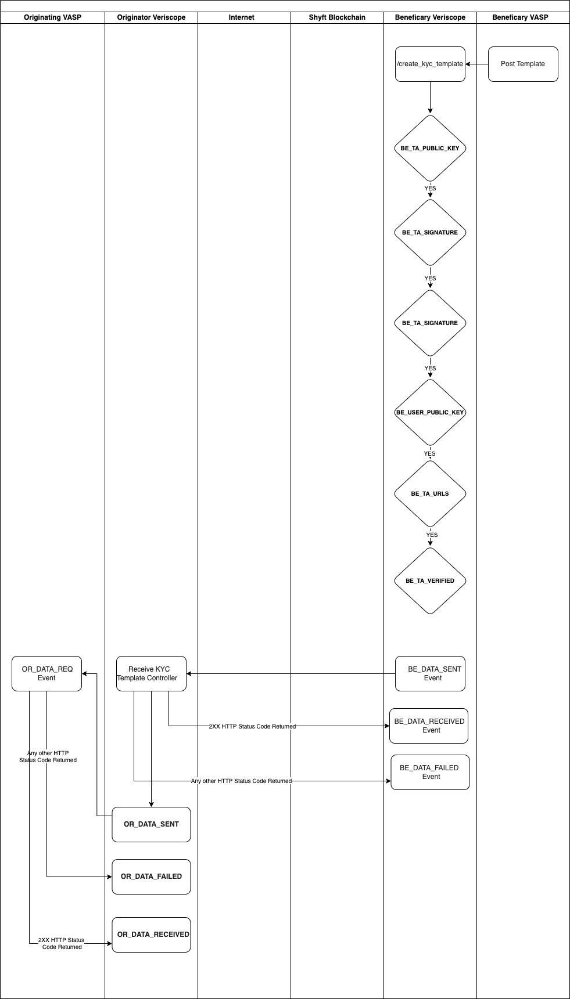

# State Machine Documentation

### KYC Template Data States

| To | From | Description |
| --- | --- | --- |
| START | BE_TA_PUBLIC_KEY |  |
| BE_TA_PUBLIC_KEY | BE_TA_SIGNATURE |  |
| BE_TA_SIGNATURE | BE_USER_PUBLIC_KEY |  |
| BE_USER_PUBLIC_KEY | BE_USER_SIGNATURE |  |
| BE_USER_SIGNATURE | BE_TA_URLS |  |
| BE_TA_URLS | BE_TA_VERIFIED |  |
|  |  |  |
| BE_TA_VERIFIED | OR_TA_PUBLIC_KEY |  |
| OR_TA_PUBLIC_KEY | OR_TA_SIGNATURE |  |
| OR_TA_SIGNATURE | OR_USER_PUBLIC_KEY |  |
| OR_USER_PUBLIC_KEY | OR_USER_SIGNATURE |  |
| OR_USER_SIGNATURE | OR_TA_URLS |  |
| OR_TA_URLS | OR_TA_VERIFIED |  |
| OR_TA_VERIFIED | BE_KYC_UPDATE,  OR_KYC_UPDATE |  |
|  |  |  |
| BE_KYC_UPDATE | OR_KYC_UPDATE, BE_KYC_ACCEPTED, BE_KYC_REJECTED, OR_KYC_ACCEPTED, OR_KYC_REJECTED |  |
| OR_KYC_UPDATE | BE_KYC_UPDATE,  BE_KYC_ACCEPTED, BE_KYC_REJECTED, OR_KYC_ACCEPTED, OR_KYC_REJECTED |  |
|  |  |  |
| BE_KYC_ACCEPTED | OR_KYC_UPDATE, OR_KYC_REJECTED, OR_KYC_ACCEPTED |  |
| BE_KYC_REJECTED | BE_KYC_UPDATE, OR_KYC_UPDATE, OR_KYC_REJECTED |  |
|  |  |  |
| OR_KYC_ACCEPTED | BE_KYC_UPDATE, BE_KYC_REJECTED, BE_KYC_ACCEPTED |  |
| OR_KYC_REJECTED | BE_KYC_UPDATE, OR_KYC_UPDATE, BE_KYC_REJECTED |  |

### **IVMS State Acknowledgement Codes**

| Code | Description |
| --- | --- |
| 0307 | Temporary Rejection |
| 0308 | Permanent Rejection |
| 0202 | Accepted |

### **Event List**

| Code | Description |
| --- | --- |
| BE_KYC_REJECTED | Beneficiary KYC Rejected |
| OR_KYC_REJECTED | Originator KYC Rejected |
| BE_KYC_ACCEPTED | Beneficiary KYC Accepted |
| OR_KYC_ACCEPTED | Originator KYC Accepted |
| BE_ENC | Beneficiary Encrypted IVMS Update Recived |
| OR_ENC | Originator Encrypted IVMS Update Recived |
| BE_KYC_REQ | Beneficiary KYC Requested |
| OR_KYC_REQ | Originator KYC Requested |
| OR_DATA | Originator Public Keys Data |
| BE_DATA | Beneficiary Public Keys Data |
| OR_DATA_REQ | Originator Public Keys Data Requested |
| NEW_ATTESTATION | New Attestion Received |

# **Step 1:**

---



**Step 1.1:** Beneficiary Initiates Template using Postman

- Postman: Create Template

**URI:**

/api/v1/server/create_kyc_template

**METHOD:**

POST

**Request:**

```json
{
  "attestation_hash": "0xcbc6c36db378cce99028a5417b6c8a36ecc67c686692685f2decb3365dfc0f34",
  "user_account": "0xe96e217759e62a044040d5593b462855e74fca41",
  "user_public_key": "0x0414bc390bb3f1124e727822164035971612059cb8b9af6880ae71ca88b42d732f79bef5dc2d6e31a5c49d98631b6d23f6ffbf033b15acca447995730df3aa69d2",
  "user_signature": "{\"r\":\"0x65424575fc10828b9b0f005d6a54dd86cc23d393c844d3a2cef33659b4391b8b\",\"s\":\"0x298e075645749d954ac90582b92ca877c1829e8037bf7f0a3803ae62291d8a81\",\"v\":\"0x26\"}",
  "user_signature_hash": "0x7ec005c40fadb64f4180dcc14d9f5927f649096a08478a4a5a112a3aa77ca549"
}
```

**Response:**

**200 OK**

```json
{
  "attestation_hash": "0xcbc6c36db378cce99028a5417b6c8a36ecc67c686692685f2decb3365dfc0f34",
  "status": "BE_TA_VERIFIED",
  "webhook_status": "START",
  "ivms_status": "START",
  "updated_at": "2022-06-07T15:20:38.000000Z",
  "created_at": "2022-06-07T15:20:38.000000Z",
  "id": 143,
  "coin_blockchain": "ETH",
  "coin_token": "ETH",
  "coin_address": "0xa6ff79f3aca5e4bb9639852c042da1de62740322",
  "coin_memo": null,
  "coin_transaction_hash": "",
  "coin_transaction_value": "",
  "sender_ta_address": "0x10a32419ABcfbaaae91D0e03bc8390c418E65680",
  "sender_user_address": "0xBf2B6E8d4BdD767EC236Cc5652B80713Ce19eADb",
  "beneficiary_ta_address": "0x4DA45d42921bc14015c469e2eecCC2793301Ef27",
  "beneficiary_ta_public_key": "1fd1f70da541b4be0490637ad3ac033c7a69f12263a1fc4a093fae762f9edbbbd80181d6764737df00bad18bd7acbe146d03e49f2cccccdc9600197d8d6acc3c",
  "beneficiary_ta_signature_hash": "0x0b709dd4809f36a22fe48250b24a5e41e8aea491bace26627f5c68ea9b4fad3f",
  "beneficiary_ta_signature": "{\"r\":\"0x3f6a5f8e4a0b1398806dae4a99947a552d72afd740aca4653555d176f43f9a54\",\"s\":\"0x55bf1ec46e9cfbd157540a320a6fadc94259bcdc1699f78626e896413c30d840\",\"v\":\"0x25\"}",
  "beneficiary_user_address": "0xe96e217759e62a044040d5593b462855e74fca41",
  "beneficiary_user_public_key": "0x0414bc390bb3f1124e727822164035971612059cb8b9af6880ae71ca88b42d732f79bef5dc2d6e31a5c49d98631b6d23f6ffbf033b15acca447995730df3aa69d2",
  "beneficiary_user_signature_hash": "0x7ec005c40fadb64f4180dcc14d9f5927f649096a08478a4a5a112a3aa77ca549",
  "beneficiary_user_signature": "{\"r\":\"0x65424575fc10828b9b0f005d6a54dd86cc23d393c844d3a2cef33659b4391b8b\",\"s\":\"0x298e075645749d954ac90582b92ca877c1829e8037bf7f0a3803ae62291d8a81\",\"v\":\"0x26\"}",
  "sender_ta_url": "https://originator.veriscope.network/kyc-template",
  "beneficiary_ta_url": "https://beneficiary.veriscope.network/kyc-template"
}
```

**400 Bad Request**

```json
{
  "error": { "field_name": ["Your error message goes here"] }
}
```

**Step 1.2:**  Originator Receives the KYC Template

**URI:**

/kyc-template

**METHOD:**

POST

```json
{
  "kycTemplate": {
    "AttestationHash": "0xcbc6c36db378cce99028a5417b6c8a36ecc67c686692685f2decb3365dfc0f34",
    "BeneficiaryTAAddress": "0x4DA45d42921bc14015c469e2eecCC2793301Ef27",
    "BeneficiaryTAPublicKey": "1fd1f70da541b4be0490637ad3ac033c7a69f12263a1fc4a093fae762f9edbbbd80181d6764737df00bad18bd7acbe146d03e49f2cccccdc9600197d8d6acc3c",
    "BeneficiaryUserAddress": "0xe96e217759e62a044040d5593b462855e74fca41",
    "BeneficiaryUserPublicKey": "0x0414bc390bb3f1124e727822164035971612059cb8b9af6880ae71ca88b42d732f79bef5dc2d6e31a5c49d98631b6d23f6ffbf033b15acca447995730df3aa69d2",
    "BeneficiaryTASignatureHash": "0x0b709dd4809f36a22fe48250b24a5e41e8aea491bace26627f5c68ea9b4fad3f",
    "BeneficiaryTASignature": {
      "r": "0x3f6a5f8e4a0b1398806dae4a99947a552d72afd740aca4653555d176f43f9a54",
      "s": "0x55bf1ec46e9cfbd157540a320a6fadc94259bcdc1699f78626e896413c30d840",
      "v": "0x25"
    },
    "BeneficiaryUserSignatureHash": "0x7ec005c40fadb64f4180dcc14d9f5927f649096a08478a4a5a112a3aa77ca549",
    "BeneficiaryUserSignature": {
      "r": "0x65424575fc10828b9b0f005d6a54dd86cc23d393c844d3a2cef33659b4391b8b",
      "s": "0x298e075645749d954ac90582b92ca877c1829e8037bf7f0a3803ae62291d8a81",
      "v": "0x26"
    },
    "CoinBlockchain": "ETH",
    "CoinToken": "ETH",
    "CoinAddress": "0xa6ff79f3aca5e4bb9639852c042da1de62740322",
    "CoinMemo": null,
    "CoinTransactionHash": "",
    "CoinTransactionValue": "",
    "SenderTAAddress": "0x10a32419abcfbaaae91d0e03bc8390c418e65680",
    "SenderTAPublicKey": null,
    "SenderUserAddress": "0xbf2b6e8d4bdd767ec236cc5652b80713ce19eadb",
    "SenderUserPublicKey": null,
    "SenderTASignatureHash": null,
    "SenderTASignature": null,
    "SenderUserSignatureHash": null,
    "SenderUserSignature": null,
    "BeneficiaryKYC": null,
    "SenderKYC": null,
    "BeneficiaryTAUrl": "https://beneficiary.veriscope.network/kyc-template",
    "SenderTAUrl": "https://originator.veriscope.network/kyc-template"
  }
}
```

**Response:**

(If KYC Template is successfully stored and acknowledged by the originator the status on the beneficiary Webhook state machine changes from **BE_DATA_SENT** → **BE_DATA_RECEIVED** )

**200 OK**

(If KYC Template is did not get stored for any reason and is not acknowledged by the originator the status on the beneficiary Webhook state machine changes from **BE_DATA_SENT** → **BE_DATA_FAILED**  after retrying the request for x times)

**400 Bad Request**

**Step 1.3:**  Originator Receives the KYC Template can send the **OR_DATA_REQ** event to its VASP backend server.

```json
{
"eventType": "OR_DATA_REQ",
"kycTemplate": {
 "AttestationHash": "0xcbc6c36db378cce99028a5417b6c8a36ecc67c686692685f2decb3365dfc0f34",
 "BeneficiaryTAAddress": "0x4DA45d42921bc14015c469e2eecCC2793301Ef27",
 "BeneficiaryTAPublicKey": "1fd1f70da541b4be0490637ad3ac033c7a69f12263a1fc4a093fae762f9edbbbd80181d6764737df00bad18bd7acbe146d03e49f2cccccdc9600197d8d6acc3c",
 "BeneficiaryUserAddress": "0xe96e217759e62a044040d5593b462855e74fca41",
 "BeneficiaryUserPublicKey": "0x0414bc390bb3f1124e727822164035971612059cb8b9af6880ae71ca88b42d732f79bef5dc2d6e31a5c49d98631b6d23f6ffbf033b15acca447995730df3aa69d2",
 "BeneficiaryTASignatureHash": "0x0b709dd4809f36a22fe48250b24a5e41e8aea491bace26627f5c68ea9b4fad3f",
 "BeneficiaryTASignature": {
  "r": "0x3f6a5f8e4a0b1398806dae4a99947a552d72afd740aca4653555d176f43f9a54",
  "s": "0x55bf1ec46e9cfbd157540a320a6fadc94259bcdc1699f78626e896413c30d840",
  "v": "0x25"
 },
 "BeneficiaryUserSignatureHash": "0x7ec005c40fadb64f4180dcc14d9f5927f649096a08478a4a5a112a3aa77ca549",
 "BeneficiaryUserSignature": {
  "r": "0x65424575fc10828b9b0f005d6a54dd86cc23d393c844d3a2cef33659b4391b8b",
  "s": "0x298e075645749d954ac90582b92ca877c1829e8037bf7f0a3803ae62291d8a81",
  "v": "0x26"
 },
 "CoinBlockchain": "ETH",
 "CoinToken": "ETH",
 "CoinAddress": "0xa6ff79f3aca5e4bb9639852c042da1de62740322",
 "CoinMemo": null,
 "CoinTransactionHash": null,
 "CoinTransactionValue": null,
 "SenderTAAddress": "0x10a32419abcfbaaae91d0e03bc8390c418e65680",
 "SenderTAPublicKey": null,
 "SenderUserAddress": "0xbf2b6e8d4bdd767ec236cc5652b80713ce19eadb",
 "SenderUserPublicKey": null,
 "SenderTASignatureHash": null,
 "SenderTASignature": null,
 "SenderUserSignatureHash": null,
 "SenderUserSignature": null,
 "BeneficiaryKYC": null,
 "SenderKYC": null,
 "BeneficiaryTAUrl": "https://beneficiary.veriscope.network/kyc-template",
 "SenderTAUrl": "https://originator.veriscope.network/kyc-template"
 }
}
```

**Response:**

(If KYC Template is successfully received  the originator the status on the beneficiary Webhook state machine changes from **OR_DATA_REQ_SENT** → **OR_DATA_REQ_RECEIVED** )

**200 OK**

(If KYC Template did not get stored for any reason and is not acknowledged by the originator the status on the beneficiary Webhook state machine changes from **OR_DATA_REQ_SENT** → **OR_DATA_REQ_FAILED**  after retrying the request for x times)

**400 Bad Request**

# **Step 2:**

---


**Step 2.1:** Originator Responds Initiates Template using Postman

- Postman: Create Template

**URI:**

/api/v1/server/create_kyc_template

**METHOD:**

POST

**Request:**

```json
{
  "attestation_hash": "0xcbc6c36db378cce99028a5417b6c8a36ecc67c686692685f2decb3365dfc0f34",
  "user_account": "0xbf2b6e8d4bdd767ec236cc5652b80713ce19eadb",
  "user_public_key": "0x04d95277e0eda4eba445d8bb746f137872ed7f5302aec4e4655396fbad352fbb19a86696e527c155f9feb93b7ac2e86066a7a7e33e031fd93257b40cedffacbbe7",
  "user_signature": "{\"r\":\"0xfb20891f9f08bcf12d97930c1917137712057d491ffedc883e04a4990d7730d8\",\"s\":\"0x7e9235069c34a90d82e937dc5901c9f9e55c511ed35ccd940233862c77eaf23d\",\"v\":\"0x26\"}",
  "user_signature_hash": "0x7ec005c40fadb64f4180dcc14d9f5927f649096a08478a4a5a112a3aa77ca549"
}
```

**Response:**

**200 OK**

```json
{
  "id": 139,
  "attestation_hash": "0xcbc6c36db378cce99028a5417b6c8a36ecc67c686692685f2decb3365dfc0f34",
  "beneficiary_ta_address": "0x4DA45d42921bc14015c469e2eecCC2793301Ef27",
  "beneficiary_ta_public_key": "1fd1f70da541b4be0490637ad3ac033c7a69f12263a1fc4a093fae762f9edbbbd80181d6764737df00bad18bd7acbe146d03e49f2cccccdc9600197d8d6acc3c",
  "beneficiary_user_address": "0xe96e217759e62a044040d5593b462855e74fca41",
  "beneficiary_user_public_key": "0x0414bc390bb3f1124e727822164035971612059cb8b9af6880ae71ca88b42d732f79bef5dc2d6e31a5c49d98631b6d23f6ffbf033b15acca447995730df3aa69d2",
  "beneficiary_ta_signature_hash": "0x0b709dd4809f36a22fe48250b24a5e41e8aea491bace26627f5c68ea9b4fad3f",
  "beneficiary_ta_signature": "{\"r\":\"0x3f6a5f8e4a0b1398806dae4a99947a552d72afd740aca4653555d176f43f9a54\",\"s\":\"0x55bf1ec46e9cfbd157540a320a6fadc94259bcdc1699f78626e896413c30d840\",\"v\":\"0x25\"}",
  "crypto_address_type": null,
  "crypto_address": null,
  "crypto_public_key": null,
  "crypto_signature_hash": null,
  "crypto_signature": null,
  "sender_ta_address": "0x10a32419ABcfbaaae91D0e03bc8390c418E65680",
  "sender_ta_public_key": "12eea3e1969efb01617b0b4d5ece86d9f6d885e84d2908d695d0940478e6d357ff939732e15fceb562893e48681fe0221724946ccba65e6c9953b2e3866b27f1",
  "sender_user_address": "0xbf2b6e8d4bdd767ec236cc5652b80713ce19eadb",
  "sender_user_public_key": "0x04d95277e0eda4eba445d8bb746f137872ed7f5302aec4e4655396fbad352fbb19a86696e527c155f9feb93b7ac2e86066a7a7e33e031fd93257b40cedffacbbe7",
  "sender_ta_signature_hash": "0x0b709dd4809f36a22fe48250b24a5e41e8aea491bace26627f5c68ea9b4fad3f",
  "sender_ta_signature": "{\"r\":\"0xa671ceaf2ff7ce84bf5137757ce8f39b792d97f751d192a7e67fa8d2f78cd7f4\",\"s\":\"0x221852ba79ac4744ba5a4bba9cb44dfe14c80c06b1000e42ec9109d3cbd38de3\",\"v\":\"0x26\"}",
  "payload": null,
  "beneficiary_kyc": null,
  "sender_kyc": null,
  "created_at": "2022-06-09T14:51:30.000000Z",
  "updated_at": "2022-06-09T15:41:14.000000Z",
  "kyc_template_state_id": null,
  "beneficiary_user_signature_hash": "0x7ec005c40fadb64f4180dcc14d9f5927f649096a08478a4a5a112a3aa77ca549",
  "beneficiary_user_signature": "{\"r\":\"0x65424575fc10828b9b0f005d6a54dd86cc23d393c844d3a2cef33659b4391b8b\",\"s\":\"0x298e075645749d954ac90582b92ca877c1829e8037bf7f0a3803ae62291d8a81\",\"v\":\"0x26\"}",
  "sender_user_signature_hash": "0x7ec005c40fadb64f4180dcc14d9f5927f649096a08478a4a5a112a3aa77ca549",
  "sender_user_signature": "{\"r\":\"0xfb20891f9f08bcf12d97930c1917137712057d491ffedc883e04a4990d7730d8\",\"s\":\"0x7e9235069c34a90d82e937dc5901c9f9e55c511ed35ccd940233862c77eaf23d\",\"v\":\"0x26\"}",
  "beneficiary_ta_url": "https://beneficiary.veriscope.network/kyc-template",
  "sender_ta_url": "https://originator.veriscope.network/kyc-template",
  "beneficiary_kyc_decrypt": null,
  "sender_kyc_decrypt": null,
  "coin_blockchain": "ETH",
  "coin_token": "ETH",
  "coin_address": "0xa6ff79f3aca5e4bb9639852c042da1de62740322",
  "coin_memo": null,
  "coin_transaction_hash": "",
  "coin_transaction_value": "",
  "status": "OR_TA_VERIFIED",
  "webhook_status": "OR_DATA_REQ_RECEIVED",
  "ivms_status": "START"
}
```

**400 Bad Request**

```json
{
  "error": { "field_name": ["Your error message goes here"] }
}
```

**Step 2.2:**  Beneficiary Receives the KYC Template

**URI:**

/kyc-template

**METHOD:**

POST

```json
{
  "kycTemplate": {
    "AttestationHash": "0xcbc6c36db378cce99028a5417b6c8a36ecc67c686692685f2decb3365dfc0f34",
    "BeneficiaryTAAddress": "0x4DA45d42921bc14015c469e2eecCC2793301Ef27",
    "BeneficiaryTAPublicKey": "1fd1f70da541b4be0490637ad3ac033c7a69f12263a1fc4a093fae762f9edbbbd80181d6764737df00bad18bd7acbe146d03e49f2cccccdc9600197d8d6acc3c",
    "BeneficiaryUserAddress": "0xe96e217759e62a044040d5593b462855e74fca41",
    "BeneficiaryUserPublicKey": "0x0414bc390bb3f1124e727822164035971612059cb8b9af6880ae71ca88b42d732f79bef5dc2d6e31a5c49d98631b6d23f6ffbf033b15acca447995730df3aa69d2",
    "BeneficiaryTASignatureHash": "0x0b709dd4809f36a22fe48250b24a5e41e8aea491bace26627f5c68ea9b4fad3f",
    "BeneficiaryTASignature": {
      "r": "0x3f6a5f8e4a0b1398806dae4a99947a552d72afd740aca4653555d176f43f9a54",
      "s": "0x55bf1ec46e9cfbd157540a320a6fadc94259bcdc1699f78626e896413c30d840",
      "v": "0x25"
    },
    "BeneficiaryUserSignatureHash": "0x7ec005c40fadb64f4180dcc14d9f5927f649096a08478a4a5a112a3aa77ca549",
    "BeneficiaryUserSignature": {
      "r": "0x65424575fc10828b9b0f005d6a54dd86cc23d393c844d3a2cef33659b4391b8b",
      "s": "0x298e075645749d954ac90582b92ca877c1829e8037bf7f0a3803ae62291d8a81",
      "v": "0x26"
    },
    "CoinBlockchain": "ETH",
    "CoinToken": "ETH",
    "CoinAddress": "0xa6ff79f3aca5e4bb9639852c042da1de62740322",
    "CoinMemo": null,
    "CoinTransactionHash": "",
    "CoinTransactionValue": "",
    "SenderTAAddress": "0x10a32419abcfbaaae91d0e03bc8390c418e65680",
    "SenderTAPublicKey": "12eea3e1969efb01617b0b4d5ece86d9f6d885e84d2908d695d0940478e6d357ff939732e15fceb562893e48681fe0221724946ccba65e6c9953b2e3866b27f1",
    "SenderUserAddress": "0xbf2b6e8d4bdd767ec236cc5652b80713ce19eadb",
    "SenderUserPublicKey": "0x04d95277e0eda4eba445d8bb746f137872ed7f5302aec4e4655396fbad352fbb19a86696e527c155f9feb93b7ac2e86066a7a7e33e031fd93257b40cedffacbbe7",
    "SenderTASignatureHash": "0x0b709dd4809f36a22fe48250b24a5e41e8aea491bace26627f5c68ea9b4fad3f",
    "SenderTASignature": {
      "r": "0xa671ceaf2ff7ce84bf5137757ce8f39b792d97f751d192a7e67fa8d2f78cd7f4",
      "s": "0x221852ba79ac4744ba5a4bba9cb44dfe14c80c06b1000e42ec9109d3cbd38de3",
      "v": "0x26"
    },
    "SenderUserSignatureHash": "0x7ec005c40fadb64f4180dcc14d9f5927f649096a08478a4a5a112a3aa77ca549",
    "SenderUserSignature": {
      "r": "0xfb20891f9f08bcf12d97930c1917137712057d491ffedc883e04a4990d7730d8",
      "s": "0x7e9235069c34a90d82e937dc5901c9f9e55c511ed35ccd940233862c77eaf23d",
      "v": "0x26"
    },
    "BeneficiaryKYC": null,
    "SenderKYC": null,
    "BeneficiaryTAUrl": "https://beneficiary.veriscope.network/kyc-template",
    "SenderTAUrl": "https://originator.veriscope.network/kyc-template"
  }
}
```

**Response:**

(If KYC Template is successfully stored and acknowledged by the originator the status on the beneficiary Webhook state machine changes from **OR_DATA_SENT** → **OR_DATA_RECEIVED** )

**200 OK**

(If KYC Template did not get stored for any reason and is not acknowledged by the originator the status on the beneficiary Webhook state machine changes from **OR_DATA_SENT** → **OR_DATA_FAILED**  after retrying the request for x times)

**400 Bad Request**

**Step 2.3:**  Originator Fires and Event on **OR_DATA_RECEIVED**  sends the **OR_KYC_REQ** event to its VASP backend server if no **ivms_encrypt** is not supplied.

```json
{
  "eventType": "OR_KYC_REQ",
  "kycTemplate": {
    "AttestationHash": "0xcbc6c36db378cce99028a5417b6c8a36ecc67c686692685f2decb3365dfc0f34",
    "BeneficiaryTAAddress": "0x4DA45d42921bc14015c469e2eecCC2793301Ef27",
    "BeneficiaryTAPublicKey": "1fd1f70da541b4be0490637ad3ac033c7a69f12263a1fc4a093fae762f9edbbbd80181d6764737df00bad18bd7acbe146d03e49f2cccccdc9600197d8d6acc3c",
    "BeneficiaryUserAddress": "0xe96e217759e62a044040d5593b462855e74fca41",
    "BeneficiaryUserPublicKey": "0x0414bc390bb3f1124e727822164035971612059cb8b9af6880ae71ca88b42d732f79bef5dc2d6e31a5c49d98631b6d23f6ffbf033b15acca447995730df3aa69d2",
    "BeneficiaryTASignatureHash": "0x0b709dd4809f36a22fe48250b24a5e41e8aea491bace26627f5c68ea9b4fad3f",
    "BeneficiaryTASignature": {
      "r": "0x3f6a5f8e4a0b1398806dae4a99947a552d72afd740aca4653555d176f43f9a54",
      "s": "0x55bf1ec46e9cfbd157540a320a6fadc94259bcdc1699f78626e896413c30d840",
      "v": "0x25"
    },
    "BeneficiaryUserSignatureHash": "0x7ec005c40fadb64f4180dcc14d9f5927f649096a08478a4a5a112a3aa77ca549",
    "BeneficiaryUserSignature": {
      "r": "0x65424575fc10828b9b0f005d6a54dd86cc23d393c844d3a2cef33659b4391b8b",
      "s": "0x298e075645749d954ac90582b92ca877c1829e8037bf7f0a3803ae62291d8a81",
      "v": "0x26"
    },
    "CoinBlockchain": "ETH",
    "CoinToken": "ETH",
    "CoinAddress": "0xa6ff79f3aca5e4bb9639852c042da1de62740322",
    "CoinMemo": null,
    "CoinTransactionHash": "",
    "CoinTransactionValue": "",
    "SenderTAAddress": "0x10a32419abcfbaaae91d0e03bc8390c418e65680",
    "SenderTAPublicKey": "12eea3e1969efb01617b0b4d5ece86d9f6d885e84d2908d695d0940478e6d357ff939732e15fceb562893e48681fe0221724946ccba65e6c9953b2e3866b27f1",
    "SenderUserAddress": "0xbf2b6e8d4bdd767ec236cc5652b80713ce19eadb",
    "SenderUserPublicKey": "0x04d95277e0eda4eba445d8bb746f137872ed7f5302aec4e4655396fbad352fbb19a86696e527c155f9feb93b7ac2e86066a7a7e33e031fd93257b40cedffacbbe7",
    "SenderTASignatureHash": "0x0b709dd4809f36a22fe48250b24a5e41e8aea491bace26627f5c68ea9b4fad3f",
    "SenderTASignature": {
      "r": "0xa671ceaf2ff7ce84bf5137757ce8f39b792d97f751d192a7e67fa8d2f78cd7f4",
      "s": "0x221852ba79ac4744ba5a4bba9cb44dfe14c80c06b1000e42ec9109d3cbd38de3",
      "v": "0x26"
    },
    "SenderUserSignatureHash": "0x7ec005c40fadb64f4180dcc14d9f5927f649096a08478a4a5a112a3aa77ca549",
    "SenderUserSignature": {
      "r": "0xfb20891f9f08bcf12d97930c1917137712057d491ffedc883e04a4990d7730d8",
      "s": "0x7e9235069c34a90d82e937dc5901c9f9e55c511ed35ccd940233862c77eaf23d",
      "v": "0x26"
    },
    "BeneficiaryKYC": null,
    "SenderKYC": null,
    "BeneficiaryTAUrl": "https://beneficiary.veriscope.network/kyc-template",
    "SenderTAUrl": "https://originator.veriscope.network/kyc-template"
  }
}
```

**Response:**

(If KYC Template is successfully received  the originator the status on the beneficiary Webhook state machine changes from **OR_KYC_REQ_SENT** → **OR_KYC_REQ_RECEIVED** )

**200 OK**

(If KYC Template did not get stored for any reason and is not acknowledged by the originator the status on the beneficiary Webhook state machine changes from **OR_KYC_REQ_SENT** → **OR_KYC_REQ_FAILED**  after retrying the request for x times)

**400 Bad Request**

**Step 2.4:**  Beneficiary Receives the KYC Template and sends the **BE_KYC_REQ** event to its VASP backend server.

```json
{
  "eventType": "BE_KYC_REQ",
  "kycTemplate": {
    "AttestationHash": "0xcbc6c36db378cce99028a5417b6c8a36ecc67c686692685f2decb3365dfc0f34",
    "BeneficiaryTAAddress": "0x4DA45d42921bc14015c469e2eecCC2793301Ef27",
    "BeneficiaryTAPublicKey": "1fd1f70da541b4be0490637ad3ac033c7a69f12263a1fc4a093fae762f9edbbbd80181d6764737df00bad18bd7acbe146d03e49f2cccccdc9600197d8d6acc3c",
    "BeneficiaryUserAddress": "0xe96e217759e62a044040d5593b462855e74fca41",
    "BeneficiaryUserPublicKey": "0x0414bc390bb3f1124e727822164035971612059cb8b9af6880ae71ca88b42d732f79bef5dc2d6e31a5c49d98631b6d23f6ffbf033b15acca447995730df3aa69d2",
    "BeneficiaryTASignatureHash": "0x0b709dd4809f36a22fe48250b24a5e41e8aea491bace26627f5c68ea9b4fad3f",
    "BeneficiaryTASignature": {
      "r": "0x3f6a5f8e4a0b1398806dae4a99947a552d72afd740aca4653555d176f43f9a54",
      "s": "0x55bf1ec46e9cfbd157540a320a6fadc94259bcdc1699f78626e896413c30d840",
      "v": "0x25"
    },
    "BeneficiaryUserSignatureHash": "0x7ec005c40fadb64f4180dcc14d9f5927f649096a08478a4a5a112a3aa77ca549",
    "BeneficiaryUserSignature": {
      "r": "0x65424575fc10828b9b0f005d6a54dd86cc23d393c844d3a2cef33659b4391b8b",
      "s": "0x298e075645749d954ac90582b92ca877c1829e8037bf7f0a3803ae62291d8a81",
      "v": "0x26"
    },
    "CoinBlockchain": "ETH",
    "CoinToken": "ETH",
    "CoinAddress": "0xa6ff79f3aca5e4bb9639852c042da1de62740322",
    "CoinMemo": null,
    "CoinTransactionHash": null,
    "CoinTransactionValue": null,
    "SenderTAAddress": "0x10a32419abcfbaaae91d0e03bc8390c418e65680",
    "SenderTAPublicKey": "12eea3e1969efb01617b0b4d5ece86d9f6d885e84d2908d695d0940478e6d357ff939732e15fceb562893e48681fe0221724946ccba65e6c9953b2e3866b27f1",
    "SenderUserAddress": "0xbf2b6e8d4bdd767ec236cc5652b80713ce19eadb",
    "SenderUserPublicKey": "0x04d95277e0eda4eba445d8bb746f137872ed7f5302aec4e4655396fbad352fbb19a86696e527c155f9feb93b7ac2e86066a7a7e33e031fd93257b40cedffacbbe7",
    "SenderTASignatureHash": "0x0b709dd4809f36a22fe48250b24a5e41e8aea491bace26627f5c68ea9b4fad3f",
    "SenderTASignature": {
      "r": "0xa671ceaf2ff7ce84bf5137757ce8f39b792d97f751d192a7e67fa8d2f78cd7f4",
      "s": "0x221852ba79ac4744ba5a4bba9cb44dfe14c80c06b1000e42ec9109d3cbd38de3",
      "v": "0x26"
    },
    "SenderUserSignatureHash": "0x7ec005c40fadb64f4180dcc14d9f5927f649096a08478a4a5a112a3aa77ca549",
    "SenderUserSignature": {
      "r": "0xfb20891f9f08bcf12d97930c1917137712057d491ffedc883e04a4990d7730d8",
      "s": "0x7e9235069c34a90d82e937dc5901c9f9e55c511ed35ccd940233862c77eaf23d",
      "v": "0x26"
    },
    "BeneficiaryKYC": null,
    "SenderKYC": null,
    "BeneficiaryTAUrl": "https://beneficiary.veriscope.network/kyc-template",
    "SenderTAUrl": "https://originator.veriscope.network/kyc-template"
  }
}
```

**Response:**

(If KYC Template is successfully received  the beneficiary the status on the beneficiary Webhook state machine changes from **BE_KYC_REQ_SENT** → **BE_KYC_REQ_RECEIVED** )

**200 OK**

(If KYC Template did not get stored for any reason and is not acknowledged by the beneficiary the status on the beneficiary Webhook state machine changes from **BE_KYC_REQ_SENT** → **BE_KYC_REQ_FAILED**  after retrying the request for x times)

**400 Bad Request**

# Step 3:

---


**Step 3.1:**   Beneficiary Responds Initiates Template using Postman

- Postman: Create Template with IVMS Encrypt Parameter

```json
{
  "attestation_hash": "0xcbc6c36db378cce99028a5417b6c8a36ecc67c686692685f2decb3365dfc0f34",
  "user_account": "0xe96e217759e62a044040d5593b462855e74fca41",
  "user_public_key": "0x0414bc390bb3f1124e727822164035971612059cb8b9af6880ae71ca88b42d732f79bef5dc2d6e31a5c49d98631b6d23f6ffbf033b15acca447995730df3aa69d2",
  "user_signature": "{\"r\":\"0x65424575fc10828b9b0f005d6a54dd86cc23d393c844d3a2cef33659b4391b8b\",\"s\":\"0x298e075645749d954ac90582b92ca877c1829e8037bf7f0a3803ae62291d8a81\",\"v\":\"0x26\"}",
  "user_signature_hash": "0x7ec005c40fadb64f4180dcc14d9f5927f649096a08478a4a5a112a3aa77ca549",
  "ivms_encrypt": "BEN123"
}
```

**Response:**

**200 OK**

```json
{
  "id": 143,
  "attestation_hash": "0xcbc6c36db378cce99028a5417b6c8a36ecc67c686692685f2decb3365dfc0f34",
  "beneficiary_ta_address": "0x4DA45d42921bc14015c469e2eecCC2793301Ef27",
  "beneficiary_ta_public_key": "1fd1f70da541b4be0490637ad3ac033c7a69f12263a1fc4a093fae762f9edbbbd80181d6764737df00bad18bd7acbe146d03e49f2cccccdc9600197d8d6acc3c",
  "beneficiary_user_address": "0xe96e217759e62a044040d5593b462855e74fca41",
  "beneficiary_user_public_key": "0x0414bc390bb3f1124e727822164035971612059cb8b9af6880ae71ca88b42d732f79bef5dc2d6e31a5c49d98631b6d23f6ffbf033b15acca447995730df3aa69d2",
  "beneficiary_ta_signature_hash": "0x0b709dd4809f36a22fe48250b24a5e41e8aea491bace26627f5c68ea9b4fad3f",
  "beneficiary_ta_signature": "{\"r\":\"0x3f6a5f8e4a0b1398806dae4a99947a552d72afd740aca4653555d176f43f9a54\",\"s\":\"0x55bf1ec46e9cfbd157540a320a6fadc94259bcdc1699f78626e896413c30d840\",\"v\":\"0x25\"}",
  "crypto_address_type": null,
  "crypto_address": null,
  "crypto_public_key": null,
  "crypto_signature_hash": null,
  "crypto_signature": null,
  "sender_ta_address": "0x10a32419ABcfbaaae91D0e03bc8390c418E65680",
  "sender_ta_public_key": "12eea3e1969efb01617b0b4d5ece86d9f6d885e84d2908d695d0940478e6d357ff939732e15fceb562893e48681fe0221724946ccba65e6c9953b2e3866b27f1",
  "sender_user_address": "0xBf2B6E8d4BdD767EC236Cc5652B80713Ce19eADb",
  "sender_user_public_key": "0x04d95277e0eda4eba445d8bb746f137872ed7f5302aec4e4655396fbad352fbb19a86696e527c155f9feb93b7ac2e86066a7a7e33e031fd93257b40cedffacbbe7",
  "sender_ta_signature_hash": "0x0b709dd4809f36a22fe48250b24a5e41e8aea491bace26627f5c68ea9b4fad3f",
  "sender_ta_signature": "{\"r\":\"0xa671ceaf2ff7ce84bf5137757ce8f39b792d97f751d192a7e67fa8d2f78cd7f4\",\"s\":\"0x221852ba79ac4744ba5a4bba9cb44dfe14c80c06b1000e42ec9109d3cbd38de3\",\"v\":\"0x26\"}",
  "payload": null,
  "beneficiary_kyc": "BEN123",
  "sender_kyc": null,
  "created_at": "2022-06-09T18:04:59.000000Z",
  "updated_at": "2022-06-09T18:05:10.000000Z",
  "kyc_template_state_id": null,
  "beneficiary_user_signature_hash": "0x7ec005c40fadb64f4180dcc14d9f5927f649096a08478a4a5a112a3aa77ca549",
  "beneficiary_user_signature": "{\"r\":\"0x65424575fc10828b9b0f005d6a54dd86cc23d393c844d3a2cef33659b4391b8b\",\"s\":\"0x298e075645749d954ac90582b92ca877c1829e8037bf7f0a3803ae62291d8a81\",\"v\":\"0x26\"}",
  "sender_user_signature_hash": "0x7ec005c40fadb64f4180dcc14d9f5927f649096a08478a4a5a112a3aa77ca549",
  "sender_user_signature": "{\"r\":\"0xfb20891f9f08bcf12d97930c1917137712057d491ffedc883e04a4990d7730d8\",\"s\":\"0x7e9235069c34a90d82e937dc5901c9f9e55c511ed35ccd940233862c77eaf23d\",\"v\":\"0x26\"}",
  "beneficiary_ta_url": "https://beneficiary.veriscope.network/kyc-template",
  "sender_ta_url": "https://originator.veriscope.network/kyc-template",
  "beneficiary_kyc_decrypt": null,
  "sender_kyc_decrypt": null,
  "coin_blockchain": "ETH",
  "coin_token": "ETH",
  "coin_address": "0xa6ff79f3aca5e4bb9639852c042da1de62740322",
  "coin_memo": null,
  "coin_transaction_hash": "",
  "coin_transaction_value": "",
  "status": "BE_KYC_UPDATE",
  "webhook_status": "BE_KYC_REQ_RECEIVED",
  "ivms_status": "START"
}
```

**400 Bad Request**

```json
{
  "error": { "field_name": ["Your error message goes here"] }
}
```

**Step 3.2:**  Originator Receives the KYC Template

**URI:**

/kyc-template

**METHOD:**

POST

```json
{
  "kycTemplate": {
    "AttestationHash": "0xcbc6c36db378cce99028a5417b6c8a36ecc67c686692685f2decb3365dfc0f34",
    "BeneficiaryTAAddress": "0x4DA45d42921bc14015c469e2eecCC2793301Ef27",
    "BeneficiaryTAPublicKey": "1fd1f70da541b4be0490637ad3ac033c7a69f12263a1fc4a093fae762f9edbbbd80181d6764737df00bad18bd7acbe146d03e49f2cccccdc9600197d8d6acc3c",
    "BeneficiaryUserAddress": "0xe96e217759e62a044040d5593b462855e74fca41",
    "BeneficiaryUserPublicKey": "0x0414bc390bb3f1124e727822164035971612059cb8b9af6880ae71ca88b42d732f79bef5dc2d6e31a5c49d98631b6d23f6ffbf033b15acca447995730df3aa69d2",
    "BeneficiaryTASignatureHash": "0x0b709dd4809f36a22fe48250b24a5e41e8aea491bace26627f5c68ea9b4fad3f",
    "BeneficiaryTASignature": {
      "r": "0x3f6a5f8e4a0b1398806dae4a99947a552d72afd740aca4653555d176f43f9a54",
      "s": "0x55bf1ec46e9cfbd157540a320a6fadc94259bcdc1699f78626e896413c30d840",
      "v": "0x25"
    },
    "BeneficiaryUserSignatureHash": "0x7ec005c40fadb64f4180dcc14d9f5927f649096a08478a4a5a112a3aa77ca549",
    "BeneficiaryUserSignature": {
      "r": "0x65424575fc10828b9b0f005d6a54dd86cc23d393c844d3a2cef33659b4391b8b",
      "s": "0x298e075645749d954ac90582b92ca877c1829e8037bf7f0a3803ae62291d8a81",
      "v": "0x26"
    },
    "CoinBlockchain": "ETH",
    "CoinToken": "ETH",
    "CoinAddress": "0xa6ff79f3aca5e4bb9639852c042da1de62740322",
    "CoinMemo": null,
    "CoinTransactionHash": "",
    "CoinTransactionValue": "",
    "SenderTAAddress": "0x10a32419abcfbaaae91d0e03bc8390c418e65680",
    "SenderTAPublicKey": "12eea3e1969efb01617b0b4d5ece86d9f6d885e84d2908d695d0940478e6d357ff939732e15fceb562893e48681fe0221724946ccba65e6c9953b2e3866b27f1",
    "SenderUserAddress": "0xbf2b6e8d4bdd767ec236cc5652b80713ce19eadb",
    "SenderUserPublicKey": "0x04d95277e0eda4eba445d8bb746f137872ed7f5302aec4e4655396fbad352fbb19a86696e527c155f9feb93b7ac2e86066a7a7e33e031fd93257b40cedffacbbe7",
    "SenderTASignatureHash": "0x0b709dd4809f36a22fe48250b24a5e41e8aea491bace26627f5c68ea9b4fad3f",
    "SenderTASignature": {
      "r": "0xa671ceaf2ff7ce84bf5137757ce8f39b792d97f751d192a7e67fa8d2f78cd7f4",
      "s": "0x221852ba79ac4744ba5a4bba9cb44dfe14c80c06b1000e42ec9109d3cbd38de3",
      "v": "0x26"
    },
    "SenderUserSignatureHash": "0x7ec005c40fadb64f4180dcc14d9f5927f649096a08478a4a5a112a3aa77ca549",
    "SenderUserSignature": {
      "r": "0xfb20891f9f08bcf12d97930c1917137712057d491ffedc883e04a4990d7730d8",
      "s": "0x7e9235069c34a90d82e937dc5901c9f9e55c511ed35ccd940233862c77eaf23d",
      "v": "0x26"
    },
    "BeneficiaryKYC": "BEN123",
    "SenderKYC": null,
    "BeneficiaryTAUrl": "https://beneficiary.veriscope.network/kyc-template",
    "SenderTAUrl": "https://originator.veriscope.network/kyc-template"
  }
}
```

**Response:**

(If KYC Template IVMS Encrypt is successfully stored and acknowledged by the originator the status on the beneficiary Webhook state machine changes from **BE_KYC_SENT** → **BE_KYC_RECEIVED** )

**200 OK**

(If KYC Template IVMS Encrypt did not get stored for any reason and is not acknowledged by the originator the status on the beneficiary Webhook state machine changes from **BE_KYC_SENT** → **BE_KYC_FAILED**  after retrying the request for x times)

**400 Bad Request**

**Step 3.3:**  Originator Fires sends the **BE_ENC** event to its VASP backend server.

```json
{
  "eventType": "BE_ENC",
  "kycTemplate": {
    "AttestationHash": "0xcbc6c36db378cce99028a5417b6c8a36ecc67c686692685f2decb3365dfc0f34",
    "BeneficiaryTAAddress": "0x4DA45d42921bc14015c469e2eecCC2793301Ef27",
    "BeneficiaryTAPublicKey": "1fd1f70da541b4be0490637ad3ac033c7a69f12263a1fc4a093fae762f9edbbbd80181d6764737df00bad18bd7acbe146d03e49f2cccccdc9600197d8d6acc3c",
    "BeneficiaryUserAddress": "0xe96e217759e62a044040d5593b462855e74fca41",
    "BeneficiaryUserPublicKey": "0x0414bc390bb3f1124e727822164035971612059cb8b9af6880ae71ca88b42d732f79bef5dc2d6e31a5c49d98631b6d23f6ffbf033b15acca447995730df3aa69d2",
    "BeneficiaryTASignatureHash": "0x0b709dd4809f36a22fe48250b24a5e41e8aea491bace26627f5c68ea9b4fad3f",
    "BeneficiaryTASignature": {
      "r": "0x3f6a5f8e4a0b1398806dae4a99947a552d72afd740aca4653555d176f43f9a54",
      "s": "0x55bf1ec46e9cfbd157540a320a6fadc94259bcdc1699f78626e896413c30d840",
      "v": "0x25"
    },
    "BeneficiaryUserSignatureHash": "0x7ec005c40fadb64f4180dcc14d9f5927f649096a08478a4a5a112a3aa77ca549",
    "BeneficiaryUserSignature": {
      "r": "0x65424575fc10828b9b0f005d6a54dd86cc23d393c844d3a2cef33659b4391b8b",
      "s": "0x298e075645749d954ac90582b92ca877c1829e8037bf7f0a3803ae62291d8a81",
      "v": "0x26"
    },
    "CoinBlockchain": "ETH",
    "CoinToken": "ETH",
    "CoinAddress": "0xa6ff79f3aca5e4bb9639852c042da1de62740322",
    "CoinMemo": null,
    "CoinTransactionHash": null,
    "CoinTransactionValue": null,
    "SenderTAAddress": "0x10a32419abcfbaaae91d0e03bc8390c418e65680",
    "SenderTAPublicKey": "12eea3e1969efb01617b0b4d5ece86d9f6d885e84d2908d695d0940478e6d357ff939732e15fceb562893e48681fe0221724946ccba65e6c9953b2e3866b27f1",
    "SenderUserAddress": "0xbf2b6e8d4bdd767ec236cc5652b80713ce19eadb",
    "SenderUserPublicKey": "0x04d95277e0eda4eba445d8bb746f137872ed7f5302aec4e4655396fbad352fbb19a86696e527c155f9feb93b7ac2e86066a7a7e33e031fd93257b40cedffacbbe7",
    "SenderTASignatureHash": "0x0b709dd4809f36a22fe48250b24a5e41e8aea491bace26627f5c68ea9b4fad3f",
    "SenderTASignature": {
      "r": "0xa671ceaf2ff7ce84bf5137757ce8f39b792d97f751d192a7e67fa8d2f78cd7f4",
      "s": "0x221852ba79ac4744ba5a4bba9cb44dfe14c80c06b1000e42ec9109d3cbd38de3",
      "v": "0x26"
    },
    "SenderUserSignatureHash": "0x7ec005c40fadb64f4180dcc14d9f5927f649096a08478a4a5a112a3aa77ca549",
    "SenderUserSignature": {
      "r": "0xfb20891f9f08bcf12d97930c1917137712057d491ffedc883e04a4990d7730d8",
      "s": "0x7e9235069c34a90d82e937dc5901c9f9e55c511ed35ccd940233862c77eaf23d",
      "v": "0x26"
    },
    "BeneficiaryKYC": "BEN123",
    "SenderKYC": null,
    "BeneficiaryTAUrl": "https://beneficiary.veriscope.network/kyc-template",
    "SenderTAUrl": "https://originator.veriscope.network/kyc-template"
  }
}
```

**Response:**

(If KYC Template is successfully received  the beneficiary backend the status on the beneficiary ivms state machine changes from **BE_ENC_SENT** → **BE_ENC_RECEIVED** )

**200 OK**

(If KYC Template did not get stored for any reason and is not acknowledged by the beneficiary the status on the beneficiary ivms state machine changes from **BE_ENC_SENT** → **BE_ENC_FAILED**  after retrying the request for x times)

**400 Bad Request**

# Step 4:

---

.drawio_(3).png)

**Step 4.1:**   Originator Responds Initiates Template using Postman

- Postman: Create Template with IVMS Encrypt Parameter

```json
{
  "attestation_hash": "0xcbc6c36db378cce99028a5417b6c8a36ecc67c686692685f2decb3365dfc0f34",
  "user_account": "0xbf2b6e8d4bdd767ec236cc5652b80713ce19eadb",
  "user_public_key": "0x04d95277e0eda4eba445d8bb746f137872ed7f5302aec4e4655396fbad352fbb19a86696e527c155f9feb93b7ac2e86066a7a7e33e031fd93257b40cedffacbbe7",
  "user_signature": "{\"r\":\"0xfb20891f9f08bcf12d97930c1917137712057d491ffedc883e04a4990d7730d8\",\"s\":\"0x7e9235069c34a90d82e937dc5901c9f9e55c511ed35ccd940233862c77eaf23d\",\"v\":\"0x26\"}",
  "user_signature_hash": "0x7ec005c40fadb64f4180dcc14d9f5927f649096a08478a4a5a112a3aa77ca549",
  "ivms_encrypt": "ORI123"
}
```

**Response:**

**200 OK**

```json
{
  "id": 139,
  "attestation_hash": "0xcbc6c36db378cce99028a5417b6c8a36ecc67c686692685f2decb3365dfc0f34",
  "beneficiary_ta_address": "0x4DA45d42921bc14015c469e2eecCC2793301Ef27",
  "beneficiary_ta_public_key": "1fd1f70da541b4be0490637ad3ac033c7a69f12263a1fc4a093fae762f9edbbbd80181d6764737df00bad18bd7acbe146d03e49f2cccccdc9600197d8d6acc3c",
  "beneficiary_user_address": "0xe96e217759e62a044040d5593b462855e74fca41",
  "beneficiary_user_public_key": "0x0414bc390bb3f1124e727822164035971612059cb8b9af6880ae71ca88b42d732f79bef5dc2d6e31a5c49d98631b6d23f6ffbf033b15acca447995730df3aa69d2",
  "beneficiary_ta_signature_hash": "0x0b709dd4809f36a22fe48250b24a5e41e8aea491bace26627f5c68ea9b4fad3f",
  "beneficiary_ta_signature": "{\"r\":\"0x3f6a5f8e4a0b1398806dae4a99947a552d72afd740aca4653555d176f43f9a54\",\"s\":\"0x55bf1ec46e9cfbd157540a320a6fadc94259bcdc1699f78626e896413c30d840\",\"v\":\"0x25\"}",
  "crypto_address_type": null,
  "crypto_address": null,
  "crypto_public_key": null,
  "crypto_signature_hash": null,
  "crypto_signature": null,
  "sender_ta_address": "0x10a32419ABcfbaaae91D0e03bc8390c418E65680",
  "sender_ta_public_key": "12eea3e1969efb01617b0b4d5ece86d9f6d885e84d2908d695d0940478e6d357ff939732e15fceb562893e48681fe0221724946ccba65e6c9953b2e3866b27f1",
  "sender_user_address": "0xBf2B6E8d4BdD767EC236Cc5652B80713Ce19eADb",
  "sender_user_public_key": "0x04d95277e0eda4eba445d8bb746f137872ed7f5302aec4e4655396fbad352fbb19a86696e527c155f9feb93b7ac2e86066a7a7e33e031fd93257b40cedffacbbe7",
  "sender_ta_signature_hash": "0x0b709dd4809f36a22fe48250b24a5e41e8aea491bace26627f5c68ea9b4fad3f",
  "sender_ta_signature": "{\"r\":\"0xa671ceaf2ff7ce84bf5137757ce8f39b792d97f751d192a7e67fa8d2f78cd7f4\",\"s\":\"0x221852ba79ac4744ba5a4bba9cb44dfe14c80c06b1000e42ec9109d3cbd38de3\",\"v\":\"0x26\"}",
  "payload": null,
  "beneficiary_kyc": "BEN123",
  "sender_kyc": "ORI123",
  "created_at": "2022-06-09T18:05:00.000000Z",
  "updated_at": "2022-06-09T18:23:34.000000Z",
  "kyc_template_state_id": null,
  "beneficiary_user_signature_hash": "0x7ec005c40fadb64f4180dcc14d9f5927f649096a08478a4a5a112a3aa77ca549",
  "beneficiary_user_signature": "{\"r\":\"0x65424575fc10828b9b0f005d6a54dd86cc23d393c844d3a2cef33659b4391b8b\",\"s\":\"0x298e075645749d954ac90582b92ca877c1829e8037bf7f0a3803ae62291d8a81\",\"v\":\"0x26\"}",
  "sender_user_signature_hash": "0x7ec005c40fadb64f4180dcc14d9f5927f649096a08478a4a5a112a3aa77ca549",
  "sender_user_signature": "{\"r\":\"0xfb20891f9f08bcf12d97930c1917137712057d491ffedc883e04a4990d7730d8\",\"s\":\"0x7e9235069c34a90d82e937dc5901c9f9e55c511ed35ccd940233862c77eaf23d\",\"v\":\"0x26\"}",
  "beneficiary_ta_url": "https://beneficiary.veriscope.network/kyc-template",
  "sender_ta_url": "https://originator.veriscope.network/kyc-template",
  "beneficiary_kyc_decrypt": null,
  "sender_kyc_decrypt": null,
  "coin_blockchain": "ETH",
  "coin_token": "ETH",
  "coin_address": "0xa6ff79f3aca5e4bb9639852c042da1de62740322",
  "coin_memo": null,
  "coin_transaction_hash": "",
  "coin_transaction_value": "",
  "status": "OR_KYC_UPDATE",
  "webhook_status": "OR_KYC_REQ_RECEIVED",
  "ivms_status": "BE_ENC_RECEIVED"
}
```

**400 Bad Request**

```json
{
  "error": { "field_name": ["Your error message goes here"] }
}
```

**Step 4.2:**  Beneficiary Receives the KYC Template

**URI:**

/kyc-template

**METHOD:**

POST

```json
{
  "kycTemplate": {
    "AttestationHash": "0xcbc6c36db378cce99028a5417b6c8a36ecc67c686692685f2decb3365dfc0f34",
    "BeneficiaryTAAddress": "0x4DA45d42921bc14015c469e2eecCC2793301Ef27",
    "BeneficiaryTAPublicKey": "1fd1f70da541b4be0490637ad3ac033c7a69f12263a1fc4a093fae762f9edbbbd80181d6764737df00bad18bd7acbe146d03e49f2cccccdc9600197d8d6acc3c",
    "BeneficiaryUserAddress": "0xe96e217759e62a044040d5593b462855e74fca41",
    "BeneficiaryUserPublicKey": "0x0414bc390bb3f1124e727822164035971612059cb8b9af6880ae71ca88b42d732f79bef5dc2d6e31a5c49d98631b6d23f6ffbf033b15acca447995730df3aa69d2",
    "BeneficiaryTASignatureHash": "0x0b709dd4809f36a22fe48250b24a5e41e8aea491bace26627f5c68ea9b4fad3f",
    "BeneficiaryTASignature": {
      "r": "0x3f6a5f8e4a0b1398806dae4a99947a552d72afd740aca4653555d176f43f9a54",
      "s": "0x55bf1ec46e9cfbd157540a320a6fadc94259bcdc1699f78626e896413c30d840",
      "v": "0x25"
    },
    "BeneficiaryUserSignatureHash": "0x7ec005c40fadb64f4180dcc14d9f5927f649096a08478a4a5a112a3aa77ca549",
    "BeneficiaryUserSignature": {
      "r": "0x65424575fc10828b9b0f005d6a54dd86cc23d393c844d3a2cef33659b4391b8b",
      "s": "0x298e075645749d954ac90582b92ca877c1829e8037bf7f0a3803ae62291d8a81",
      "v": "0x26"
    },
    "CoinBlockchain": "ETH",
    "CoinToken": "ETH",
    "CoinAddress": "0xa6ff79f3aca5e4bb9639852c042da1de62740322",
    "CoinMemo": null,
    "CoinTransactionHash": "",
    "CoinTransactionValue": "",
    "SenderTAAddress": "0x10a32419abcfbaaae91d0e03bc8390c418e65680",
    "SenderTAPublicKey": "12eea3e1969efb01617b0b4d5ece86d9f6d885e84d2908d695d0940478e6d357ff939732e15fceb562893e48681fe0221724946ccba65e6c9953b2e3866b27f1",
    "SenderUserAddress": "0xbf2b6e8d4bdd767ec236cc5652b80713ce19eadb",
    "SenderUserPublicKey": "0x04d95277e0eda4eba445d8bb746f137872ed7f5302aec4e4655396fbad352fbb19a86696e527c155f9feb93b7ac2e86066a7a7e33e031fd93257b40cedffacbbe7",
    "SenderTASignatureHash": "0x0b709dd4809f36a22fe48250b24a5e41e8aea491bace26627f5c68ea9b4fad3f",
    "SenderTASignature": {
      "r": "0xa671ceaf2ff7ce84bf5137757ce8f39b792d97f751d192a7e67fa8d2f78cd7f4",
      "s": "0x221852ba79ac4744ba5a4bba9cb44dfe14c80c06b1000e42ec9109d3cbd38de3",
      "v": "0x26"
    },
    "SenderUserSignatureHash": "0x7ec005c40fadb64f4180dcc14d9f5927f649096a08478a4a5a112a3aa77ca549",
    "SenderUserSignature": {
      "r": "0xfb20891f9f08bcf12d97930c1917137712057d491ffedc883e04a4990d7730d8",
      "s": "0x7e9235069c34a90d82e937dc5901c9f9e55c511ed35ccd940233862c77eaf23d",
      "v": "0x26"
    },
    "BeneficiaryKYC": "BEN123",
    "SenderKYC": "ORI123",
    "BeneficiaryTAUrl": "https://beneficiary.veriscope.network/kyc-template",
    "SenderTAUrl": "https://originator.veriscope.network/kyc-template"
  }
}
```

**Response:**

(If KYC Template IVMS Encrypt is successfully stored and acknowledged by the beneficary the status on the beneficiary Webhook state machine changes from **OR_KYC_SENT** → **OR_KYC_RECEIVED** )

**200 OK**

(If KYC Template IVMS Encrypt did not get stored for any reason and is not acknowledged by the beneficary the status on the beneficiary Webhook state machine changes from **OR_KYC_SENT** → **OR_KYC_FAILED**  after retrying the request for x times)

**400 Bad Request**

**Step 3.3:**  Beneficiary Fires sends the **OR_ENC** event to its VASP backend server.

```json
{
  "eventType": "OR_ENC",
  "kycTemplate": {
    "AttestationHash": "0xcbc6c36db378cce99028a5417b6c8a36ecc67c686692685f2decb3365dfc0f34",
    "BeneficiaryTAAddress": "0x4DA45d42921bc14015c469e2eecCC2793301Ef27",
    "BeneficiaryTAPublicKey": "1fd1f70da541b4be0490637ad3ac033c7a69f12263a1fc4a093fae762f9edbbbd80181d6764737df00bad18bd7acbe146d03e49f2cccccdc9600197d8d6acc3c",
    "BeneficiaryUserAddress": "0xe96e217759e62a044040d5593b462855e74fca41",
    "BeneficiaryUserPublicKey": "0x0414bc390bb3f1124e727822164035971612059cb8b9af6880ae71ca88b42d732f79bef5dc2d6e31a5c49d98631b6d23f6ffbf033b15acca447995730df3aa69d2",
    "BeneficiaryTASignatureHash": "0x0b709dd4809f36a22fe48250b24a5e41e8aea491bace26627f5c68ea9b4fad3f",
    "BeneficiaryTASignature": {
      "r": "0x3f6a5f8e4a0b1398806dae4a99947a552d72afd740aca4653555d176f43f9a54",
      "s": "0x55bf1ec46e9cfbd157540a320a6fadc94259bcdc1699f78626e896413c30d840",
      "v": "0x25"
    },
    "BeneficiaryUserSignatureHash": "0x7ec005c40fadb64f4180dcc14d9f5927f649096a08478a4a5a112a3aa77ca549",
    "BeneficiaryUserSignature": {
      "r": "0x65424575fc10828b9b0f005d6a54dd86cc23d393c844d3a2cef33659b4391b8b",
      "s": "0x298e075645749d954ac90582b92ca877c1829e8037bf7f0a3803ae62291d8a81",
      "v": "0x26"
    },
    "CoinBlockchain": "ETH",
    "CoinToken": "ETH",
    "CoinAddress": "0xa6ff79f3aca5e4bb9639852c042da1de62740322",
    "CoinMemo": null,
    "CoinTransactionHash": null,
    "CoinTransactionValue": null,
    "SenderTAAddress": "0x10a32419abcfbaaae91d0e03bc8390c418e65680",
    "SenderTAPublicKey": "12eea3e1969efb01617b0b4d5ece86d9f6d885e84d2908d695d0940478e6d357ff939732e15fceb562893e48681fe0221724946ccba65e6c9953b2e3866b27f1",
    "SenderUserAddress": "0xbf2b6e8d4bdd767ec236cc5652b80713ce19eadb",
    "SenderUserPublicKey": "0x04d95277e0eda4eba445d8bb746f137872ed7f5302aec4e4655396fbad352fbb19a86696e527c155f9feb93b7ac2e86066a7a7e33e031fd93257b40cedffacbbe7",
    "SenderTASignatureHash": "0x0b709dd4809f36a22fe48250b24a5e41e8aea491bace26627f5c68ea9b4fad3f",
    "SenderTASignature": {
      "r": "0xa671ceaf2ff7ce84bf5137757ce8f39b792d97f751d192a7e67fa8d2f78cd7f4",
      "s": "0x221852ba79ac4744ba5a4bba9cb44dfe14c80c06b1000e42ec9109d3cbd38de3",
      "v": "0x26"
    },
    "SenderUserSignatureHash": "0x7ec005c40fadb64f4180dcc14d9f5927f649096a08478a4a5a112a3aa77ca549",
    "SenderUserSignature": {
      "r": "0xfb20891f9f08bcf12d97930c1917137712057d491ffedc883e04a4990d7730d8",
      "s": "0x7e9235069c34a90d82e937dc5901c9f9e55c511ed35ccd940233862c77eaf23d",
      "v": "0x26"
    },
    "BeneficiaryKYC": "BEN123",
    "SenderKYC": "ORI123",
    "BeneficiaryTAUrl": "https://beneficiary.veriscope.network/kyc-template",
    "SenderTAUrl": "https://originator.veriscope.network/kyc-template"
  }
}
```

**Response:**

(If KYC Template is successfully received  the beneficiary backend the status on the beneficiary ivms state machine changes from **OR_ENC_SENT** → **OR_ENC_RECEIVED** )

**200 OK**

(If KYC Template did not get stored for any reason and is not acknowledged by the beneficiary the status on the beneficiary ivms state machine changes from **OR_ENC_SENT** → **OR_ENC_FAILED**  after retrying the request for x times)

**400 Bad Request**

# Optional Steps:

### Beneficiary Acceptance By Originator


 **Step 1:**   Originator Responds Initiates Template using Postman

- Postman: Create Template with IVMS State Code Parameter

```json
{
  "attestation_hash": "0xcbc6c36db378cce99028a5417b6c8a36ecc67c686692685f2decb3365dfc0f34",
  "user_account": "0xbf2b6e8d4bdd767ec236cc5652b80713ce19eadb",
  "user_public_key": "0x04d95277e0eda4eba445d8bb746f137872ed7f5302aec4e4655396fbad352fbb19a86696e527c155f9feb93b7ac2e86066a7a7e33e031fd93257b40cedffacbbe7",
  "user_signature": "{\"r\":\"0xfb20891f9f08bcf12d97930c1917137712057d491ffedc883e04a4990d7730d8\",\"s\":\"0x7e9235069c34a90d82e937dc5901c9f9e55c511ed35ccd940233862c77eaf23d\",\"v\":\"0x26\"}",
  "user_signature_hash": "0x7ec005c40fadb64f4180dcc14d9f5927f649096a08478a4a5a112a3aa77ca549",
  "ivms_state_code": "0202"
}
```

**Response:**

**200 OK**

```json
{
  "id": 139,
  "attestation_hash": "0xcbc6c36db378cce99028a5417b6c8a36ecc67c686692685f2decb3365dfc0f34",
  "beneficiary_ta_address": "0x4DA45d42921bc14015c469e2eecCC2793301Ef27",
  "beneficiary_ta_public_key": "1fd1f70da541b4be0490637ad3ac033c7a69f12263a1fc4a093fae762f9edbbbd80181d6764737df00bad18bd7acbe146d03e49f2cccccdc9600197d8d6acc3c",
  "beneficiary_user_address": "0xe96e217759e62a044040d5593b462855e74fca41",
  "beneficiary_user_public_key": "0x0414bc390bb3f1124e727822164035971612059cb8b9af6880ae71ca88b42d732f79bef5dc2d6e31a5c49d98631b6d23f6ffbf033b15acca447995730df3aa69d2",
  "beneficiary_ta_signature_hash": "0x0b709dd4809f36a22fe48250b24a5e41e8aea491bace26627f5c68ea9b4fad3f",
  "beneficiary_ta_signature": "{\"r\":\"0x3f6a5f8e4a0b1398806dae4a99947a552d72afd740aca4653555d176f43f9a54\",\"s\":\"0x55bf1ec46e9cfbd157540a320a6fadc94259bcdc1699f78626e896413c30d840\",\"v\":\"0x25\"}",
  "crypto_address_type": null,
  "crypto_address": null,
  "crypto_public_key": null,
  "crypto_signature_hash": null,
  "crypto_signature": null,
  "sender_ta_address": "0x10a32419ABcfbaaae91D0e03bc8390c418E65680",
  "sender_ta_public_key": "12eea3e1969efb01617b0b4d5ece86d9f6d885e84d2908d695d0940478e6d357ff939732e15fceb562893e48681fe0221724946ccba65e6c9953b2e3866b27f1",
  "sender_user_address": "0xBf2B6E8d4BdD767EC236Cc5652B80713Ce19eADb",
  "sender_user_public_key": "0x04d95277e0eda4eba445d8bb746f137872ed7f5302aec4e4655396fbad352fbb19a86696e527c155f9feb93b7ac2e86066a7a7e33e031fd93257b40cedffacbbe7",
  "sender_ta_signature_hash": "0x0b709dd4809f36a22fe48250b24a5e41e8aea491bace26627f5c68ea9b4fad3f",
  "sender_ta_signature": "{\"r\":\"0xa671ceaf2ff7ce84bf5137757ce8f39b792d97f751d192a7e67fa8d2f78cd7f4\",\"s\":\"0x221852ba79ac4744ba5a4bba9cb44dfe14c80c06b1000e42ec9109d3cbd38de3\",\"v\":\"0x26\"}",
  "payload": null,
  "beneficiary_kyc": "BEN123",
  "sender_kyc": "ORI123",
  "created_at": "2022-06-09T18:05:00.000000Z",
  "updated_at": "2022-06-10T16:10:29.000000Z",
  "kyc_template_state_id": null,
  "beneficiary_user_signature_hash": "0x7ec005c40fadb64f4180dcc14d9f5927f649096a08478a4a5a112a3aa77ca549",
  "beneficiary_user_signature": "{\"r\":\"0x65424575fc10828b9b0f005d6a54dd86cc23d393c844d3a2cef33659b4391b8b\",\"s\":\"0x298e075645749d954ac90582b92ca877c1829e8037bf7f0a3803ae62291d8a81\",\"v\":\"0x26\"}",
  "sender_user_signature_hash": "0x7ec005c40fadb64f4180dcc14d9f5927f649096a08478a4a5a112a3aa77ca549",
  "sender_user_signature": "{\"r\":\"0xfb20891f9f08bcf12d97930c1917137712057d491ffedc883e04a4990d7730d8\",\"s\":\"0x7e9235069c34a90d82e937dc5901c9f9e55c511ed35ccd940233862c77eaf23d\",\"v\":\"0x26\"}",
  "beneficiary_ta_url": "https://beneficiary.veriscope.network/kyc-template",
  "sender_ta_url": "https://originator.veriscope.network/kyc-template",
  "beneficiary_kyc_decrypt": null,
  "sender_kyc_decrypt": null,
  "coin_blockchain": "ETH",
  "coin_token": "ETH",
  "coin_address": "0xa6ff79f3aca5e4bb9639852c042da1de62740322",
  "coin_memo": null,
  "coin_transaction_hash": "",
  "coin_transaction_value": "",
  "status": "BE_KYC_ACCEPTED",
  "webhook_status": "OR_KYC_RECEIVED",
  "ivms_status": "BE_ENC_RECEIVED"
}
```

**400 Bad Request**

```json
{
  "error": { "field_name": ["Your error message goes here"] }
}
```

**Step 2:**  Beneficiary Receives the KYC Template

**URI:**

/kyc-template

**METHOD:**

POST

```json
{
  "kycStateMachine": {
    "code": "0202"
  },
  "kycTemplate": {
    "AttestationHash": "0xcbc6c36db378cce99028a5417b6c8a36ecc67c686692685f2decb3365dfc0f34",
    "BeneficiaryTAAddress": "0x4DA45d42921bc14015c469e2eecCC2793301Ef27",
    "BeneficiaryTAPublicKey": "1fd1f70da541b4be0490637ad3ac033c7a69f12263a1fc4a093fae762f9edbbbd80181d6764737df00bad18bd7acbe146d03e49f2cccccdc9600197d8d6acc3c",
    "BeneficiaryUserAddress": "0xe96e217759e62a044040d5593b462855e74fca41",
    "BeneficiaryUserPublicKey": "0x0414bc390bb3f1124e727822164035971612059cb8b9af6880ae71ca88b42d732f79bef5dc2d6e31a5c49d98631b6d23f6ffbf033b15acca447995730df3aa69d2",
    "BeneficiaryTASignatureHash": "0x0b709dd4809f36a22fe48250b24a5e41e8aea491bace26627f5c68ea9b4fad3f",
    "BeneficiaryTASignature": {
      "r": "0x3f6a5f8e4a0b1398806dae4a99947a552d72afd740aca4653555d176f43f9a54",
      "s": "0x55bf1ec46e9cfbd157540a320a6fadc94259bcdc1699f78626e896413c30d840",
      "v": "0x25"
    },
    "BeneficiaryUserSignatureHash": "0x7ec005c40fadb64f4180dcc14d9f5927f649096a08478a4a5a112a3aa77ca549",
    "BeneficiaryUserSignature": {
      "r": "0x65424575fc10828b9b0f005d6a54dd86cc23d393c844d3a2cef33659b4391b8b",
      "s": "0x298e075645749d954ac90582b92ca877c1829e8037bf7f0a3803ae62291d8a81",
      "v": "0x26"
    },
    "CoinBlockchain": "ETH",
    "CoinToken": "ETH",
    "CoinAddress": "0xa6ff79f3aca5e4bb9639852c042da1de62740322",
    "CoinMemo": null,
    "CoinTransactionHash": "",
    "CoinTransactionValue": "",
    "SenderTAAddress": "0x10a32419abcfbaaae91d0e03bc8390c418e65680",
    "SenderTAPublicKey": "12eea3e1969efb01617b0b4d5ece86d9f6d885e84d2908d695d0940478e6d357ff939732e15fceb562893e48681fe0221724946ccba65e6c9953b2e3866b27f1",
    "SenderUserAddress": "0xbf2b6e8d4bdd767ec236cc5652b80713ce19eadb",
    "SenderUserPublicKey": "0x04d95277e0eda4eba445d8bb746f137872ed7f5302aec4e4655396fbad352fbb19a86696e527c155f9feb93b7ac2e86066a7a7e33e031fd93257b40cedffacbbe7",
    "SenderTASignatureHash": "0x0b709dd4809f36a22fe48250b24a5e41e8aea491bace26627f5c68ea9b4fad3f",
    "SenderTASignature": {
      "r": "0xa671ceaf2ff7ce84bf5137757ce8f39b792d97f751d192a7e67fa8d2f78cd7f4",
      "s": "0x221852ba79ac4744ba5a4bba9cb44dfe14c80c06b1000e42ec9109d3cbd38de3",
      "v": "0x26"
    },
    "SenderUserSignatureHash": "0x7ec005c40fadb64f4180dcc14d9f5927f649096a08478a4a5a112a3aa77ca549",
    "SenderUserSignature": {
      "r": "0xfb20891f9f08bcf12d97930c1917137712057d491ffedc883e04a4990d7730d8",
      "s": "0x7e9235069c34a90d82e937dc5901c9f9e55c511ed35ccd940233862c77eaf23d",
      "v": "0x26"
    },
    "BeneficiaryKYC": "BEN123",
    "SenderKYC": "ORI123",
    "BeneficiaryTAUrl": "https://beneficiary.veriscope.network/kyc-template",
    "SenderTAUrl": "https://originator.veriscope.network/kyc-template"
  }
}
```

### Originator Acceptance By Beneficiary


 **Step 1:**   Beneficiary Responds Initiates Template using Postman

- Postman: Create Template with IVMS State Code Parameter

```json
{
  "attestation_hash": "0xcbc6c36db378cce99028a5417b6c8a36ecc67c686692685f2decb3365dfc0f34",
  "user_account": "0xe96e217759e62a044040d5593b462855e74fca41",
  "user_public_key": "0x0414bc390bb3f1124e727822164035971612059cb8b9af6880ae71ca88b42d732f79bef5dc2d6e31a5c49d98631b6d23f6ffbf033b15acca447995730df3aa69d2",
  "user_signature": "{\"r\":\"0x65424575fc10828b9b0f005d6a54dd86cc23d393c844d3a2cef33659b4391b8b\",\"s\":\"0x298e075645749d954ac90582b92ca877c1829e8037bf7f0a3803ae62291d8a81\",\"v\":\"0x26\"}",
  "user_signature_hash": "0x7ec005c40fadb64f4180dcc14d9f5927f649096a08478a4a5a112a3aa77ca549",
  "ivms_state_code": "0202"
}
```

**Response:**

**200 OK**

```json
{
  "id": 143,
  "attestation_hash": "0xcbc6c36db378cce99028a5417b6c8a36ecc67c686692685f2decb3365dfc0f34",
  "beneficiary_ta_address": "0x4DA45d42921bc14015c469e2eecCC2793301Ef27",
  "beneficiary_ta_public_key": "1fd1f70da541b4be0490637ad3ac033c7a69f12263a1fc4a093fae762f9edbbbd80181d6764737df00bad18bd7acbe146d03e49f2cccccdc9600197d8d6acc3c",
  "beneficiary_user_address": "0xe96e217759e62a044040d5593b462855e74fca41",
  "beneficiary_user_public_key": "0x0414bc390bb3f1124e727822164035971612059cb8b9af6880ae71ca88b42d732f79bef5dc2d6e31a5c49d98631b6d23f6ffbf033b15acca447995730df3aa69d2",
  "beneficiary_ta_signature_hash": "0x0b709dd4809f36a22fe48250b24a5e41e8aea491bace26627f5c68ea9b4fad3f",
  "beneficiary_ta_signature": "{\"r\":\"0x3f6a5f8e4a0b1398806dae4a99947a552d72afd740aca4653555d176f43f9a54\",\"s\":\"0x55bf1ec46e9cfbd157540a320a6fadc94259bcdc1699f78626e896413c30d840\",\"v\":\"0x25\"}",
  "crypto_address_type": null,
  "crypto_address": null,
  "crypto_public_key": null,
  "crypto_signature_hash": null,
  "crypto_signature": null,
  "sender_ta_address": "0x10a32419ABcfbaaae91D0e03bc8390c418E65680",
  "sender_ta_public_key": "12eea3e1969efb01617b0b4d5ece86d9f6d885e84d2908d695d0940478e6d357ff939732e15fceb562893e48681fe0221724946ccba65e6c9953b2e3866b27f1",
  "sender_user_address": "0xBf2B6E8d4BdD767EC236Cc5652B80713Ce19eADb",
  "sender_user_public_key": "0x04d95277e0eda4eba445d8bb746f137872ed7f5302aec4e4655396fbad352fbb19a86696e527c155f9feb93b7ac2e86066a7a7e33e031fd93257b40cedffacbbe7",
  "sender_ta_signature_hash": "0x0b709dd4809f36a22fe48250b24a5e41e8aea491bace26627f5c68ea9b4fad3f",
  "sender_ta_signature": "{\"r\":\"0xa671ceaf2ff7ce84bf5137757ce8f39b792d97f751d192a7e67fa8d2f78cd7f4\",\"s\":\"0x221852ba79ac4744ba5a4bba9cb44dfe14c80c06b1000e42ec9109d3cbd38de3\",\"v\":\"0x26\"}",
  "payload": null,
  "beneficiary_kyc": "BEN123",
  "sender_kyc": "ORI123",
  "created_at": "2022-06-09T18:04:59.000000Z",
  "updated_at": "2022-06-10T16:53:38.000000Z",
  "kyc_template_state_id": null,
  "beneficiary_user_signature_hash": "0x7ec005c40fadb64f4180dcc14d9f5927f649096a08478a4a5a112a3aa77ca549",
  "beneficiary_user_signature": "{\"r\":\"0x65424575fc10828b9b0f005d6a54dd86cc23d393c844d3a2cef33659b4391b8b\",\"s\":\"0x298e075645749d954ac90582b92ca877c1829e8037bf7f0a3803ae62291d8a81\",\"v\":\"0x26\"}",
  "sender_user_signature_hash": "0x7ec005c40fadb64f4180dcc14d9f5927f649096a08478a4a5a112a3aa77ca549",
  "sender_user_signature": "{\"r\":\"0xfb20891f9f08bcf12d97930c1917137712057d491ffedc883e04a4990d7730d8\",\"s\":\"0x7e9235069c34a90d82e937dc5901c9f9e55c511ed35ccd940233862c77eaf23d\",\"v\":\"0x26\"}",
  "beneficiary_ta_url": "https://beneficiary.veriscope.network/kyc-template",
  "sender_ta_url": "https://originator.veriscope.network/kyc-template",
  "beneficiary_kyc_decrypt": null,
  "sender_kyc_decrypt": null,
  "coin_blockchain": "ETH",
  "coin_token": "ETH",
  "coin_address": "0xa6ff79f3aca5e4bb9639852c042da1de62740322",
  "coin_memo": null,
  "coin_transaction_hash": "",
  "coin_transaction_value": "",
  "status": "OR_KYC_ACCEPTED",
  "webhook_status": "BE_KYC_RECEIVED",
  "ivms_status": "OR_ENC_RECEIVED"
}
```

**400 Bad Request**

```json
{
  "error": { "field_name": ["Your error message goes here"] }
}
```

**Step 2:**  Originator Receives the KYC Template

**URI:**

/kyc-template

**METHOD:**

POST

```json
{
  "kycStateMachine": {
    "code": "0202"
  },
  "kycTemplate": {
    "AttestationHash": "0xcbc6c36db378cce99028a5417b6c8a36ecc67c686692685f2decb3365dfc0f34",
    "BeneficiaryTAAddress": "0x4DA45d42921bc14015c469e2eecCC2793301Ef27",
    "BeneficiaryTAPublicKey": "1fd1f70da541b4be0490637ad3ac033c7a69f12263a1fc4a093fae762f9edbbbd80181d6764737df00bad18bd7acbe146d03e49f2cccccdc9600197d8d6acc3c",
    "BeneficiaryUserAddress": "0xe96e217759e62a044040d5593b462855e74fca41",
    "BeneficiaryUserPublicKey": "0x0414bc390bb3f1124e727822164035971612059cb8b9af6880ae71ca88b42d732f79bef5dc2d6e31a5c49d98631b6d23f6ffbf033b15acca447995730df3aa69d2",
    "BeneficiaryTASignatureHash": "0x0b709dd4809f36a22fe48250b24a5e41e8aea491bace26627f5c68ea9b4fad3f",
    "BeneficiaryTASignature": {
      "r": "0x3f6a5f8e4a0b1398806dae4a99947a552d72afd740aca4653555d176f43f9a54",
      "s": "0x55bf1ec46e9cfbd157540a320a6fadc94259bcdc1699f78626e896413c30d840",
      "v": "0x25"
    },
    "BeneficiaryUserSignatureHash": "0x7ec005c40fadb64f4180dcc14d9f5927f649096a08478a4a5a112a3aa77ca549",
    "BeneficiaryUserSignature": {
      "r": "0x65424575fc10828b9b0f005d6a54dd86cc23d393c844d3a2cef33659b4391b8b",
      "s": "0x298e075645749d954ac90582b92ca877c1829e8037bf7f0a3803ae62291d8a81",
      "v": "0x26"
    },
    "CoinBlockchain": "ETH",
    "CoinToken": "ETH",
    "CoinAddress": "0xa6ff79f3aca5e4bb9639852c042da1de62740322",
    "CoinMemo": null,
    "CoinTransactionHash": "",
    "CoinTransactionValue": "",
    "SenderTAAddress": "0x10a32419abcfbaaae91d0e03bc8390c418e65680",
    "SenderTAPublicKey": "12eea3e1969efb01617b0b4d5ece86d9f6d885e84d2908d695d0940478e6d357ff939732e15fceb562893e48681fe0221724946ccba65e6c9953b2e3866b27f1",
    "SenderUserAddress": "0xbf2b6e8d4bdd767ec236cc5652b80713ce19eadb",
    "SenderUserPublicKey": "0x04d95277e0eda4eba445d8bb746f137872ed7f5302aec4e4655396fbad352fbb19a86696e527c155f9feb93b7ac2e86066a7a7e33e031fd93257b40cedffacbbe7",
    "SenderTASignatureHash": "0x0b709dd4809f36a22fe48250b24a5e41e8aea491bace26627f5c68ea9b4fad3f",
    "SenderTASignature": {
      "r": "0xa671ceaf2ff7ce84bf5137757ce8f39b792d97f751d192a7e67fa8d2f78cd7f4",
      "s": "0x221852ba79ac4744ba5a4bba9cb44dfe14c80c06b1000e42ec9109d3cbd38de3",
      "v": "0x26"
    },
    "SenderUserSignatureHash": "0x7ec005c40fadb64f4180dcc14d9f5927f649096a08478a4a5a112a3aa77ca549",
    "SenderUserSignature": {
      "r": "0xfb20891f9f08bcf12d97930c1917137712057d491ffedc883e04a4990d7730d8",
      "s": "0x7e9235069c34a90d82e937dc5901c9f9e55c511ed35ccd940233862c77eaf23d",
      "v": "0x26"
    },
    "BeneficiaryKYC": "BEN123",
    "SenderKYC": "ORI123",
    "BeneficiaryTAUrl": "https://beneficiary.veriscope.network/kyc-template",
    "SenderTAUrl": "https://originator.veriscope.network/kyc-template"
  }
}
```

### Beneficiary Permanent Rejection By Originator


**Step 1:**   Originator Responds Initiates Template using Postman

- Postman: Create Template with IVMS State Code Parameter

```json
{
  "attestation_hash": "0xcbc6c36db378cce99028a5417b6c8a36ecc67c686692685f2decb3365dfc0f34",
  "user_account": "0xbf2b6e8d4bdd767ec236cc5652b80713ce19eadb",
  "user_public_key": "0x04d95277e0eda4eba445d8bb746f137872ed7f5302aec4e4655396fbad352fbb19a86696e527c155f9feb93b7ac2e86066a7a7e33e031fd93257b40cedffacbbe7",
  "user_signature": "{\"r\":\"0xfb20891f9f08bcf12d97930c1917137712057d491ffedc883e04a4990d7730d8\",\"s\":\"0x7e9235069c34a90d82e937dc5901c9f9e55c511ed35ccd940233862c77eaf23d\",\"v\":\"0x26\"}",
  "user_signature_hash": "0x7ec005c40fadb64f4180dcc14d9f5927f649096a08478a4a5a112a3aa77ca549",
  "ivms_state_code": "0308"
}
```

**Response:**

**200 OK**

```json
{
  "id": 139,
  "attestation_hash": "0xcbc6c36db378cce99028a5417b6c8a36ecc67c686692685f2decb3365dfc0f34",
  "beneficiary_ta_address": "0x4DA45d42921bc14015c469e2eecCC2793301Ef27",
  "beneficiary_ta_public_key": "1fd1f70da541b4be0490637ad3ac033c7a69f12263a1fc4a093fae762f9edbbbd80181d6764737df00bad18bd7acbe146d03e49f2cccccdc9600197d8d6acc3c",
  "beneficiary_user_address": "0xe96e217759e62a044040d5593b462855e74fca41",
  "beneficiary_user_public_key": "0x0414bc390bb3f1124e727822164035971612059cb8b9af6880ae71ca88b42d732f79bef5dc2d6e31a5c49d98631b6d23f6ffbf033b15acca447995730df3aa69d2",
  "beneficiary_ta_signature_hash": "0x0b709dd4809f36a22fe48250b24a5e41e8aea491bace26627f5c68ea9b4fad3f",
  "beneficiary_ta_signature": "{\"r\":\"0x3f6a5f8e4a0b1398806dae4a99947a552d72afd740aca4653555d176f43f9a54\",\"s\":\"0x55bf1ec46e9cfbd157540a320a6fadc94259bcdc1699f78626e896413c30d840\",\"v\":\"0x25\"}",
  "crypto_address_type": null,
  "crypto_address": null,
  "crypto_public_key": null,
  "crypto_signature_hash": null,
  "crypto_signature": null,
  "sender_ta_address": "0x10a32419ABcfbaaae91D0e03bc8390c418E65680",
  "sender_ta_public_key": "12eea3e1969efb01617b0b4d5ece86d9f6d885e84d2908d695d0940478e6d357ff939732e15fceb562893e48681fe0221724946ccba65e6c9953b2e3866b27f1",
  "sender_user_address": "0xBf2B6E8d4BdD767EC236Cc5652B80713Ce19eADb",
  "sender_user_public_key": "0x04d95277e0eda4eba445d8bb746f137872ed7f5302aec4e4655396fbad352fbb19a86696e527c155f9feb93b7ac2e86066a7a7e33e031fd93257b40cedffacbbe7",
  "sender_ta_signature_hash": "0x0b709dd4809f36a22fe48250b24a5e41e8aea491bace26627f5c68ea9b4fad3f",
  "sender_ta_signature": "{\"r\":\"0xa671ceaf2ff7ce84bf5137757ce8f39b792d97f751d192a7e67fa8d2f78cd7f4\",\"s\":\"0x221852ba79ac4744ba5a4bba9cb44dfe14c80c06b1000e42ec9109d3cbd38de3\",\"v\":\"0x26\"}",
  "payload": null,
  "beneficiary_kyc": "BEN123",
  "sender_kyc": "ORI123",
  "created_at": "2022-06-09T18:05:00.000000Z",
  "updated_at": "2022-06-10T16:10:29.000000Z",
  "kyc_template_state_id": null,
  "beneficiary_user_signature_hash": "0x7ec005c40fadb64f4180dcc14d9f5927f649096a08478a4a5a112a3aa77ca549",
  "beneficiary_user_signature": "{\"r\":\"0x65424575fc10828b9b0f005d6a54dd86cc23d393c844d3a2cef33659b4391b8b\",\"s\":\"0x298e075645749d954ac90582b92ca877c1829e8037bf7f0a3803ae62291d8a81\",\"v\":\"0x26\"}",
  "sender_user_signature_hash": "0x7ec005c40fadb64f4180dcc14d9f5927f649096a08478a4a5a112a3aa77ca549",
  "sender_user_signature": "{\"r\":\"0xfb20891f9f08bcf12d97930c1917137712057d491ffedc883e04a4990d7730d8\",\"s\":\"0x7e9235069c34a90d82e937dc5901c9f9e55c511ed35ccd940233862c77eaf23d\",\"v\":\"0x26\"}",
  "beneficiary_ta_url": "https://beneficiary.veriscope.network/kyc-template",
  "sender_ta_url": "https://originator.veriscope.network/kyc-template",
  "beneficiary_kyc_decrypt": null,
  "sender_kyc_decrypt": null,
  "coin_blockchain": "ETH",
  "coin_token": "ETH",
  "coin_address": "0xa6ff79f3aca5e4bb9639852c042da1de62740322",
  "coin_memo": null,
  "coin_transaction_hash": "",
  "coin_transaction_value": "",
  "status": "BE_KYC_REJECTED",
  "webhook_status": "OR_KYC_RECEIVED",
  "ivms_status": "BE_ENC_RECEIVED"
}
```

**400 Bad Request**

```json
{
  "error": { "field_name": ["Your error message goes here"] }
}
```

**Step 2:**  Beneficiary Receives the KYC Template

**URI:**

/kyc-template

**METHOD:**

POST

```json
{
  "kycStateMachine": {
    "code": "0308"
  },
  "kycTemplate": {
    "AttestationHash": "0xcbc6c36db378cce99028a5417b6c8a36ecc67c686692685f2decb3365dfc0f34",
    "BeneficiaryTAAddress": "0x4DA45d42921bc14015c469e2eecCC2793301Ef27",
    "BeneficiaryTAPublicKey": "1fd1f70da541b4be0490637ad3ac033c7a69f12263a1fc4a093fae762f9edbbbd80181d6764737df00bad18bd7acbe146d03e49f2cccccdc9600197d8d6acc3c",
    "BeneficiaryUserAddress": "0xe96e217759e62a044040d5593b462855e74fca41",
    "BeneficiaryUserPublicKey": "0x0414bc390bb3f1124e727822164035971612059cb8b9af6880ae71ca88b42d732f79bef5dc2d6e31a5c49d98631b6d23f6ffbf033b15acca447995730df3aa69d2",
    "BeneficiaryTASignatureHash": "0x0b709dd4809f36a22fe48250b24a5e41e8aea491bace26627f5c68ea9b4fad3f",
    "BeneficiaryTASignature": {
      "r": "0x3f6a5f8e4a0b1398806dae4a99947a552d72afd740aca4653555d176f43f9a54",
      "s": "0x55bf1ec46e9cfbd157540a320a6fadc94259bcdc1699f78626e896413c30d840",
      "v": "0x25"
    },
    "BeneficiaryUserSignatureHash": "0x7ec005c40fadb64f4180dcc14d9f5927f649096a08478a4a5a112a3aa77ca549",
    "BeneficiaryUserSignature": {
      "r": "0x65424575fc10828b9b0f005d6a54dd86cc23d393c844d3a2cef33659b4391b8b",
      "s": "0x298e075645749d954ac90582b92ca877c1829e8037bf7f0a3803ae62291d8a81",
      "v": "0x26"
    },
    "CoinBlockchain": "ETH",
    "CoinToken": "ETH",
    "CoinAddress": "0xa6ff79f3aca5e4bb9639852c042da1de62740322",
    "CoinMemo": null,
    "CoinTransactionHash": "",
    "CoinTransactionValue": "",
    "SenderTAAddress": "0x10a32419abcfbaaae91d0e03bc8390c418e65680",
    "SenderTAPublicKey": "12eea3e1969efb01617b0b4d5ece86d9f6d885e84d2908d695d0940478e6d357ff939732e15fceb562893e48681fe0221724946ccba65e6c9953b2e3866b27f1",
    "SenderUserAddress": "0xbf2b6e8d4bdd767ec236cc5652b80713ce19eadb",
    "SenderUserPublicKey": "0x04d95277e0eda4eba445d8bb746f137872ed7f5302aec4e4655396fbad352fbb19a86696e527c155f9feb93b7ac2e86066a7a7e33e031fd93257b40cedffacbbe7",
    "SenderTASignatureHash": "0x0b709dd4809f36a22fe48250b24a5e41e8aea491bace26627f5c68ea9b4fad3f",
    "SenderTASignature": {
      "r": "0xa671ceaf2ff7ce84bf5137757ce8f39b792d97f751d192a7e67fa8d2f78cd7f4",
      "s": "0x221852ba79ac4744ba5a4bba9cb44dfe14c80c06b1000e42ec9109d3cbd38de3",
      "v": "0x26"
    },
    "SenderUserSignatureHash": "0x7ec005c40fadb64f4180dcc14d9f5927f649096a08478a4a5a112a3aa77ca549",
    "SenderUserSignature": {
      "r": "0xfb20891f9f08bcf12d97930c1917137712057d491ffedc883e04a4990d7730d8",
      "s": "0x7e9235069c34a90d82e937dc5901c9f9e55c511ed35ccd940233862c77eaf23d",
      "v": "0x26"
    },
    "BeneficiaryKYC": "BEN123",
    "SenderKYC": "ORI123",
    "BeneficiaryTAUrl": "https://beneficiary.veriscope.network/kyc-template",
    "SenderTAUrl": "https://originator.veriscope.network/kyc-template"
  }
}
```

### Originator Permanent Rejection By Beneficiary


 **Step 1:**   Beneficiary Responds Initiates Template using Postman

- Postman: Create Template with IVMS State Code Parameter

```json
{
  "attestation_hash": "0xcbc6c36db378cce99028a5417b6c8a36ecc67c686692685f2decb3365dfc0f34",
  "user_account": "0xe96e217759e62a044040d5593b462855e74fca41",
  "user_public_key": "0x0414bc390bb3f1124e727822164035971612059cb8b9af6880ae71ca88b42d732f79bef5dc2d6e31a5c49d98631b6d23f6ffbf033b15acca447995730df3aa69d2",
  "user_signature": "{\"r\":\"0x65424575fc10828b9b0f005d6a54dd86cc23d393c844d3a2cef33659b4391b8b\",\"s\":\"0x298e075645749d954ac90582b92ca877c1829e8037bf7f0a3803ae62291d8a81\",\"v\":\"0x26\"}",
  "user_signature_hash": "0x7ec005c40fadb64f4180dcc14d9f5927f649096a08478a4a5a112a3aa77ca549",
  "ivms_state_code": "0308"
}
```

**Response:**

**200 OK**

```json
{
  "id": 143,
  "attestation_hash": "0xcbc6c36db378cce99028a5417b6c8a36ecc67c686692685f2decb3365dfc0f34",
  "beneficiary_ta_address": "0x4DA45d42921bc14015c469e2eecCC2793301Ef27",
  "beneficiary_ta_public_key": "1fd1f70da541b4be0490637ad3ac033c7a69f12263a1fc4a093fae762f9edbbbd80181d6764737df00bad18bd7acbe146d03e49f2cccccdc9600197d8d6acc3c",
  "beneficiary_user_address": "0xe96e217759e62a044040d5593b462855e74fca41",
  "beneficiary_user_public_key": "0x0414bc390bb3f1124e727822164035971612059cb8b9af6880ae71ca88b42d732f79bef5dc2d6e31a5c49d98631b6d23f6ffbf033b15acca447995730df3aa69d2",
  "beneficiary_ta_signature_hash": "0x0b709dd4809f36a22fe48250b24a5e41e8aea491bace26627f5c68ea9b4fad3f",
  "beneficiary_ta_signature": "{\"r\":\"0x3f6a5f8e4a0b1398806dae4a99947a552d72afd740aca4653555d176f43f9a54\",\"s\":\"0x55bf1ec46e9cfbd157540a320a6fadc94259bcdc1699f78626e896413c30d840\",\"v\":\"0x25\"}",
  "crypto_address_type": null,
  "crypto_address": null,
  "crypto_public_key": null,
  "crypto_signature_hash": null,
  "crypto_signature": null,
  "sender_ta_address": "0x10a32419ABcfbaaae91D0e03bc8390c418E65680",
  "sender_ta_public_key": "12eea3e1969efb01617b0b4d5ece86d9f6d885e84d2908d695d0940478e6d357ff939732e15fceb562893e48681fe0221724946ccba65e6c9953b2e3866b27f1",
  "sender_user_address": "0xBf2B6E8d4BdD767EC236Cc5652B80713Ce19eADb",
  "sender_user_public_key": "0x04d95277e0eda4eba445d8bb746f137872ed7f5302aec4e4655396fbad352fbb19a86696e527c155f9feb93b7ac2e86066a7a7e33e031fd93257b40cedffacbbe7",
  "sender_ta_signature_hash": "0x0b709dd4809f36a22fe48250b24a5e41e8aea491bace26627f5c68ea9b4fad3f",
  "sender_ta_signature": "{\"r\":\"0xa671ceaf2ff7ce84bf5137757ce8f39b792d97f751d192a7e67fa8d2f78cd7f4\",\"s\":\"0x221852ba79ac4744ba5a4bba9cb44dfe14c80c06b1000e42ec9109d3cbd38de3\",\"v\":\"0x26\"}",
  "payload": null,
  "beneficiary_kyc": "BEN123",
  "sender_kyc": "ORI123",
  "created_at": "2022-06-09T18:04:59.000000Z",
  "updated_at": "2022-06-10T16:53:38.000000Z",
  "kyc_template_state_id": null,
  "beneficiary_user_signature_hash": "0x7ec005c40fadb64f4180dcc14d9f5927f649096a08478a4a5a112a3aa77ca549",
  "beneficiary_user_signature": "{\"r\":\"0x65424575fc10828b9b0f005d6a54dd86cc23d393c844d3a2cef33659b4391b8b\",\"s\":\"0x298e075645749d954ac90582b92ca877c1829e8037bf7f0a3803ae62291d8a81\",\"v\":\"0x26\"}",
  "sender_user_signature_hash": "0x7ec005c40fadb64f4180dcc14d9f5927f649096a08478a4a5a112a3aa77ca549",
  "sender_user_signature": "{\"r\":\"0xfb20891f9f08bcf12d97930c1917137712057d491ffedc883e04a4990d7730d8\",\"s\":\"0x7e9235069c34a90d82e937dc5901c9f9e55c511ed35ccd940233862c77eaf23d\",\"v\":\"0x26\"}",
  "beneficiary_ta_url": "https://beneficiary.veriscope.network/kyc-template",
  "sender_ta_url": "https://originator.veriscope.network/kyc-template",
  "beneficiary_kyc_decrypt": null,
  "sender_kyc_decrypt": null,
  "coin_blockchain": "ETH",
  "coin_token": "ETH",
  "coin_address": "0xa6ff79f3aca5e4bb9639852c042da1de62740322",
  "coin_memo": null,
  "coin_transaction_hash": "",
  "coin_transaction_value": "",
  "status": "OR_KYC_REJECTED",
  "webhook_status": "BE_KYC_RECEIVED",
  "ivms_status": "OR_ENC_RECEIVED"
}
```

**400 Bad Request**

```json
{
  "error": { "field_name": ["Your error message goes here"] }
}
```

**Step 2:**  Originator Receives the KYC Template

**URI:**

/kyc-template

**METHOD:**

POST

```json
{
  "kycStateMachine": {
    "code": "0308"
  },
  "kycTemplate": {
    "AttestationHash": "0xcbc6c36db378cce99028a5417b6c8a36ecc67c686692685f2decb3365dfc0f34",
    "BeneficiaryTAAddress": "0x4DA45d42921bc14015c469e2eecCC2793301Ef27",
    "BeneficiaryTAPublicKey": "1fd1f70da541b4be0490637ad3ac033c7a69f12263a1fc4a093fae762f9edbbbd80181d6764737df00bad18bd7acbe146d03e49f2cccccdc9600197d8d6acc3c",
    "BeneficiaryUserAddress": "0xe96e217759e62a044040d5593b462855e74fca41",
    "BeneficiaryUserPublicKey": "0x0414bc390bb3f1124e727822164035971612059cb8b9af6880ae71ca88b42d732f79bef5dc2d6e31a5c49d98631b6d23f6ffbf033b15acca447995730df3aa69d2",
    "BeneficiaryTASignatureHash": "0x0b709dd4809f36a22fe48250b24a5e41e8aea491bace26627f5c68ea9b4fad3f",
    "BeneficiaryTASignature": {
      "r": "0x3f6a5f8e4a0b1398806dae4a99947a552d72afd740aca4653555d176f43f9a54",
      "s": "0x55bf1ec46e9cfbd157540a320a6fadc94259bcdc1699f78626e896413c30d840",
      "v": "0x25"
    },
    "BeneficiaryUserSignatureHash": "0x7ec005c40fadb64f4180dcc14d9f5927f649096a08478a4a5a112a3aa77ca549",
    "BeneficiaryUserSignature": {
      "r": "0x65424575fc10828b9b0f005d6a54dd86cc23d393c844d3a2cef33659b4391b8b",
      "s": "0x298e075645749d954ac90582b92ca877c1829e8037bf7f0a3803ae62291d8a81",
      "v": "0x26"
    },
    "CoinBlockchain": "ETH",
    "CoinToken": "ETH",
    "CoinAddress": "0xa6ff79f3aca5e4bb9639852c042da1de62740322",
    "CoinMemo": null,
    "CoinTransactionHash": "",
    "CoinTransactionValue": "",
    "SenderTAAddress": "0x10a32419abcfbaaae91d0e03bc8390c418e65680",
    "SenderTAPublicKey": "12eea3e1969efb01617b0b4d5ece86d9f6d885e84d2908d695d0940478e6d357ff939732e15fceb562893e48681fe0221724946ccba65e6c9953b2e3866b27f1",
    "SenderUserAddress": "0xbf2b6e8d4bdd767ec236cc5652b80713ce19eadb",
    "SenderUserPublicKey": "0x04d95277e0eda4eba445d8bb746f137872ed7f5302aec4e4655396fbad352fbb19a86696e527c155f9feb93b7ac2e86066a7a7e33e031fd93257b40cedffacbbe7",
    "SenderTASignatureHash": "0x0b709dd4809f36a22fe48250b24a5e41e8aea491bace26627f5c68ea9b4fad3f",
    "SenderTASignature": {
      "r": "0xa671ceaf2ff7ce84bf5137757ce8f39b792d97f751d192a7e67fa8d2f78cd7f4",
      "s": "0x221852ba79ac4744ba5a4bba9cb44dfe14c80c06b1000e42ec9109d3cbd38de3",
      "v": "0x26"
    },
    "SenderUserSignatureHash": "0x7ec005c40fadb64f4180dcc14d9f5927f649096a08478a4a5a112a3aa77ca549",
    "SenderUserSignature": {
      "r": "0xfb20891f9f08bcf12d97930c1917137712057d491ffedc883e04a4990d7730d8",
      "s": "0x7e9235069c34a90d82e937dc5901c9f9e55c511ed35ccd940233862c77eaf23d",
      "v": "0x26"
    },
    "BeneficiaryKYC": "BEN123",
    "SenderKYC": "ORI123",
    "BeneficiaryTAUrl": "https://beneficiary.veriscope.network/kyc-template",
    "SenderTAUrl": "https://originator.veriscope.network/kyc-template"
  }
}
```

### Beneficiary Temporary Rejection By Originator


**Step 1:**   Originator Responds Initiates Template using Postman

- Postman: Create Template with IVMS State Code Parameter

```json
{
  "attestation_hash": "0xcbc6c36db378cce99028a5417b6c8a36ecc67c686692685f2decb3365dfc0f34",
  "user_account": "0xbf2b6e8d4bdd767ec236cc5652b80713ce19eadb",
  "user_public_key": "0x04d95277e0eda4eba445d8bb746f137872ed7f5302aec4e4655396fbad352fbb19a86696e527c155f9feb93b7ac2e86066a7a7e33e031fd93257b40cedffacbbe7",
  "user_signature": "{\"r\":\"0xfb20891f9f08bcf12d97930c1917137712057d491ffedc883e04a4990d7730d8\",\"s\":\"0x7e9235069c34a90d82e937dc5901c9f9e55c511ed35ccd940233862c77eaf23d\",\"v\":\"0x26\"}",
  "user_signature_hash": "0x7ec005c40fadb64f4180dcc14d9f5927f649096a08478a4a5a112a3aa77ca549",
  "ivms_state_code": "0307"
}
```

**Response:**

**200 OK**

```json
{
  "id": 139,
  "attestation_hash": "0xcbc6c36db378cce99028a5417b6c8a36ecc67c686692685f2decb3365dfc0f34",
  "beneficiary_ta_address": "0x4DA45d42921bc14015c469e2eecCC2793301Ef27",
  "beneficiary_ta_public_key": "1fd1f70da541b4be0490637ad3ac033c7a69f12263a1fc4a093fae762f9edbbbd80181d6764737df00bad18bd7acbe146d03e49f2cccccdc9600197d8d6acc3c",
  "beneficiary_user_address": "0xe96e217759e62a044040d5593b462855e74fca41",
  "beneficiary_user_public_key": "0x0414bc390bb3f1124e727822164035971612059cb8b9af6880ae71ca88b42d732f79bef5dc2d6e31a5c49d98631b6d23f6ffbf033b15acca447995730df3aa69d2",
  "beneficiary_ta_signature_hash": "0x0b709dd4809f36a22fe48250b24a5e41e8aea491bace26627f5c68ea9b4fad3f",
  "beneficiary_ta_signature": "{\"r\":\"0x3f6a5f8e4a0b1398806dae4a99947a552d72afd740aca4653555d176f43f9a54\",\"s\":\"0x55bf1ec46e9cfbd157540a320a6fadc94259bcdc1699f78626e896413c30d840\",\"v\":\"0x25\"}",
  "crypto_address_type": null,
  "crypto_address": null,
  "crypto_public_key": null,
  "crypto_signature_hash": null,
  "crypto_signature": null,
  "sender_ta_address": "0x10a32419ABcfbaaae91D0e03bc8390c418E65680",
  "sender_ta_public_key": "12eea3e1969efb01617b0b4d5ece86d9f6d885e84d2908d695d0940478e6d357ff939732e15fceb562893e48681fe0221724946ccba65e6c9953b2e3866b27f1",
  "sender_user_address": "0xBf2B6E8d4BdD767EC236Cc5652B80713Ce19eADb",
  "sender_user_public_key": "0x04d95277e0eda4eba445d8bb746f137872ed7f5302aec4e4655396fbad352fbb19a86696e527c155f9feb93b7ac2e86066a7a7e33e031fd93257b40cedffacbbe7",
  "sender_ta_signature_hash": "0x0b709dd4809f36a22fe48250b24a5e41e8aea491bace26627f5c68ea9b4fad3f",
  "sender_ta_signature": "{\"r\":\"0xa671ceaf2ff7ce84bf5137757ce8f39b792d97f751d192a7e67fa8d2f78cd7f4\",\"s\":\"0x221852ba79ac4744ba5a4bba9cb44dfe14c80c06b1000e42ec9109d3cbd38de3\",\"v\":\"0x26\"}",
  "payload": null,
  "beneficiary_kyc": "BEN123",
  "sender_kyc": "ORI123",
  "created_at": "2022-06-09T18:05:00.000000Z",
  "updated_at": "2022-06-10T16:10:29.000000Z",
  "kyc_template_state_id": null,
  "beneficiary_user_signature_hash": "0x7ec005c40fadb64f4180dcc14d9f5927f649096a08478a4a5a112a3aa77ca549",
  "beneficiary_user_signature": "{\"r\":\"0x65424575fc10828b9b0f005d6a54dd86cc23d393c844d3a2cef33659b4391b8b\",\"s\":\"0x298e075645749d954ac90582b92ca877c1829e8037bf7f0a3803ae62291d8a81\",\"v\":\"0x26\"}",
  "sender_user_signature_hash": "0x7ec005c40fadb64f4180dcc14d9f5927f649096a08478a4a5a112a3aa77ca549",
  "sender_user_signature": "{\"r\":\"0xfb20891f9f08bcf12d97930c1917137712057d491ffedc883e04a4990d7730d8\",\"s\":\"0x7e9235069c34a90d82e937dc5901c9f9e55c511ed35ccd940233862c77eaf23d\",\"v\":\"0x26\"}",
  "beneficiary_ta_url": "https://beneficiary.veriscope.network/kyc-template",
  "sender_ta_url": "https://originator.veriscope.network/kyc-template",
  "beneficiary_kyc_decrypt": null,
  "sender_kyc_decrypt": null,
  "coin_blockchain": "ETH",
  "coin_token": "ETH",
  "coin_address": "0xa6ff79f3aca5e4bb9639852c042da1de62740322",
  "coin_memo": null,
  "coin_transaction_hash": "",
  "coin_transaction_value": "",
  "status": "BE_KYC_REJECTED",
  "webhook_status": "BE_KYC_REQ_RECEIVED",
  "ivms_status": "BE_ENC_RECEIVED"
}
```

**400 Bad Request**

```json
{
  "error": { "field_name": ["Your error message goes here"] }
}
```

**Step 2:**  Beneficiary Receives the KYC Template

**URI:**

/kyc-template

**METHOD:**

POST

```json
{
  "kycStateMachine": {
    "code": "0307"
  },
  "kycTemplate": {
    "AttestationHash": "0xcbc6c36db378cce99028a5417b6c8a36ecc67c686692685f2decb3365dfc0f34",
    "BeneficiaryTAAddress": "0x4DA45d42921bc14015c469e2eecCC2793301Ef27",
    "BeneficiaryTAPublicKey": "1fd1f70da541b4be0490637ad3ac033c7a69f12263a1fc4a093fae762f9edbbbd80181d6764737df00bad18bd7acbe146d03e49f2cccccdc9600197d8d6acc3c",
    "BeneficiaryUserAddress": "0xe96e217759e62a044040d5593b462855e74fca41",
    "BeneficiaryUserPublicKey": "0x0414bc390bb3f1124e727822164035971612059cb8b9af6880ae71ca88b42d732f79bef5dc2d6e31a5c49d98631b6d23f6ffbf033b15acca447995730df3aa69d2",
    "BeneficiaryTASignatureHash": "0x0b709dd4809f36a22fe48250b24a5e41e8aea491bace26627f5c68ea9b4fad3f",
    "BeneficiaryTASignature": {
      "r": "0x3f6a5f8e4a0b1398806dae4a99947a552d72afd740aca4653555d176f43f9a54",
      "s": "0x55bf1ec46e9cfbd157540a320a6fadc94259bcdc1699f78626e896413c30d840",
      "v": "0x25"
    },
    "BeneficiaryUserSignatureHash": "0x7ec005c40fadb64f4180dcc14d9f5927f649096a08478a4a5a112a3aa77ca549",
    "BeneficiaryUserSignature": {
      "r": "0x65424575fc10828b9b0f005d6a54dd86cc23d393c844d3a2cef33659b4391b8b",
      "s": "0x298e075645749d954ac90582b92ca877c1829e8037bf7f0a3803ae62291d8a81",
      "v": "0x26"
    },
    "CoinBlockchain": "ETH",
    "CoinToken": "ETH",
    "CoinAddress": "0xa6ff79f3aca5e4bb9639852c042da1de62740322",
    "CoinMemo": null,
    "CoinTransactionHash": "",
    "CoinTransactionValue": "",
    "SenderTAAddress": "0x10a32419abcfbaaae91d0e03bc8390c418e65680",
    "SenderTAPublicKey": "12eea3e1969efb01617b0b4d5ece86d9f6d885e84d2908d695d0940478e6d357ff939732e15fceb562893e48681fe0221724946ccba65e6c9953b2e3866b27f1",
    "SenderUserAddress": "0xbf2b6e8d4bdd767ec236cc5652b80713ce19eadb",
    "SenderUserPublicKey": "0x04d95277e0eda4eba445d8bb746f137872ed7f5302aec4e4655396fbad352fbb19a86696e527c155f9feb93b7ac2e86066a7a7e33e031fd93257b40cedffacbbe7",
    "SenderTASignatureHash": "0x0b709dd4809f36a22fe48250b24a5e41e8aea491bace26627f5c68ea9b4fad3f",
    "SenderTASignature": {
      "r": "0xa671ceaf2ff7ce84bf5137757ce8f39b792d97f751d192a7e67fa8d2f78cd7f4",
      "s": "0x221852ba79ac4744ba5a4bba9cb44dfe14c80c06b1000e42ec9109d3cbd38de3",
      "v": "0x26"
    },
    "SenderUserSignatureHash": "0x7ec005c40fadb64f4180dcc14d9f5927f649096a08478a4a5a112a3aa77ca549",
    "SenderUserSignature": {
      "r": "0xfb20891f9f08bcf12d97930c1917137712057d491ffedc883e04a4990d7730d8",
      "s": "0x7e9235069c34a90d82e937dc5901c9f9e55c511ed35ccd940233862c77eaf23d",
      "v": "0x26"
    },
    "BeneficiaryKYC": "BEN123",
    "SenderKYC": "ORI123",
    "BeneficiaryTAUrl": "https://beneficiary.veriscope.network/kyc-template",
    "SenderTAUrl": "https://originator.veriscope.network/kyc-template"
  }
}
```

**Response:**

(If KYC Template is successfully received  the beneficiary the status on the beneficiary Webhook state machine changes from **BE_KYC_REQ_SENT** → **BE_KYC_REQ_RECEIVED** )

**200 OK**

(If KYC Template did not get stored for any reason and is not acknowledged by the beneficiary the status on the beneficiary Webhook state machine changes from **BE_KYC_REQ_SENT** → **BE_KYC_REQ_FAILED**  after retrying the request for x times)

**400 Bad Request**

### Originator Temporary Rejection By Beneficiary


**Step 1:**   Beneficiary Responds Initiates Template using Postman

- Postman: Create Template with IVMS State Code Parameter

```json
{
  "attestation_hash": "0xcbc6c36db378cce99028a5417b6c8a36ecc67c686692685f2decb3365dfc0f34",
  "user_account": "0xe96e217759e62a044040d5593b462855e74fca41",
  "user_public_key": "0x0414bc390bb3f1124e727822164035971612059cb8b9af6880ae71ca88b42d732f79bef5dc2d6e31a5c49d98631b6d23f6ffbf033b15acca447995730df3aa69d2",
  "user_signature": "{\"r\":\"0x65424575fc10828b9b0f005d6a54dd86cc23d393c844d3a2cef33659b4391b8b\",\"s\":\"0x298e075645749d954ac90582b92ca877c1829e8037bf7f0a3803ae62291d8a81\",\"v\":\"0x26\"}",
  "user_signature_hash": "0x7ec005c40fadb64f4180dcc14d9f5927f649096a08478a4a5a112a3aa77ca549",
  "ivms_state_code": "0307"
}
```

**Response:**

**200 OK**

```json
{
  "id": 143,
  "attestation_hash": "0xcbc6c36db378cce99028a5417b6c8a36ecc67c686692685f2decb3365dfc0f34",
  "beneficiary_ta_address": "0x4DA45d42921bc14015c469e2eecCC2793301Ef27",
  "beneficiary_ta_public_key": "1fd1f70da541b4be0490637ad3ac033c7a69f12263a1fc4a093fae762f9edbbbd80181d6764737df00bad18bd7acbe146d03e49f2cccccdc9600197d8d6acc3c",
  "beneficiary_user_address": "0xe96e217759e62a044040d5593b462855e74fca41",
  "beneficiary_user_public_key": "0x0414bc390bb3f1124e727822164035971612059cb8b9af6880ae71ca88b42d732f79bef5dc2d6e31a5c49d98631b6d23f6ffbf033b15acca447995730df3aa69d2",
  "beneficiary_ta_signature_hash": "0x0b709dd4809f36a22fe48250b24a5e41e8aea491bace26627f5c68ea9b4fad3f",
  "beneficiary_ta_signature": "{\"r\":\"0x3f6a5f8e4a0b1398806dae4a99947a552d72afd740aca4653555d176f43f9a54\",\"s\":\"0x55bf1ec46e9cfbd157540a320a6fadc94259bcdc1699f78626e896413c30d840\",\"v\":\"0x25\"}",
  "crypto_address_type": null,
  "crypto_address": null,
  "crypto_public_key": null,
  "crypto_signature_hash": null,
  "crypto_signature": null,
  "sender_ta_address": "0x10a32419ABcfbaaae91D0e03bc8390c418E65680",
  "sender_ta_public_key": "12eea3e1969efb01617b0b4d5ece86d9f6d885e84d2908d695d0940478e6d357ff939732e15fceb562893e48681fe0221724946ccba65e6c9953b2e3866b27f1",
  "sender_user_address": "0xBf2B6E8d4BdD767EC236Cc5652B80713Ce19eADb",
  "sender_user_public_key": "0x04d95277e0eda4eba445d8bb746f137872ed7f5302aec4e4655396fbad352fbb19a86696e527c155f9feb93b7ac2e86066a7a7e33e031fd93257b40cedffacbbe7",
  "sender_ta_signature_hash": "0x0b709dd4809f36a22fe48250b24a5e41e8aea491bace26627f5c68ea9b4fad3f",
  "sender_ta_signature": "{\"r\":\"0xa671ceaf2ff7ce84bf5137757ce8f39b792d97f751d192a7e67fa8d2f78cd7f4\",\"s\":\"0x221852ba79ac4744ba5a4bba9cb44dfe14c80c06b1000e42ec9109d3cbd38de3\",\"v\":\"0x26\"}",
  "payload": null,
  "beneficiary_kyc": "BEN123",
  "sender_kyc": "ORI123",
  "created_at": "2022-06-09T18:04:59.000000Z",
  "updated_at": "2022-06-10T16:53:38.000000Z",
  "kyc_template_state_id": null,
  "beneficiary_user_signature_hash": "0x7ec005c40fadb64f4180dcc14d9f5927f649096a08478a4a5a112a3aa77ca549",
  "beneficiary_user_signature": "{\"r\":\"0x65424575fc10828b9b0f005d6a54dd86cc23d393c844d3a2cef33659b4391b8b\",\"s\":\"0x298e075645749d954ac90582b92ca877c1829e8037bf7f0a3803ae62291d8a81\",\"v\":\"0x26\"}",
  "sender_user_signature_hash": "0x7ec005c40fadb64f4180dcc14d9f5927f649096a08478a4a5a112a3aa77ca549",
  "sender_user_signature": "{\"r\":\"0xfb20891f9f08bcf12d97930c1917137712057d491ffedc883e04a4990d7730d8\",\"s\":\"0x7e9235069c34a90d82e937dc5901c9f9e55c511ed35ccd940233862c77eaf23d\",\"v\":\"0x26\"}",
  "beneficiary_ta_url": "https://beneficiary.veriscope.network/kyc-template",
  "sender_ta_url": "https://originator.veriscope.network/kyc-template",
  "beneficiary_kyc_decrypt": null,
  "sender_kyc_decrypt": null,
  "coin_blockchain": "ETH",
  "coin_token": "ETH",
  "coin_address": "0xa6ff79f3aca5e4bb9639852c042da1de62740322",
  "coin_memo": null,
  "coin_transaction_hash": "",
  "coin_transaction_value": "",
  "status": "OR_KYC_REJECTED",
  "webhook_status": "BE_KYC_RECEIVED",
  "ivms_status": "OR_ENC_RECEIVED"
}
```

**400 Bad Request**

```json
{
  "error": { "field_name": ["Your error message goes here"] }
}
```

**Step 2:**  Originator Receives the KYC Template

**URI:**

/kyc-template

**METHOD:**

POST

```json
{
  "kycStateMachine": {
    "code": "0307"
  },
  "kycTemplate": {
    "AttestationHash": "0xcbc6c36db378cce99028a5417b6c8a36ecc67c686692685f2decb3365dfc0f34",
    "BeneficiaryTAAddress": "0x4DA45d42921bc14015c469e2eecCC2793301Ef27",
    "BeneficiaryTAPublicKey": "1fd1f70da541b4be0490637ad3ac033c7a69f12263a1fc4a093fae762f9edbbbd80181d6764737df00bad18bd7acbe146d03e49f2cccccdc9600197d8d6acc3c",
    "BeneficiaryUserAddress": "0xe96e217759e62a044040d5593b462855e74fca41",
    "BeneficiaryUserPublicKey": "0x0414bc390bb3f1124e727822164035971612059cb8b9af6880ae71ca88b42d732f79bef5dc2d6e31a5c49d98631b6d23f6ffbf033b15acca447995730df3aa69d2",
    "BeneficiaryTASignatureHash": "0x0b709dd4809f36a22fe48250b24a5e41e8aea491bace26627f5c68ea9b4fad3f",
    "BeneficiaryTASignature": {
      "r": "0x3f6a5f8e4a0b1398806dae4a99947a552d72afd740aca4653555d176f43f9a54",
      "s": "0x55bf1ec46e9cfbd157540a320a6fadc94259bcdc1699f78626e896413c30d840",
      "v": "0x25"
    },
    "BeneficiaryUserSignatureHash": "0x7ec005c40fadb64f4180dcc14d9f5927f649096a08478a4a5a112a3aa77ca549",
    "BeneficiaryUserSignature": {
      "r": "0x65424575fc10828b9b0f005d6a54dd86cc23d393c844d3a2cef33659b4391b8b",
      "s": "0x298e075645749d954ac90582b92ca877c1829e8037bf7f0a3803ae62291d8a81",
      "v": "0x26"
    },
    "CoinBlockchain": "ETH",
    "CoinToken": "ETH",
    "CoinAddress": "0xa6ff79f3aca5e4bb9639852c042da1de62740322",
    "CoinMemo": null,
    "CoinTransactionHash": "",
    "CoinTransactionValue": "",
    "SenderTAAddress": "0x10a32419abcfbaaae91d0e03bc8390c418e65680",
    "SenderTAPublicKey": "12eea3e1969efb01617b0b4d5ece86d9f6d885e84d2908d695d0940478e6d357ff939732e15fceb562893e48681fe0221724946ccba65e6c9953b2e3866b27f1",
    "SenderUserAddress": "0xbf2b6e8d4bdd767ec236cc5652b80713ce19eadb",
    "SenderUserPublicKey": "0x04d95277e0eda4eba445d8bb746f137872ed7f5302aec4e4655396fbad352fbb19a86696e527c155f9feb93b7ac2e86066a7a7e33e031fd93257b40cedffacbbe7",
    "SenderTASignatureHash": "0x0b709dd4809f36a22fe48250b24a5e41e8aea491bace26627f5c68ea9b4fad3f",
    "SenderTASignature": {
      "r": "0xa671ceaf2ff7ce84bf5137757ce8f39b792d97f751d192a7e67fa8d2f78cd7f4",
      "s": "0x221852ba79ac4744ba5a4bba9cb44dfe14c80c06b1000e42ec9109d3cbd38de3",
      "v": "0x26"
    },
    "SenderUserSignatureHash": "0x7ec005c40fadb64f4180dcc14d9f5927f649096a08478a4a5a112a3aa77ca549",
    "SenderUserSignature": {
      "r": "0xfb20891f9f08bcf12d97930c1917137712057d491ffedc883e04a4990d7730d8",
      "s": "0x7e9235069c34a90d82e937dc5901c9f9e55c511ed35ccd940233862c77eaf23d",
      "v": "0x26"
    },
    "BeneficiaryKYC": "BEN123",
    "SenderKYC": "ORI123",
    "BeneficiaryTAUrl": "https://beneficiary.veriscope.network/kyc-template",
    "SenderTAUrl": "https://originator.veriscope.network/kyc-template"
  }
}
```

**Response:**

(If KYC Template is successfully received  the originator the status on the originator Webhook state machine changes from **OR_KYC_REQ_SENT** → **OR_KYC_REQ_RECEIVED** )

**200 OK**

(If KYC Template did not get stored for any reason and is not acknowledged by the originator the status on the originator Webhook state machine changes from **OR_KYC_REQ_SENT** → **OR_KYC_REQ_FAILED**  after retrying the request for x times)

**400 Bad Request**


**Step Optional:** Retry KYC Template using Postman (In case a KYC template has failed due to error at the receiving VASP it can be retried using this endpoint)

- Postman: Retry Failed Template

**URI:**

/api/v1/server/retry_kyc_template

**METHOD:**

PUT

**Request:**

```json
{
  "attestation_hash": "0xcbc6c36db378cce99028a5417b6c8a36ecc67c686692685f2decb3365dfc0f34"
}
```

**Response:**

**200 OK**

```json
{
  "id": 139,
  "attestation_hash": "0xcbc6c36db378cce99028a5417b6c8a36ecc67c686692685f2decb3365dfc0f34",
  "beneficiary_ta_address": "0x4DA45d42921bc14015c469e2eecCC2793301Ef27",
  "beneficiary_ta_public_key": "1fd1f70da541b4be0490637ad3ac033c7a69f12263a1fc4a093fae762f9edbbbd80181d6764737df00bad18bd7acbe146d03e49f2cccccdc9600197d8d6acc3c",
  "beneficiary_user_address": "0xe96e217759e62a044040d5593b462855e74fca41",
  "beneficiary_user_public_key": "0x0414bc390bb3f1124e727822164035971612059cb8b9af6880ae71ca88b42d732f79bef5dc2d6e31a5c49d98631b6d23f6ffbf033b15acca447995730df3aa69d2",
  "beneficiary_ta_signature_hash": "0x0b709dd4809f36a22fe48250b24a5e41e8aea491bace26627f5c68ea9b4fad3f",
  "beneficiary_ta_signature": "{\"r\":\"0x3f6a5f8e4a0b1398806dae4a99947a552d72afd740aca4653555d176f43f9a54\",\"s\":\"0x55bf1ec46e9cfbd157540a320a6fadc94259bcdc1699f78626e896413c30d840\",\"v\":\"0x25\"}",
  "crypto_address_type": null,
  "crypto_address": null,
  "crypto_public_key": null,
  "crypto_signature_hash": null,
  "crypto_signature": null,
  "sender_ta_address": "0x10a32419ABcfbaaae91D0e03bc8390c418E65680",
  "sender_ta_public_key": "12eea3e1969efb01617b0b4d5ece86d9f6d885e84d2908d695d0940478e6d357ff939732e15fceb562893e48681fe0221724946ccba65e6c9953b2e3866b27f1",
  "sender_user_address": "0xbf2b6e8d4bdd767ec236cc5652b80713ce19eadb",
  "sender_user_public_key": "0x04d95277e0eda4eba445d8bb746f137872ed7f5302aec4e4655396fbad352fbb19a86696e527c155f9feb93b7ac2e86066a7a7e33e031fd93257b40cedffacbbe7",
  "sender_ta_signature_hash": "0x0b709dd4809f36a22fe48250b24a5e41e8aea491bace26627f5c68ea9b4fad3f",
  "sender_ta_signature": "{\"r\":\"0xa671ceaf2ff7ce84bf5137757ce8f39b792d97f751d192a7e67fa8d2f78cd7f4\",\"s\":\"0x221852ba79ac4744ba5a4bba9cb44dfe14c80c06b1000e42ec9109d3cbd38de3\",\"v\":\"0x26\"}",
  "payload": null,
  "beneficiary_kyc": null,
  "sender_kyc": null,
  "created_at": "2022-06-09T14:51:30.000000Z",
  "updated_at": "2022-06-09T15:41:14.000000Z",
  "kyc_template_state_id": null,
  "beneficiary_user_signature_hash": "0x7ec005c40fadb64f4180dcc14d9f5927f649096a08478a4a5a112a3aa77ca549",
  "beneficiary_user_signature": "{\"r\":\"0x65424575fc10828b9b0f005d6a54dd86cc23d393c844d3a2cef33659b4391b8b\",\"s\":\"0x298e075645749d954ac90582b92ca877c1829e8037bf7f0a3803ae62291d8a81\",\"v\":\"0x26\"}",
  "sender_user_signature_hash": "0x7ec005c40fadb64f4180dcc14d9f5927f649096a08478a4a5a112a3aa77ca549",
  "sender_user_signature": "{\"r\":\"0xfb20891f9f08bcf12d97930c1917137712057d491ffedc883e04a4990d7730d8\",\"s\":\"0x7e9235069c34a90d82e937dc5901c9f9e55c511ed35ccd940233862c77eaf23d\",\"v\":\"0x26\"}",
  "beneficiary_ta_url": "https://beneficiary.veriscope.network/kyc-template",
  "sender_ta_url": "https://originator.veriscope.network/kyc-template",
  "beneficiary_kyc_decrypt": null,
  "sender_kyc_decrypt": null,
  "coin_blockchain": "ETH",
  "coin_token": "ETH",
  "coin_address": "0xa6ff79f3aca5e4bb9639852c042da1de62740322",
  "coin_memo": null,
  "coin_transaction_hash": "",
  "coin_transaction_value": "",
  "status": "OR_TA_VERIFIED",
  "webhook_status": "OR_DATA_REQ_RECEIVED",
  "ivms_status": "START"
}
```

**400 Bad Request**

```json
{
  "error": { "field_name": ["Your error message goes here"] }
}
```

