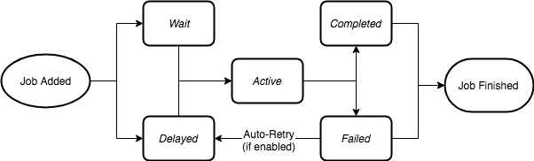
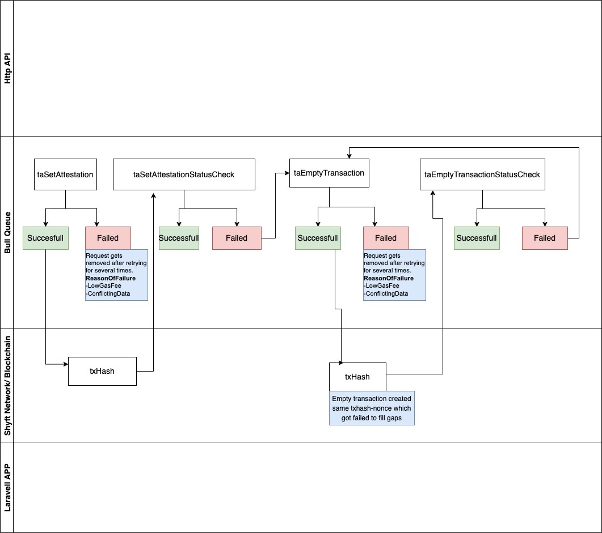
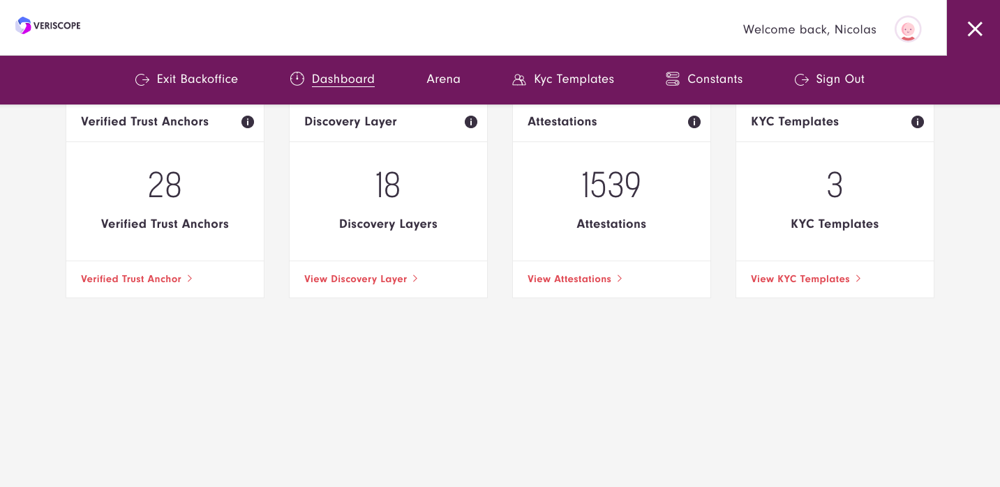
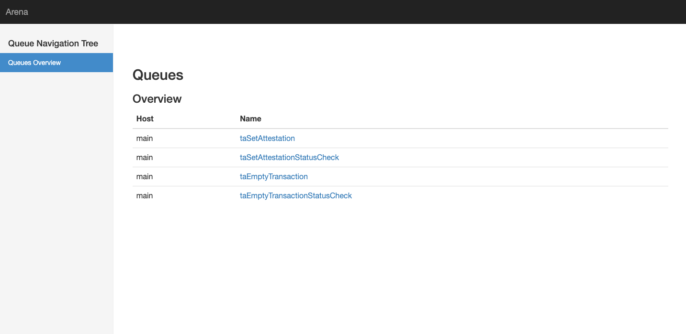

## Problem

At Shyft Network it is crucial for us to build a system which is able to do millions of attestations in an asynchronous manner.

The Shyft Network is a PoA based Ethereum chain hence it faces problems similar to Ethereum.

Ethereum is a decentralized network of nodes. When you send a transaction to the Ethereum blockchain, it gets sent into the mempool until some miner mines it and includes it in a valid block.

Suppose you want to send two transactions transferring 2 ETH and 4 ETH respectively and want them to be processed sequentially. Ideally you shouldn't have to wait to send the second transaction until the first one gets mined and included in a block. Instead, you should be able to send out both transactions in a batch so both get mined in sequence.

Every Ethereum transaction is composed of the following components:
- nonce: Number of confirmed transactions this account has previously sent
- gasPrice: Price of gas (in wei) the originator is willing to pay for this transaction
- to: Recipient of this transaction (smart contract or EOA)
- value: How much ether this transaction is spending
- data: Any binary data payload
- v,r,s: Three components of ECDSA signature of originating account holder

The **nonce** is one of the **most critical** and **least understood** components of an Ethereum transaction.

As explained in the Ethereum Yellow Paper, a nonce is defined as:      
A scalar value equal to the number of transactions sent from this address or, in the case of accounts with associated code, the number of contract-creations made by this account.


Without a **nonce**, it would be impossible for miners to know your intent to **maintain the order of transactions**.


However, with the nonce, if your first transaction (2 ETH) has nonce 0 (assuming it's a new account), then the 4 ETH transaction will have nonce 1. The transaction with 4 ETH will not be processed unless the previous transaction of 2 ETH (the one with a lower nonce) is processed. Hence, maintaining the sequence of transactions.


If there are **gaps in nonces**, all subsequent transactions will remain in the mempool until the gap is filled by nonced transactions.


For example: if the total transaction confirmation count for account X is nonce 8 and a transaction with nonce 10 from account X is broadcasted to the network, it will reside in the mempool until another transaction from account X with nonce = 9 is broadcasted and mined. Thus, filling the gap.  Only then will the transaction of nonce 10 be processed.


## Solution

Our objective is to support millions of attestations by VASPs in an asynchronous and fault tolerant manner.

Our queuing system supports nonce management locally inside the queue management system in order to achieve this goal.




[Bull](https://github.com/OptimalBits/bull) is a Node library that implements a fast and robust queue system based on redis.

A queue stores jobs and messages so that specific jobs can be run once or a specific number of times. A queue instance can have three main roles:

1. **Job producer**
2. **Job consumer**
3. **Job events listener**

In this implementation we have 5 queues:

1. **taSetAttestation** - Input Data for taSetAttestation is passed via the http endpoint [http://localhost:8080/ta-set-attestation](http://localhost:8080/ta-set-attestation) and the request is added into the queue named taSetAttestation. The processor file ``veriscope_ta_node/processors/taSetAttestation.js`` calls the ``utility.taSetAttestation`` function which calls  ``TrustAnchorStorage.setAttestation`` and also keeps track of the TA Account nonce and increments the nonce upon a successfull call inside the queue system. If the request is sucessfull then we catch the response from the success job event and add the response data to the ``taSetAttestationStatusCheck`` queue.


2. **taSetAttestationStatusCheck** - We receive the job data from the ``taSetAttestation`` along with txHash of the pending transaction that is in the mempool, then we keep checking in the hash status looking for it to confirm and be added to the next block; we look for ``2 confirmations`` and the timeout is set to ``60 seconds``.  It checks transactions in sequence **FIFO** (First In First Out) and if the trasaction fails then we send the ``nonce`` to ``taEmptyTransaction`` queue.


3. **taEmptyTransaction** - We receive the job data from the ``taSetAttestationStatusCheck`` with the ``nonce`` we creates a ``zero value transaction`` with the nonce supplied. If the request is sucessfull then we catch the response from success job event and add the response data to the ``taEmptyTransactionStatusCheck`` queue.

4. **taEmptyTransactionStatusCheck** We receive the job data from the ``taEmptyTransaction`` along with txHash of the pending transaction that is in the mempool, then we keep checking in the hash status looking for it to confirm and be added to the block we look for ``2 confirmations`` and the timeout is set to ``60 seconds``.  It checks transactions in sequence **FIFO** (First In First Out) and if the trasaction fails then we send the ``nonce`` to ``taEmptyTransaction`` queue to retry again.

5. **pendingTransaction**  We listen the pending transactions that arrive in the mempool using event listener and websocket once a transaction fires an event the transaction is then added to the `pendingTransaction` process.  

### In order to enable Websocket connecttion over RPC, the Subscribe module must be enabled in the Nethermind config.
```
"JsonRpc": {
 "Enabled": true,
 "Host": "0.0.0.0",
 "Port": 8545,
 "EnabledModules": ["Admin","Net", "Eth", "Trace","Parity", "Web3", "Debug","Subscribe"]
}
```

## Diagram



## Queue Arena

To access the Queue Arena, navigate to the backoffice.  In the hamberger menu, you can choose the Arena link.  The link is authenicated by a jwt token that will expire.



Below is the view for all the queues currently supported for Attestations as described above.


